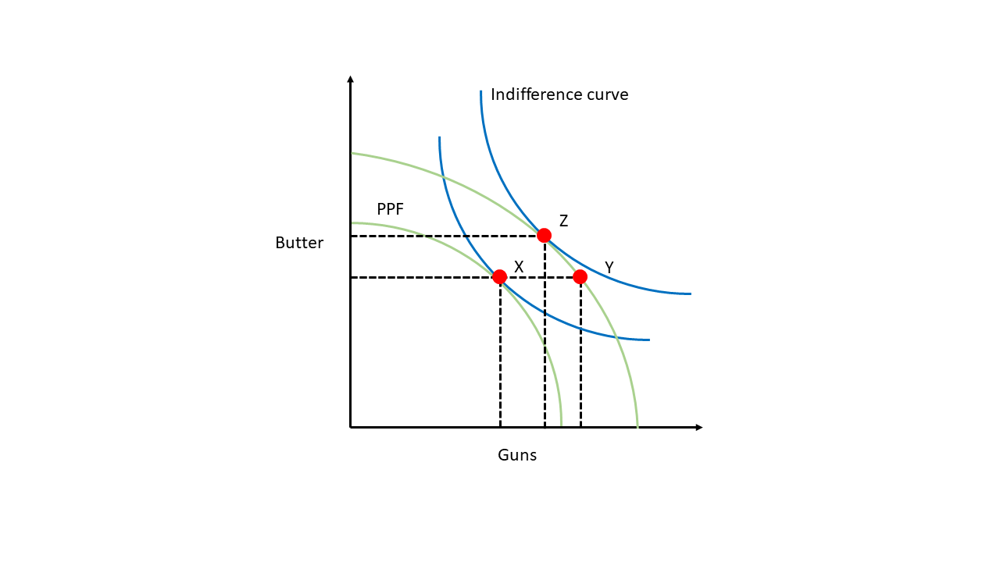
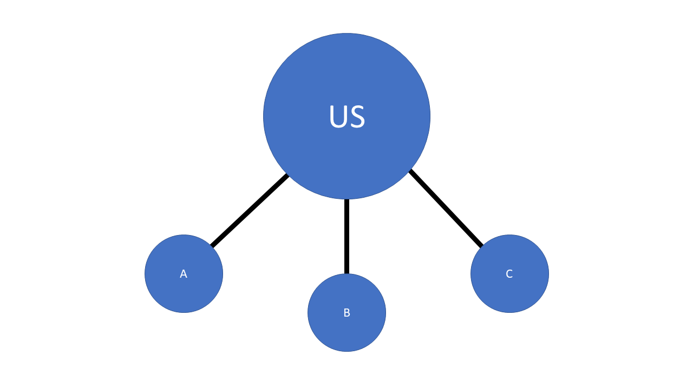

```{r setup, include = FALSE, echo = FALSE}
library(tidyverse)
library(tidyquant)
library(plotly)
library(scales)
library(here)
library(Hmisc)
library(kableExtra)
library(knitr)
library(lubridate)
library(rgdal) # used to read world map data
library(rgeos) 
library(rvest)
library(maptools)
library(ggmap)
library(ggtext)
library(colorRamps)
library(RColorBrewer)
knitr::opts_chunk$set(fig.width=12, fig.height=8, fig.align="center", echo=FALSE, warning=FALSE, error=FALSE, message=FALSE, dpi=400) 

# Plotly font
t <- list(family = "arial",
          size = 18)

# Regular plot theme
theme_flynn <- function(){ 
  
      theme_linedraw(base_size = 12, base_family = "Arial") %+replace% 
        
        theme(plot.title = element_markdown(face = "bold", size = 20, hjust = 0, margin = margin(t = 0, b = 0.3, l = 0, r = 0, unit = "cm")),
              plot.subtitle = element_markdown(size = 14, face = "italic", color = "gray50", margin = margin(t = 0, b = 0.2, l = 0, r = 0, unit = "cm"), hjust = 0),
              plot.caption = element_markdown(face = "italic", size = 8, hjust = 0, lineheight = 0.5, margin = margin(t = 0.4, b = 0, l = 0, r = 0, unit = "cm")), 
              strip.background = element_rect(fill = "gray80", color = "black"),
              strip.text = element_markdown(color = "black", face = "bold", margin = margin(t = 0.2, b = 0.2, l = 0.2, r = 0.2, unit = "cm")),
              panel.grid.major = element_line(color = "gray70", size = 0.15),
              panel.grid.minor = element_line(color = "gray90", size = 0.1),
              plot.margin = margin(l = 5, r = 15, t = 5, b = 5, unit = "pt"),
              axis.title = element_markdown(face = "bold", size = 12),
              axis.title.y = element_markdown(angle = 90, margin = margin(t = 0, r = 0.5, b = 0, l = 0, unit = "cm")),
              axis.title.x = element_markdown(margin = margin(t = 0.5, r = 0, b = 0, l = 0, unit = "cm")),
              legend.title = element_markdown(face = "bold", hjust = 0))
  }

```


# Lecture Overview

1. Trends in alliance ties and troop deployments

2. Why allies?

3. Alliances and security issues

4. Alliances and economic issues


---
class: left, top

# Key Questions

1. Why do states form alliances?

2. How do allies help redistribute the costs of war?

3. What is the relationship between economic interests and security cooperation?

4. What are the differences between bilateral vs. multilateral alliances?

5. What are the tradeoffs associated with the United States' alliance relationships?


---
class: center, middle


<iframe width="1120" height="630" src="https://www.youtube.com/embed/y2TLJmIF220" title="YouTube video player" frameborder="0" allow="accelerometer; autoplay; clipboard-write; encrypted-media; gyroscope; picture-in-picture" allowfullscreen></iframe>


---
class: center, middle

```{r ally count}

allydata <- read.csv(here("../../../Data Files/ATOP V4.0 Data (csv)/atop4_0ddyr.csv")) %>% 
  subset(stateA == 2 & defense == 1) %>% 
  group_by(year) %>% 
  summarise(allies = n_distinct(stateB))

combined <- tibble(year = seq(1815, 2016)) %>% 
  left_join(allydata) %>% 
  mutate(allies = ifelse(is.na(allies), 0, allies)) 


# US allies over time
ggplot(data = combined, aes(x = year, y = allies)) +
  geom_line(size = 1.5) +
  theme_flynn() +
  scale_x_continuous(breaks = seq(1815, 2016, 20)) +
  scale_y_continuous(breaks = seq(0, 70, 10), limits = c(0, 70)) +
  labs(x = "Year",
       y = "Count",
       title = "US defense pacts over time, 1815-2016",
       subtitle = "World War II and the Cold War mark an important turning point",
       caption = "Data obtained from the Alliance Treaty Obligations and Provisions Data (v4.0)")

```

???

# Notes

- US really stuck to the no entangling relations thing for a long time


---
class: center, middle

```{r ally region}

allydataregion <- read.csv(here("../../../Data Files/ATOP V4.0 Data (csv)/atop4_0ddyr.csv")) %>% 
  subset(stateA == 2 & defense == 1) %>% 
  group_by(year) %>% 
  mutate(region = countrycode::countrycode(stateB, "cown", "region")) %>% 
  group_by(region, year) %>% 
  summarise(allycount = sum(atopally, na.rm = TRUE)) %>% 
  filter(!is.na(region))


ggplot(allydataregion, aes(x = year, y = allycount, fill = region)) +
  geom_bar(position = "stack", stat = "identity", color = "black", size = 0.1) +
  scale_fill_brewer(palette = "Set2") +
  theme_flynn() + 
  labs(x = "Year",
       y = "Count",
       title = "US defense pacts by geographic region, 1942-2016",
       fill = "Region",
       subtitle = "What can the regional emphasis tell us about US priorities?",
       caption = "Data obtained from the Alliance Treaty Obligations and Provisions (ATOP) Dataset (v4.0).")

```


???
 

# Notes

- Looking at where allies are gives you a sense of regional priorities


---
class: center, middle


???

# Notes

- Realist thinking often talked about alliances in the context of balance of power
- States ally with one another to check another, bigger country.
- It's about the aggregation of capabilities


---
class: left, top

# Why Alliances?

Burden sharing

- Distribute the costs of military operations

- Defense

- Offense

- Deter Adversaries

- Coordinate capabilities 

???

# Notes

- States also ally for a number of other reasons
- Burden sharing is the idea that allies distribute the costs of military operations across the member states
- This doesn't mean it's going to be evenly distributed by any means, but helps to reduce burden on any one state


---
class: center, middle

```{r}

fat.data <- readxl::read_xlsx(here("../../../Data Files/icasualties/afghan-iraq-fatalities.xlsx")) %>%
  mutate(NonUS = Total - US) %>% 
  select(Year, War, US, NonUS) %>% 
  pivot_longer(cols = c(3,4),
               names_to = "country",
               values_to = "deaths")

ggplot(fat.data, aes(x = Year, y = deaths, fill = country)) +
  geom_bar(stat = "identity", position = "stack", color = "black", size = 0.1) +
  facet_wrap(. ~ War) +
  theme_flynn() +
  scale_fill_brewer(palette = "Set2") +
  labs(x = "Year",
       y = "Count",
       fill = "Country",
       title = "Coalition deaths in Afghanistan and Iraq, 2001-2020",
       caption = "Data obtained from icasualties.org")


```


???

# Notes

- Example of burden sharing in Afghanistan and comparison case of Iraq
- In Afghanistan US endured majority of casualties, but coalition partners also took on a sizeable share of casualties
- In Iraq the US went in with relatively few partner states dedicated to combat operations
- Note this doesn't include other areas of burden sharing like financial support


---
class: center, middle

```{r coalition fatalities percent}

fat.perc <- readxl::read_xlsx(here("../../../Data Files/icasualties/afghan-iraq-fatalities.xlsx")) %>%
  mutate(percent = US/Total)

ggplot(fat.perc, aes(x = Year, y = percent, color = War, linetype = War)) +
  geom_line(size = 1.5) +
  theme_flynn() +
  scale_color_brewer(palette = "Set2") +
  scale_y_continuous(labels = percent_format()) +
  guides(linetype = FALSE) +
  labs(x = "Year",
       y = "Percent",
       color = "Conflict",
       title = "US fatalities as a percentage of total coalition fatalities",
       subtitle = "Coalition warfighting can spread risk to many states.",
       caption = "Data obtained from icasualties.org")
```


???

# Notes

- Another example from Iraq and Afghanistan
- US fatalities consistently high as a percentage of total fatalities in Iraq
- In Afghanistan allied states suffered a much higher proportion of the total casualties over time, particularly during the "surge" years around 2009 and 2010.


---
class: left, top

# Why Alliances?


.pull-left[
Burden sharing: What it's not

- A point of conflict among NATO members in recent years

- President Trump repeatedly criticized NATO for taking advantage of the US

- Has pressed allies to give US more in exchange for "protection"

To right: President Trump at a NATO summit with other alliance member leaders in Brussels, 2018.
]

.pull-right[

]


???

# Notes

- Burden sharing can and does vary considerably over time and context
- Nothing in the NATO treaty requires a certain contribution by allied states in wartime. Wartime contributions are determined by political factors on a rolling basis. 
- Burden sharing is also not a protection racket. Member states do split the costs of NATO's operating budget, but this is relatively small.
- When we talk about meeting commitments we're talking about individual countries increasing their own defense budgets, and perhaps dedicating spending to particular categories of defense, like R&D, manpower, equipment, etc.
  - 2014 Wales Summit called for members to spend 2% of their GDP on defense, and 20% of their budgets on major equipment and R&D.
  - Also calls for allies not meeting this threshold to halt their decline and increase real expenditures as GDP grows.
  - Sets longterm time frame for meeting these obligations.
- Countries do not pay the US for protection


---
class: center, middle

```{r nato-votes}

natodata <- readxl::read_xlsx(here("../../../Projects/Republican opposition to multilateralism/Data/NATO Voting/Data/NATO Votes Compiled 20180412.xlsx")) %>% 
  subset(select = c("congress", "date", "expansion_mf", "limits_mf", "allied_contributions_mf", "general_participation_mf")) %>% 
  gather(., group, count, -congress, -date) %>% 
  ungroup() %>% 
  mutate(Category = factor(group, labels = c("Allied Contributions", "NATO Expansion", "US Limits", "All Votes")),
         Year = as.numeric(format(date, "%Y")) )


# All votes concerning NATO by year
ggplot(data = natodata %>% filter(Category != "All Votes"), aes(x = Year, y = count, fill = Category)) +
  geom_bar(stat = "identity", position = "stack", size = 0.1) +
  theme_flynn() +
  scale_x_continuous(breaks = seq(1950, 2015, 5)) +
  scale_y_continuous(breaks = seq(0, 15, 5), limits = c(0,15)) +
  scale_fill_brewer(palette = "Set2") +
  labs(x = "Congress", 
       y = "Vote Count",
       title = "Voting in US Congress on NATO by subject, 1949-2017",
       subtitle = "The end of the Cold War saw a surge in activity relatd to NATO",
       caption = "Data collected from descriptions of legislation obtained through voteview.com")


```

???

# Notes

- Politicians have long been concerned about free riding and the idea that the US will be exploited by other countries
- Trump gets a lot of attention because he says things that are wildly incorrect with respect to how the alliance functions, but these concerns are not new.
- Figure shows periods where members of Congress have proposed legislation addressing various aspects of NATO and US participation.
- Note that concerns about US limits (what it will contribute, etc.) have been raised frequently
- Vandenberg Resolution during the negotiations over US membership in NATO required "self-help" language because Republican legislators worried about Europeans taking advantage of the US.


---
class: left, top

# Why Alliances?

.pull-left[
Influence and control

- Example: NATO

- NATO is a highly institutionalized alliance, with annual review processes, meetings, etc.

- Rules for expansion

- US Enjoys special privileges

To right: General Tod Wolters, Commander US European Command, Supreme Allied Commander Europe (SACEUR).
]


.pull-right[

]


???

# Notes

- In reality the US enjoys a lot of benefits
- US officer is *always* the highest ranking military officer in NATO
- This gives the US significant influence in military planning and deciding what NATO is going to do.
- US also serves as a "hub" of sorts in the expansion process, with documentation being submitted to the US
- Process of expansion also has a unanimity rule, allowing any single country to prevent new members from joining. 


---
class: left, top

# Why Alliances?

.pull-left[
Influence and control

- Alliance ties can allow members to exert influence on other member states

- Example: NATO

- Intended to deter Russian aggression 

- Also intended to facilitate cooperation among European countries

To right: Lord Hastings Lionel Ismay, first Secretary General of NATO
]

.pull-right[

]


???

# Notes

- The US also had influence because of its overwhelming power and the peripheral goals of the NATO alliance
- Lord Hastings Lionel Ismay, first Secretary General of NATO, said the alliance's purpose was "to keep the Soviet Union out, the Americans in, and the Germans down."


---
class: center, middle, inverse

# Asymmetric Alliances


---
class: left, top

# Asymmetric Alliances

Most security relationships are asymmetric

Why form a relationship with weaker partners?

- Security-Autonomy tradeoff

  - Smaller states give up foreign policy autonomy
  
  - More powerful state agrees to provide security for smaller states
  
  - In exchange, the more powerful state gets various benefits
  

???

# Notes

- Because the US is so big, most security relationships are asymmetric
- Why does the US ally with weaker states?

- Security Autonomy Tradeoff: Even when the US partners with weaker states if often gets things in return. Access is a big one!
- Other times the US gets leverage to shape the partner's decisions and policies.

  
  
  
  
  
  
---
class: left, top

# Asymmetric Alliances

.pull-left[
So what does this look like?

- The US has alliance agreements with a lot of different countries

- As a part of these agreements the US often gets access to territory for things like military bases

- Alliance agreements might also be used to shape other states' security policies in related areas

To right: President Gerald Ford with South Korean President Park Chung-hee in Seoul, 1974. Photo courtesey of George Washington University National Security Archives.
]

.pull-right[

]


???

# Notes
- Example: The US was able to stop South Korea's development of nuclear weapons
- Nixon Administration shifts policy to place a greater responsibility on allied states for their own self defense.
- The US removed thousands of personnel from South Korea in the early 1970s following Nixon's trip to China and easing of tensions.
- South Korean government perceived the US commitment to its security as weakening, and so it began to explore the development of a nuclear weapons program. 
- The US threatened to withdraw all forces from the Korean Peninsula if the South Korean Government didn't abandon the program. President Ford also indicated the US would impose economic sanctions/punishment on South Korea if it didn't abandon the program. The US also intervened to stop the sale of technology to South Korea necessary to advance its weapons development.


---
class: center, middle, inverse

# Alliances and Economic Relations


---
class: top, left

# Alliances and Economic Relations

Military alliances don't just serve security goals

Alliances are related to a broader range of states' policy goals

- Security relationships affect economic and political relationships

- But economic and political relationships also affect security relationships

"Issue linkage" 

???
# Notes

- Military alliances serve broader goals---not just security goals
- Issue linkage: The concept that the politics of some issue areas are tied to the politics of other issue areas. Vague definition, but the idea is that security affects economics, and economics affects security.


---
class: left, top

# Alliances and Economic Relations

"Guns vs Butter" framework

- States have things they want to do, but have limited resources

- This means they have to strike a balance, or mixture, of policy outputs with those limited resources

- Allied state gives up some control over its foreign policy for greater security

- This lets the allied state shift resources away from defense to other policy areas *while not reducing overall policy outputs*

???
# Notes

- Guns vs Butter framework is just the idea that, under budgetary constaints, policymakers face a tradeoff between spending on security and spending on domestic welfare programs.
 - The security-autonomy tradeoff comes into play here: States can increase security by allying with a major power, allowing them to shift budgetary resources to alternative policy goals. The price is they lose some foreign policy autonomy.
 - This tradeoff might not matter much if states don't have grand ambitions.


---
class: center, middle


---
class: center, middle


---
class: center, middle




---
class: center, middle




---
class: left, top

# Asymmetric Alliances?

Indirect relationships also matter

- Security relationships do not exist in a vacuum

- US relations with "third-party" states also matters


???

# Notes

- We often focus on dyadic relationships, but third-party relationships also matter
- Another way to think about this is to think of some alliances---multilateral alliances, specificaly---as networks.
- This means that second, and third-order connections, can also matter when determining what the US's relations look like with the referent state.


---
class: center, middle


???

# Notes

- Just illustrates previous point.


---
class: center, middle

```{r allied trade}
library(tidyquant)

cpi <- tq_get("CPIAUCNS",
              get = "economic.data",
              from = "1913-01-01",
              to = "2019-01-01") %>% 
  mutate(year = as.numeric(format(date, "%Y")),
         basevalue = mean(price[year==2018]),
         cpi = price/basevalue) %>% 
  group_by(year) %>% 
  summarise(cpi = mean(cpi))

allyid <- read_csv(here("../../../Data Files/ATOP V4.0 Data (csv)/atop4_0ddyr.csv")) %>% 
  subset(stateA == 2 & defense == 1) %>% 
  group_by(year) %>% 
  select(stateB, year, defense) %>% 
  rename("ccode" = "stateB")

tradedata <- read_csv(here("../../../Data Files/COW Data/COW_Trade_4.0/National_COW_4.0.csv")) %>% 
  filter(year >= 1950 & ccode != 2)

combined <- tradedata %>% 
  left_join(allyid, by = c("ccode", "year")) %>% 
  left_join(cpi, by = c("year")) %>% 
  mutate(defense = ifelse(is.na(defense), 0 , defense),
         exports_con = exports/cpi,
         imports_con = imports/cpi,
         total_trade = exports + imports,
         total_trade_nochina = ifelse(ccode != 710, exports + imports, NA)) %>% 
  group_by(defense, year) %>% 
  summarise(meantrade = mean(total_trade, na.rm = TRUE),
            meantrade_nochina = mean(total_trade_nochina, na.rm = TRUE)) %>% 
  group_by(defense) %>% 
  mutate(defense = factor(defense, levels = c(0, 1), labels = c("Non-US Allies", "US Allies")),
         index = (meantrade/meantrade[year==1950])*100,
         index_nochina = (meantrade_nochina/meantrade_nochina[year==1950]*100))


ggplot() +
  geom_line(data = combined, aes(x = year, y = index, linetype = defense, color = defense), size = 1.5) +
  geom_line(data = combined %>% filter(defense == "Non-US Allies"), aes(x = year, y = index_nochina, linetype = "longdash", color = "Non-US Allies (No China)"), size = 1.5) +
  theme_flynn() +
  scale_x_continuous(breaks = seq(1950, 2020, 5)) +
  scale_y_continuous() +
  scale_color_brewer(palette = "Set2") +
  guides(linetype = FALSE) +
  labs(x = "Year",
       y = "Index",
       color = "Ally Type",
       title = "Index of monadic trade for US allies and non-allied states, 1950-2016",
       subtitle = "Index tracks mean level of total monadic trade over time",
       caption = "Trade data taken from Correlates of War Trade Data (v4.0)\nAlliance data taken from Alliance Treaty Obligations and Provisions (ATOP) data (v4.0).\nTrade data defalted to constant 2018 dollars using CPI data from FRED database.")
  


```


???

# Notes

- Figure hows the gap in trade between US allies and non-allies in terms of global trade (includes exports and imports)
- The gap starts to close in more recent years, but a lot of this is driven by China (see th eline that removes China to get a sense of its effect on the final line)
- The basic idea here is that having security provisions from a country like the Untied States can make other countries more desirable for trade and investment relationships. If investors know that these are stable countries, they're more likely to invest the time and money into setting up the infrastructure to trade and invest.
- US alliance relationships are also often set up to protect commercial interests/activity.


---
class: center, middle

```{r network figure}

library(network)

# Do it for all states
tradedyad <- read_csv(here("../../../Data Files/COW Data/COW_Trade_4.0/Dyadic_COW_4.0.csv")) %>% 
  filter(year >= 1950) %>% 
  select(importer1, importer2, flow1, flow2, year) %>% 
  mutate(year = year - min(year),
         trade = flow1 + flow2,
         trade = ifelse(trade == 0, NA, trade)) %>% 
  select(importer1, importer2, trade, year) # remember to order these correctly. Node 1, Node 2, then attributes/connections

netlist <- list()
denslist <- list()

for (i in 1:61) {
  
data <- tradedyad %>% filter(year == i) # Filter out observed year

nodelist.1 <- data$importer1 # Generate list of nodes
nodelist.2 <- data$importer2 # Data aren't directed so we need to capture both columns

nodelist <- tibble(label = unique(c(nodelist.1, nodelist.2))) %>% # Combine node lists into single vector
  arrange(label) %>% 
  rowid_to_column("id") # IMPORTANT: Generate ID column to correspond to text label

edges <- data %>%  # Create edgelist
  left_join(nodelist, by = c("importer1" = "label")) %>% # Have to match labels to importer name
  rename("from" = "id")

edges <- edges %>% 
  left_join(nodelist, by = c("importer2" = "label")) %>% 
  rename("to" = "id") %>% 
  filter(!is.na(trade) & trade > 0) # Get rid of observations with NA or 0 values for trade. These count as edges even if value is NA.

edges <- select(edges, from, to, trade) # Whittle down edgelist. Order is important.

netlist[[i]] <- network(edges, 
                        matrix.type = "edgelist", 
                        vertex.attr = nodelist,
                        directed = FALSE,
                        na.omit = FALSE,
                        ignore.eval = FALSE)

}

for (i in 1:61) {
  denslist[[i]] <- network.density(netlist[[i]],
                                   na.omit = FALSE)
}

den.df <- do.call("rbind", denslist) %>% 
  as.data.frame() %>% 
  mutate(year = row_number(.) + 1949,
         ally = "All States") %>% 
  rename("density" = "V1")


# Do it for US Allies only

allyid <- read_csv(here("../../../Data Files/ATOP V4.0 Data (csv)/atop4_0ddyr.csv")) %>% 
  subset(stateA == 2 & defense == 1) %>% 
  select(stateB, year, defense) %>% 
  rename("ccode1" = "stateB") %>%
  mutate(ccode2 = ccode1) %>% 
  filter(year >= 1950)


tradedyad <- read_csv(here("../../../Data Files/COW Data/COW_Trade_4.0/Dyadic_COW_4.0.csv")) %>% 
  filter(year >= 1950) %>% 
  left_join(allyid, by = c("ccode1", "year")) %>% 
  select(-c("ccode2.y")) %>% 
  rename("ccode2" = "ccode2.x") %>% 
  left_join(allyid, by = c("ccode2", "year")) %>% 
  mutate(jointally = ifelse(defense.x == 1 & defense.y == 1, 1, 0)) %>% 
  filter(jointally == 1) %>% 
  select(importer1, importer2, flow1, flow2, year) %>% 
  mutate(year = year - min(year),
         trade = flow1 + flow2,
         trade = ifelse(trade == 0, NA, trade)) %>% 
  select(importer1, importer2, trade, year) # remember to order these correctly. Node 1, Node 2, then attributes/connections


netlist <- list()
denslist <- list()

for (i in 1:61) {
  
data <- tradedyad %>% filter(year == i) # Filter out observed year

nodelist.1 <- data$importer1 # Generate list of nodes
nodelist.2 <- data$importer2 # Data aren't directed so we need to capture both columns

nodelist <- tibble(label = unique(c(nodelist.1, nodelist.2))) %>% # Combine node lists into single vector
  arrange(label) %>% 
  rowid_to_column("id") # IMPORTANT: Generate ID column to correspond to text label

edges <- data %>%  # Create edgelist
  left_join(nodelist, by = c("importer1" = "label")) %>% # Have to match labels to importer name
  rename("from" = "id")

edges <- edges %>% 
  left_join(nodelist, by = c("importer2" = "label")) %>% 
  rename("to" = "id") %>% 
  filter(!is.na(trade) & trade > 0) # Get rid of observations with NA or 0 values for trade. These count as edges even if value is NA.

edges <- select(edges, from, to, trade) # Whittle down edgelist. Order is important.

netlist[[i]] <- network(edges, 
                        matrix.type = "edgelist", 
                        vertex.attr = nodelist,
                        directed = FALSE,
                        na.omit = FALSE,
                        ignore.eval = FALSE)

}

for (i in 1:61) {
  denslist[[i]] <- network.density(netlist[[i]],
                                   na.omit = FALSE)
}

den.df.allies <- do.call("rbind", denslist) %>% 
  as.data.frame() %>% 
  mutate(year = row_number(.) + 1949,
         ally = "Allies") %>% 
  rename("density" = "V1")


# Do it for Non-Allies only

allyid <- read_csv(here("../../../Data Files/ATOP V4.0 Data (csv)/atop4_0ddyr.csv")) %>% 
  subset(stateA == 2 & defense == 1) %>% 
  select(stateB, year, defense) %>% 
  rename("ccode1" = "stateB") %>%
  mutate(ccode2 = ccode1) %>% 
  filter(year >= 1950)


tradedyad <- read_csv(here("../../../Data Files/COW Data/COW_Trade_4.0/Dyadic_COW_4.0.csv")) %>% 
  filter(year >= 1950) %>% 
  left_join(allyid, by = c("ccode1", "year")) %>% 
  select(-c("ccode2.y")) %>% 
  rename("ccode2" = "ccode2.x") %>% 
  left_join(allyid, by = c("ccode2", "year")) %>% 
  mutate(jointally = ifelse(defense.x == 1 & defense.y == 1, 1, 0)) %>% 
  filter(is.na(jointally)) %>% 
  select(importer1, importer2, flow1, flow2, year) %>% 
  mutate(year = year - min(year),
         trade = flow1 + flow2,
         trade = ifelse(trade == 0, NA, trade)) %>% 
  select(importer1, importer2, trade, year) # remember to order these correctly. Node 1, Node 2, then attributes/connections


netlist <- list()
denslist <- list()

for (i in 1:61) {
  
data <- tradedyad %>% filter(year == i) # Filter out observed year

nodelist.1 <- data$importer1 # Generate list of nodes
nodelist.2 <- data$importer2 # Data aren't directed so we need to capture both columns

nodelist <- tibble(label = unique(c(nodelist.1, nodelist.2))) %>% # Combine node lists into single vector
  arrange(label) %>% 
  rowid_to_column("id") # IMPORTANT: Generate ID column to correspond to text label

edges <- data %>%  # Create edgelist
  left_join(nodelist, by = c("importer1" = "label")) %>% # Have to match labels to importer name
  rename("from" = "id")

edges <- edges %>% 
  left_join(nodelist, by = c("importer2" = "label")) %>% 
  rename("to" = "id") %>% 
  filter(!is.na(trade) & trade > 0) # Get rid of observations with NA or 0 values for trade. These count as edges even if value is NA.

edges <- select(edges, from, to, trade) # Whittle down edgelist. Order is important.

netlist[[i]] <- network(edges, 
                        matrix.type = "edgelist", 
                        vertex.attr = nodelist,
                        directed = FALSE,
                        na.omit = FALSE,
                        ignore.eval = FALSE)

}

for (i in 1:61) {
  denslist[[i]] <- network.density(netlist[[i]],
                                   na.omit = FALSE)
}

den.df.nonallies <- do.call("rbind", denslist) %>% 
  as.data.frame() %>% 
  mutate(year = row_number(.) + 1949,
         ally = "Non-Allies") %>% 
  rename("density" = "V1")


# Bring different network density measures together
density.df <- bind_rows(den.df, den.df.allies, den.df.nonallies)

ggplot(density.df, aes(x =  year, y = density, color = ally, linetype = ally)) +
  geom_line(size = 2) +
  theme_flynn() +
  scale_x_continuous(breaks = seq(1950, 2020, 5)) +
  scale_color_brewer(palette = "Set2") +
  guides(linetype = FALSE) +
  labs(x = "Year",
       y = "Network Density",
       color = "Alliance Relationship",
       title = "US alliance relationships and trade network density, 1950-2016",
       subtitle = "Alliance relationships reinforce other types of relationships",
       caption = "Network density calculted using 'network' package in R (v4.0.1).\nTrade data obtained from COW dyadic trade data (v4.0)\nAlliance data obtained from ATOP data (v4.0).")
```


???
# Notes

- US alliance relationships are also often set up to protect commercial interests/activity
- This figure shows the density of trade ties between groups of states
- Density refers to the proportion of all possible ties that we observe. So if we had four countries and three sets of connections, that would be a density of 50% or 0.50. 
- Number of dyads calculated as( N * N-1)/2 or (4 * 3)/2 in this example


