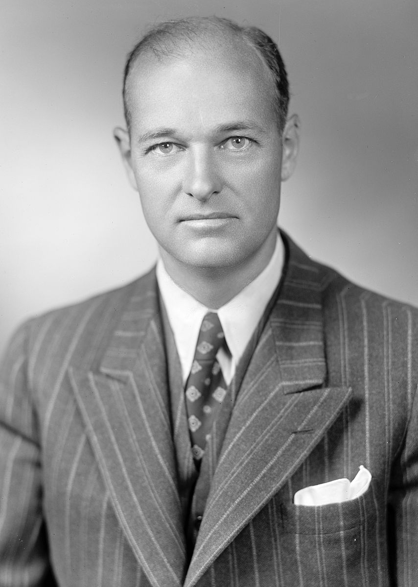
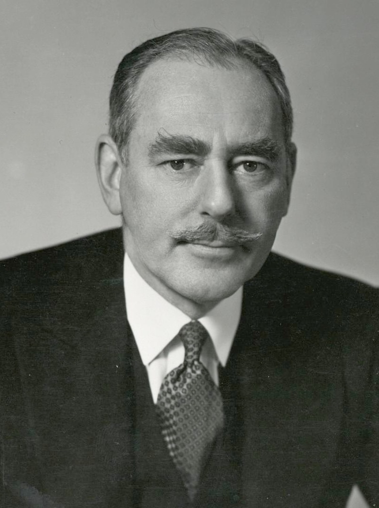
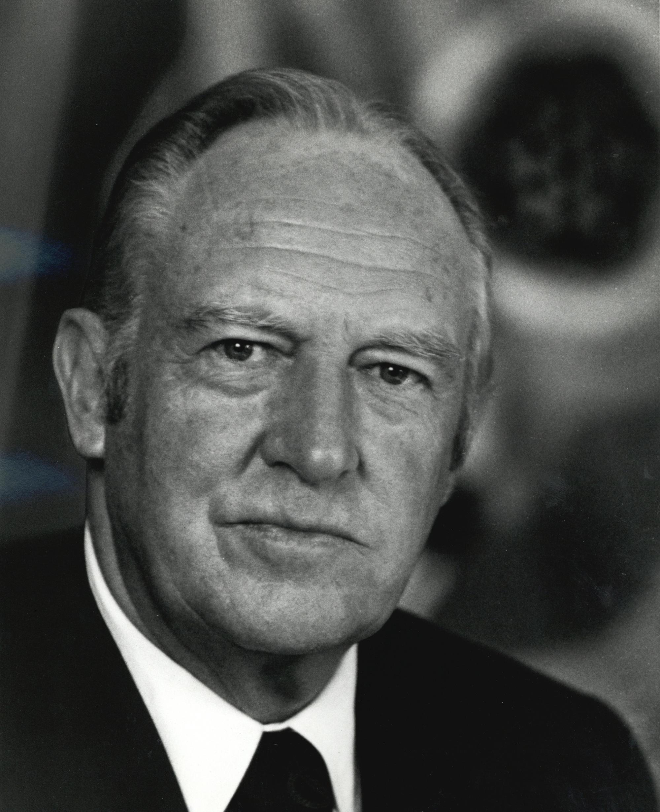
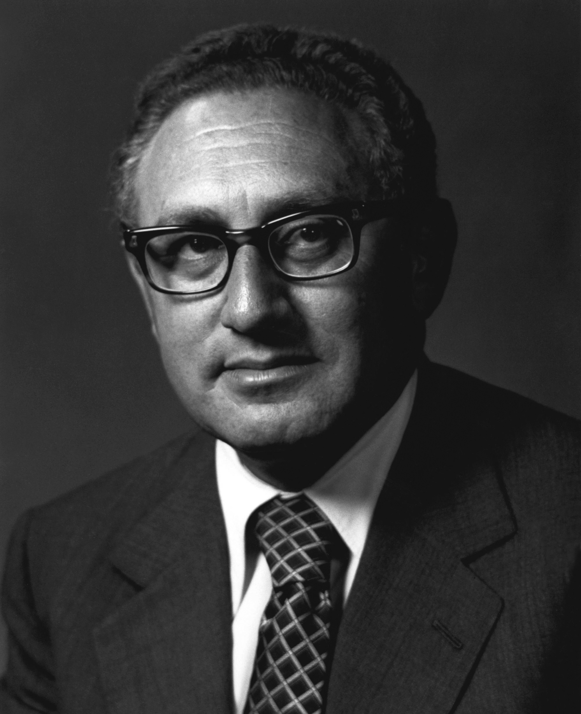

```{r setup, include = FALSE, echo = FALSE}
library(tidyverse)
library(tidyquant)
library(plotly)
library(scales)
library(here)
library(Hmisc)
library(kableExtra)
library(knitr)
library(lubridate)
library(rgdal) # used to read world map data
library(rgeos) 
library(rvest)
library(maptools)
library(ggmap)
library(colorRamps)
library(RColorBrewer)


knitr::opts_chunk$set(fig.width=12, fig.height=8, fig.align="center", echo=FALSE, warning=FALSE, error=FALSE, message=FALSE, dpi=400) 


theme_flynn <- function(){ 
  
      theme_minimal(base_size = 12, base_family = "Arial") %+replace% 
        
        theme(plot.title = element_text(face = "bold", size = 18, hjust = 0, margin = margin(t = 0, b = 0.3, l = 0, r = 0, unit = "cm")),
              plot.subtitle = element_text(size = 12, hjust = 0, margin = margin(t = 0, b = 0.3, l = 0, r = 0, unit = "cm")),
              plot.caption = element_text(face = "italic", size = 8, hjust = 1, margin = margin(t = 0.2, unit = "cm")),
              strip.background = element_rect(fill = "gray80", color = "black"),
              strip.text = element_text(color = "black", face = "bold", margin = margin(t = 0.2, b = 0.2, l = 0.2, r = 0.2, unit = "cm")),
              panel.grid.major = element_line(color = "gray70", size = 0.15),
              panel.grid.minor = element_line(color = "gray90", size = 0.1),
              axis.title = element_text(face = "bold", size = 12),
              axis.title.y = element_text(angle = 90, margin = margin(t = 0, r = 0.5, b = 0, l = 0, unit = "cm")),
              axis.title.x = element_text(margin = margin(t = 0.5, r = 0, b = 0, l = 0, unit = "cm")),
              legend.title = element_text(face = "bold", hjust = 0))
}

```

# Lecture Overview

1. Historical Trends

2. What are bureaucracies?

3. Why do they matter?

4. The State Department


---
class: left, top

# Key Questions

1. How did the foreign policy buraucracy change between the pre- and post-War periods?

2. Why/How might suboptimal policy outcomes result from otherwise good actors following organizational mandates?

3. How are actors at different positiosn in a bureaucratic hierarchy able to exercise power and influence?

4. How has the State Department's role in foreign policymaking changed over time?


---
class: center, middle, inverse

# What Are Bureaucracies?


---
class:  left, top

# What Are Bureaucracies?


Executive bureaucracy before World War II

- Very small

- Creation of the Executive Office of the President (EOP) in 1939 

- Foreign policy activism spurs demand for personnel, expertise

- Senior administrators up through World War II generall had little government experience

- Bureaucracy didn't become a "career" until post-1940s


---
class: center, middle

```{r state-size}

B <- readstata13::read.dta13(here("../../../Projects/Dissertation/Dissertation Data/Ch3_admin_year.dta"))

  ggplot(data = B) +
  geom_line(aes(x = year, y = bureaucrat), size = 2) +
  theme_flynn() +
  scale_x_continuous(breaks = seq(1950, 2010, 10)) +
    scale_y_continuous(breaks = seq(0, 20, 5)) +
    labs(x = "Year",
         y = "Average Years Experience",
         title = "Average Prior Bureaucratic Experience, 1948-2011",
         subtitle = "Prior bureaucratic experience becomes more common over time",
         caption = "Data obtained from Michael Flynn 'Those Halcyon Days: The Evolution of the American Foreign Policy Establishment'. Dissertation. Binghamton University.")

```


---
class: center, middle

```{r bureaucratic-prop}

ggplot(data = B) +
  geom_line(aes(x = year, y = bur_prop), size = 2) +
  theme_flynn() +
  scale_x_continuous(breaks = seq(1950, 2010, 10)) +
    scale_y_continuous(breaks = seq(0, 1, 0.2)) +
    labs(x = "Year",
         y = "Average Years Experience",
         title = "Proportion of Appointees with Prior Bureaucratic Experience, 1948-2011",
         subtitle = "Prior bureaucratic experience becomes more common over time",
         caption = "Data obtained from Michael Flynn 'Those Halcyon Days: The Evolution of the American Foreign Policy Establishment'. Dissertation. Binghamton University.")

```


---
class: center, middle

```{r educ}
  ggplot(data = B) +
  geom_bar(aes(x = year, y = mode_education), stat = "identity", size = 0.1, fill = "deepskyblue", color = "black") +
  theme_flynn() +
  scale_x_continuous(breaks = seq(1950, 2010, 10)) +
    scale_y_continuous(breaks = seq(0, 3, 1), labels = c("No College", "Bachelor's", "Master's", "Doctoral/JD")) +
    labs(x = "Year",
         y = "",
         title = "Modal Value of Appointee Educational Attainment, 1948-2011",
         subtitle = "Expertise and education also become more important",
         caption = "Data obtained from Michael Flynn 'Those Halcyon Days: The Evolution of the American Foreign Policy Establishment'. Dissertation. Binghamton University.")
```


---
class: center, middle

```{r business-exp}
ggplot(data = B) +
  geom_line(aes(x = year, y = business + financial), size = 2) +
  theme_flynn() +
  scale_x_continuous(breaks = seq(1950, 2010, 10)) +
    scale_y_continuous(breaks = seq(0, 15, 5)) +
    labs(x = "Year",
         y = "Average Years Experience",
         title = "Average Years of Prior Business and Finance Experience, 1948-2011",
         subtitle = "Prior bureaucratic experience becomes more common over time",
         caption = "Data obtained from Michael Flynn 'Those Halcyon Days: The Evolution of the American Foreign Policy Establishment'. Dissertation. Binghamton University.")
```


---
class: left, top

# What Are Bureaucracies?

What they do:

- Day-to-day management and operations of the government

- Help to formulate policies

- Provide expertise and advice in different policy areas

- Coordinate actions of various bureaucratic actors

- Execute and implement policies


---
class: left, top

# What Are Bureaucracies?

Functional Differentiation:

- The specialization of different governmental units

- Works at different levels:

  - State Department vs Defense Department
  
  - Navy vs Army
  
  - Artillery vs Armor
  
  
  
---
class: left, top

# What Are Bureaucracies?

Different bureaucratic agencies

.pull-left[
- State Department
- Defense Department 
- Treasury Department
- Department of Energy
- Department of Homeland Security
- Department of Commerce
- Department of Agriculture
- US Agency for International Development
- Department of Labor
- FBI
- NSA
]

.pull-right[
- Army
- Navy
- Air Force
- Marine Corps
- Coast Guard
- National Guard
- CIA
- DIA
- Customs and Border Patrol
- US Postal Service
- NASA
]


---
class: center, middle

Bureaucracy has a reputation for redundancy...


---
class: center, middle

And waste...


---
class: center, middle

```{r hierarchy-chart}
library(ggdag)
library(dagitty)

d <- dagitty('dag {
        "Secretary" [pos="0,2"]
        "Deputy Secretary" [pos="0,4"]
        "Under Secretary 1" [pos="-10,6"]
        "Under Secretary 2" [pos="0,6"]
        "Under Secretary 3" [pos="10,6"]
        "Assistant Secretary 1" [pos="-15,8"]
        "Assistant Secretary 2" [pos="-10,8"]
        "Assistant Secretary 3" [pos="-5,8"]
        "Director 1" [pos="-15,10"]
        "Director 2" [pos="-10,10"]
        "Director 3" [pos="-5,10"]
        
        "Secretary" -> "Deputy Secretary" -> "Under Secretary 1"
        "Secretary" -> "Deputy Secretary" -> "Under Secretary 2"
        "Secretary" -> "Deputy Secretary" -> "Under Secretary 3"
        "Under Secretary 1" -> "Assistant Secretary 1"
        "Under Secretary 1" -> "Assistant Secretary 2"
        "Under Secretary 1" -> "Assistant Secretary 3"
        "Assistant Secretary 2" -> "Director 1"
        "Assistant Secretary 2" -> "Director 2"
        "Assistant Secretary 2" -> "Director 3"


}')

plot(d)

```


---
class: center, middle, inverse

# Why Do Bureaucracies Matter?


---
class: left, top

# Why Do Bureaucracies Matter?

They're responsible for a lot...

- Presidents make thousands of appointments after entering office

- Hundreds of these relate to foreign policymaking

- Direct presidential involvement varies

  - Personal taste

  - Big three: State, Defense, Treasury
  
  - Subordinates?
  
  
  
---
class: left, top

# Why Do Bureaucracies Matter?

.pull-left[
Robert Lovett:

- Undersecretary of State

- Deputy Secretary of Defense

- Secretary of Defense

- Lovett was given his choice of State, Defense, or Treasury by President Kennedy.

- To right: Robert Lovett (a Republican) is sworn in as President Truman's (a Democrat) Secretary of Defense on September 17, 1951.
]

.pull-right[

]


---
class: left, top

# Why Do Bureaucracies Matter?

.pull-left[
Paul Nitze:

- Secretary of the Navy

- Assistant Secretary of Defense for International Security Affairs

- Director of State Department Policy Planning Staff

- Deputy Secretary of Defense

- Principal author of NSC-68
]

.pull-right[

]


---
class: left, top

# Why Do Bureaucracies Matter?

Power and influence

- Principals

- Deputies

- Issue Area

- Prestige

Position in bureaucratic hierarchy doesn't always match influence


---
class: center, middle

<figure>

<figcaption>Paul Nitze</figcaption>
</figure>

<figure>

<figcaption>Paul Wolfowitz</figcaption>
</figure>


---
class: center, middle

<figure>

<figcaption>George Kennan</figcaption>
</figure>

<figure>

<figcaption>Robert Kennedy</figcaption>
</figure>


---
class: center, middle

<figure>

<figcaption>Chuck Hagel</figcaption>
</figure>

<figure>

<figcaption>James Mattis</figcaption>
</figure>


---
class: left, top

# Why Do Bureaucracies Matter?

### Organizational and individuals motivations and goals

- Fulfill organization's basic operational mandates/missions

- Advance the interests of their organization

- Fulfill basic responsibilities of individual position

- Advance personal interests and power


---
class: left, top

# Why Do Bureaucracies Matter?

### Common Problems

- Capture

- Stove-piping

- Groupthink

- Turf battles

- Slow adaptation


---
class: center, middle

<figure>

<figcaption>Leon Panetta</figcaption>
</figure>

<figure>

<figcaption>James Clapper</figcaption>
</figure>


---
class: center, middle, inverse

# The State Department


---
class: left, top

# The State Department

The Secretary of State is the chief diplomat of the Untied States

- *Supposed* to be the principal adviser to the president on foreign affairs

- Provides expertise and information on a variety of policy questions and geographic areas

- Responsible for embassies and diplomats around the world


---
class: left, top

# The State Department

.pull-left[
Ambassadors

- Position of ambassador is relatively new

- Created in 1893

- "Minister" was formerly the highest ranking diplomatic position for the United States

- Ambassadorships awarded to country/region exports, but also to political allies

To right: Former US Ambassador to the United Kingdom, Matthew Barzun. Barzun also worked on President Obama's campaign.
]

.pull-right[

]


---
class: center, middle


---
class: left, top

# The State Department

.pull-left[
Historically the primary foreign policymaking body

Secretaries of State were very influential

Prominent officeholders include:

- Thomas Jefferson (to right)
- James Madison
- James Monroe
- John Quincy Adams
- Martin Van Buren
- James Buchanan
]

.pull-right[

]


---
class: left, top

# The State Department

.pull-left[
Dean Acheson

- Secretary of State Under President Truman

- Epic Mustache

- Targeted during the Red Scare by Congressional Republicans. The State Department was the subject of intense criticism by Republicans who claimed that communists had infiltrated the US government.
]

.pull-right[

]


---
class: center, middle

<figure>

<figcaption>William Rogers</figcaption>
</figure>

<figure>

<figcaption>Henry Kissinger</figcaption>
</figure>


---
class: center, middle

<figure>

<figcaption>Colin Powell</figcaption>
</figure>

<figure>

<figcaption>Donald Rumsfeld</figcaption>
</figure>


---
class: left, top

# The State Department

State in decline

- Basic organizational mandate

- Organizational structure

- Emphasized qualities of Foreign Service Officers

- Gaps between Washington and local offices

- Growth of alternative organizations/offices
