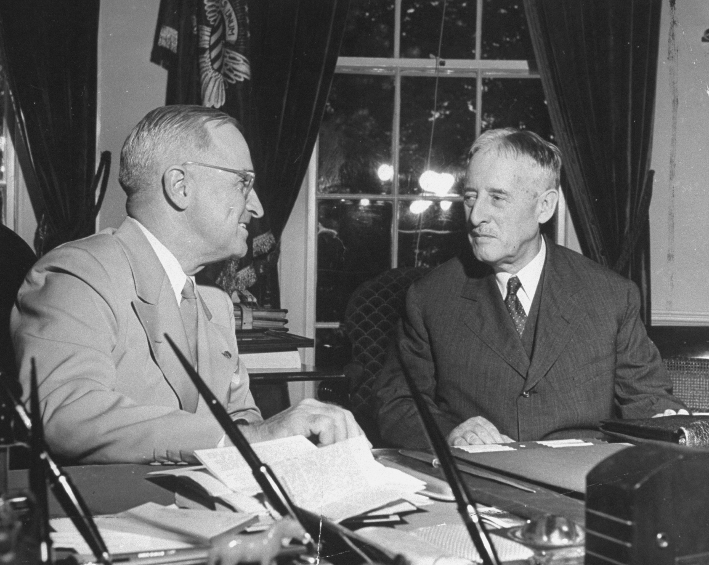
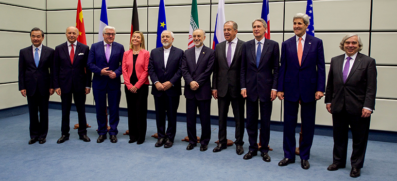
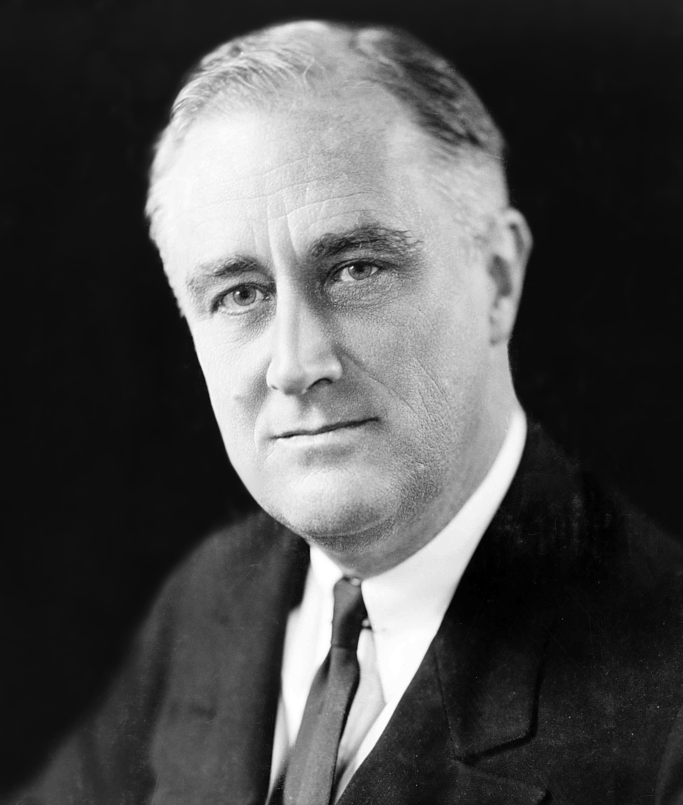
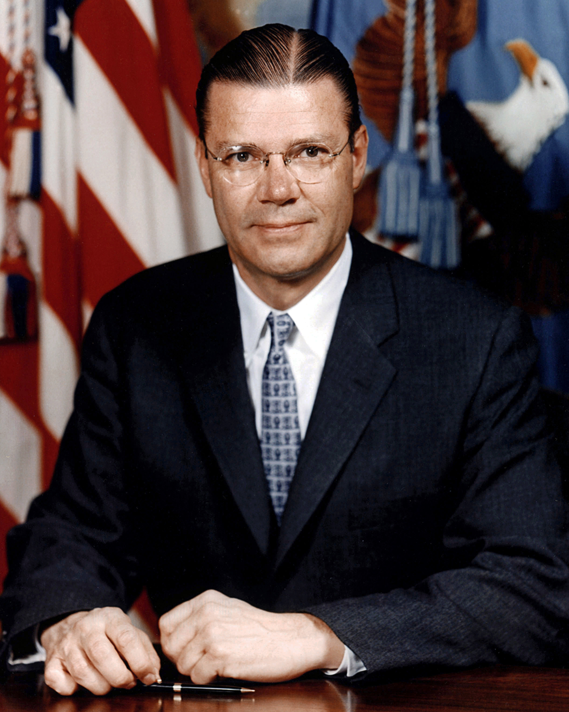
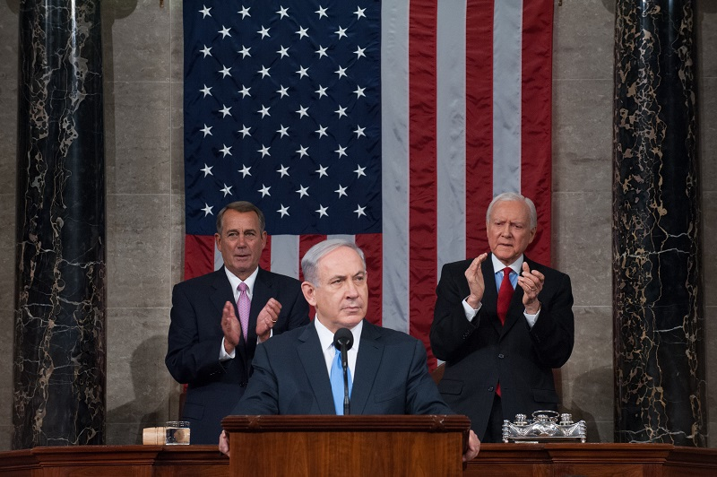

```{r setup, include = FALSE, echo = FALSE}
library(tidyverse)
library(tidyquant)
library(plotly)
library(scales)
library(here)
library(Hmisc)
library(kableExtra)
library(knitr)
library(lubridate)
library(rgdal) # used to read world map data
library(rgeos) 
library(rvest)
library(maptools)
library(ggmap)
library(colorRamps)
library(RColorBrewer)


knitr::opts_chunk$set(fig.width=12, fig.height=8, fig.align="center", echo=FALSE, warning=FALSE, error=FALSE, message=FALSE, dpi=400) 


theme_flynn <- function(){ 
  
      theme_minimal(base_size = 12, base_family = "Arial") %+replace% 
        
        theme(plot.title = element_text(face = "bold", size = 18, hjust = 0, margin = margin(t = 0, b = 0.3, l = 0, r = 0, unit = "cm")),
              plot.subtitle = element_text(size = 12, hjust = 0, margin = margin(t = 0, b = 0.3, l = 0, r = 0, unit = "cm")),
              plot.caption = element_text(face = "italic", size = 8, hjust = 1, margin = margin(t = 0.2, unit = "cm")),
              strip.background = element_rect(fill = "gray80", color = "black"),
              strip.text = element_text(color = "black", face = "bold", margin = margin(t = 0.2, b = 0.2, l = 0.2, r = 0.2, unit = "cm")),
              panel.grid.major = element_line(color = "gray70", size = 0.15),
              panel.grid.minor = element_line(color = "gray90", size = 0.1),
              axis.title = element_text(face = "bold", size = 12),
              axis.title.y = element_text(angle = 90, margin = margin(t = 0, r = 0.5, b = 0, l = 0, unit = "cm")),
              axis.title.x = element_text(margin = margin(t = 0.5, r = 0, b = 0, l = 0, unit = "cm")),
              legend.title = element_text(face = "bold", hjust = 0))
  }
```


# Lecture Overview

1. Traditional views of Congress and the Presidency

2. Institutional powers

  - Appointments

  - International agreements

  - War and conflict

3. Constraining the president


---
class: middle, center, inverse

# Traditional Views


---
class: left, top

# Traditional Views

.pull-left[
**President**

- Enjoys primacy in foreign policymaking

- Elected by one "district"

- Represents the whole country
]

.pull-right[
**Congress**

- Unimportant in foreign policymaking

- Agglomeration of narrow views

- Legislators represent narrow constituencies
]


???

# Notes

President
- Enjoys primacy in foreign policy. Executive branch is less constrained than Congress
- Being elected by the whole country means that presidents have insight into “national interest”. Talk about this in the context of earlier discussions. Northeast had lock on presidency for years. Advanced policies clearly opposed by other parties and parts of the country.
Congress
- Less important in foreign policymaking.
- Too many actors to be efficient. They all represent narrow particularistic interests. Don’t advocate for the national interest.


---
class: left, top

# Traditional Views

Conflicting institutions

- Struggle between President and Congress over control of foreign policymaking

- WWI

- WWII

- Post-Vietnam

???
# Notes
- Foreign policy literature and the press often talk about Congress and the president as conflicting institutions.
- This is dumb---Institutions don't fight.
- Key conflicts between president and Congress over foreign policy often occur during times of divided government, and often immediately following wars.
- Slide highlights examples of such events. Review for class.


---
class: center, middle

```{r institutional-control, fig.width=15, fig.height=5}

nom.data <- read_csv(here("../../../Data Files/Voteview/HSall_members.csv")) %>%
  filter(congress >= 55) %>% 
  group_by(chamber, congress) %>% 
  summarise(demcount = n_distinct(icpsr[party_code==100]),
            repcount = n_distinct(icpsr[party_code==200])) %>% 
  mutate(Party = ifelse(demcount > repcount, "Democrat", "Republican"))

plot.1 <- ggplot(data = nom.data, aes(x = congress, y = chamber, color = Party)) +
  geom_point(size = 6, alpha = 0.6, shape = 15) +
  annotate("rect", xmin = 64, xmax = 66, ymin = -Inf, ymax = Inf, color = "gray80", alpha = 0.4) +
  annotate("rect", xmin = 77, xmax = 81, ymin = -Inf, ymax = Inf, color = "gray80", alpha = 0.4) +
  annotate("rect", xmin = 88, xmax = 93, ymin = -Inf, ymax = Inf, color = "gray80", alpha = 0.4) +
  theme_flynn() + 
  theme(axis.text.x = element_text(angle = 45, hjust = 1)) +
  scale_color_brewer(palette = "Set1", direction = -1) +
  scale_x_continuous(breaks = seq(55, 115, 2)) +
  labs(x = "Congress",
       y = "",
       title = "Party control of institutions, 55th-116th Congress")

plot.1

```

???

# Notes

- Figure showing partisan control of House, Senate, and Presidency. Use to illustrate previous point. 
- Note that these key moments coincide with major conflicts, and divided government.


---
class: center, middle, inverse

# Institutional Powers


---
class: left, top

# Institutional Powers

.middle[
Richard Neustadt:

> The Constitutional Convention did not create a system of separated powers—it created a government of separated institutions sharing powers.

]

???

# Notes

- We shouldn't think of powers as separated, but as shared powers.
- In this light it makes it more apparent when Congress isn't acting and that this is the result of politics---not a lack of institutionally endowed powers.


---
class: left, top

# Institutional Powers


```{r overview table}

table.stuff <- tibble(`Power` = c("Appointments", "International Agreements", "War and the Use of Force"),
                      `President` = c("Presidents appoint executive branch officials", "Negotiate and implement international agreements", "Commander-in-Chief of military forces"),
                      `Congress` = c("Advice and consent of the Senate", "Advice and consent of the Senate", "Raise and support military forces, declare war, oversight"))

table.1 <- kable(table.stuff,
                 'html', 
                 align = c("l", "l", "l")) %>% 
  kable_styling(full_width = TRUE,
                stripe_color = "white") %>% 
  row_spec(0, bold = TRUE, color = "white", background = "#512888")

table.1

```


---
class: left, top

# Institutional Powers


```{r overview table 2}

table.2 <- kable(table.stuff,
                 'html', 
                 align = c("l", "l", "l")) %>% 
  kable_styling(full_width = TRUE,
                stripe_color = "white") %>% 
  row_spec(0, bold = TRUE, color = "white", background = "#512888") %>% 
  row_spec(1, color = "black", background = "deepskyblue") %>% 
  row_spec(2, color = "gray") %>% 
  row_spec(3, color = "gray")

table.2

```


---
class: center, middle, inverse

# Appointments


---
class: left, top

# Appointments


Appointments in two key areas:

- Foreign policy bureaucracy

- Executive Office of the President

???
# Notes
Appointments occur in two key areas
- Foreign policy bureaucracy
  - Traditional positions: Secretary of State, Secretary of Defense, etc.
  - Subject to Senate confirmation
- Executive Office of the President
  - Executive Office of the President was created in 1939 in response to growing demands placed on the executive branch of government.  New Deal led to massive growth in the size of government bureaucracy, as did WWII.


---
class: center, middle

```{r exec-leg-employ}
data <- readxl::read_xlsx(here("../../../Data Files/Executive Branch Employment.xlsx")) %>%
  mutate(transportation = as.numeric(transportation)) %>% 
  pivot_longer(cols = c(2:13)) %>% 
  mutate(value = as.numeric(value))

data.leg <- readxl::read_xlsx(here("../../../Data Files/Executive Legislative Judicial Employment.xlsx")) %>% 
  pivot_longer(cols = c(2:3)) %>% 
  mutate(name = ifelse(name == "executive", "Executive", "Legislative and Judicial"))

colourCount <- length(unique(data$name))
getPalette <- colorRampPalette(brewer.pal(11, "Spectral"))

# Legislative versus executive
ggplot(data = data.leg, aes(x = year, y = value, group = name, fill = name)) +
  geom_area(position = "identity", alpha = .75, colour = "black", size = .1) +
  theme_flynn() + 
  scale_fill_brewer(palette = "Spectral") +
  scale_x_continuous(breaks = seq(1940, 2015, 5)) +
  scale_y_continuous(breaks = seq(0, 3500, 500)) +
  labs(y = "Count (in thousands)",
       x = "Year",
       title = "Executive, legislative, and judicial branch employment, 1962-2012",
       fill = "Branch",
       caption = "Data available from http://www.opm.gov/policy-data-oversight/data-analysis-documentation/federal-employment-reports/#url=Historical-Tables")


```


???

# Notes

- Executive branch grows a lot over time
- It's mostly static in this brief period, but notice how completely dominant it is compared to the other two branches
- Executive needs a lot of people to implement policy, but this also means it has a *very* deep bench of expertise and knowledge.
- Other branches don't have this.


---
class: center, middle

```{r executive-employment, dpi = 400}


# Executive branch over time

exec.emp <- ggplot(data = subset(data, name != "total" & name != "total_civilian"), aes(x = year, y = value, group = name, fill = name)) +
  geom_area(position = "stack", alpha = .75, colour = "black", size = .1) +
  theme_flynn() + 
  scale_fill_manual(values = getPalette(colourCount)) +
  scale_x_continuous(breaks = seq(1940, 2015, 5)) +
  scale_y_continuous(breaks = seq(0, 3500, 500)) +
  labs(y = "Count (in thousands)",
       x = "Year",
       title = "Executive branch employment by department/agency, 1940-2012",
       fill = "Department/Agency",
       caption = "Data available from http://www.opm.gov/policy-data-oversight/data-analysis-documentation/federal-employment-reports/#url=Historical-Tables\nExcludes military personnel and postal employees. Homeland Security includes employees of formerly independent agencies.")
  
exec.emp

```

???
# Notes
- Executive branch grows steadily since the 1940s
- Nearly ever department experiences growth. This makes sense as responsibilities have increased.
- DOD counts for the overwhelming bulk of Executive branch employment, but this has decreased a bit over time. Note this doesn't include active duty military personnel.
- Note that Homeland Security includes employees of formerly independent agencies (e.g. Customs and Border Patrol)


---
class: center, middle

```{r state-emp}


state.df <- readxl::read_xlsx(here::here("../../../Data Files/US Government Files/state-department/state-department-personnel-size.xlsx")) %>% 
  pivot_longer(cols = 2:4)


# state department size
ggplot(data = subset(state.df, name != "Total" & Year >= 1790), aes(x = as.numeric(Year), y = value, group = name, fill = name)) +
  geom_area(position = "stack", alpha = .8, colour = "black", size = .1) +
  theme_flynn() + 
  viridis::scale_fill_viridis(discrete = TRUE) +
  scale_x_continuous(breaks = seq(1790, 2020, 20)) +
  scale_y_continuous(breaks = seq(0, 20000, 4000), limits = c(0, 20000)) +
  labs(y = "Count",
       x = "Year",
       title = "State Department personnel, 1790-2010",
       subtitle = "World War II is a watershed moment in US diplomacy",
       fill = "Location",
       caption = "Data obtained from US State Department, Office of the Historian: https://history.state.gov/about/faq/department-personnel")

```

???
# Notes
- State Department employment skyrockets with WWII
- It's easy to lose sight of how transformative this period was, and we often overstate the importance of particular moments in time, but this was huge!


---
class: center, middle


```{r approval-table}

approval <- tibble(`Senate Approval Required` = c("Secretary of State",
                                         "Secretary of Defense",
                                         "Secretary of the Treasury",
                                         "Director of the Central Intelligence Agency"),
                   `No Senate Approval Required` = c("Assistant to the President for National Security Affairs",
                                                     "Chief of Staff",
                                                     "Director of State Department Policy Planning Staff",
                                                     "Deputy Director of Central Intelligence Agency"))

kable(approval,
      'html',
      align = c("l", "l"),
      caption = "Positions subject to presidential appointment and senate approval") %>% 
  kable_styling(full_width = TRUE) %>% 
  row_spec(0, color = "white", background = "#512888", bold = TRUE)

```

???
# Notes

- Two broad classes of appointees
- Some require Senate approval to serve. This represents a check on presidential powers by ensuring that there is some level of consensus on employees
- Others do not require Senate approval. Gives the president more flexibility.
- Note the National Security Adviser
  - We'll talk more about this later, but this has contributed to the shift in power from State to the NSC


---
class: center, middle


<figure>

<figcaption>Charles Bohlen</figcaption>
</figure>


<figure>

<figcaption>John Tower</figcaption>
</figure>


???
# Notes

- Most appointments get through the Senate

- Charles Bohlen and John Tower as examples

- Successful: Charles Bohlen was appointed Ambassador to the USSR in 1953. Succeeded George Kennan after Kennan was declared persona non grata by Stalin. Confirmed 74-13. He was targeted by Joseph McCarthy for being a closeted homosexual and communist sympathizer. Note this is the height of “bipartisanship”

- Unsuccessful: John Tower was George H. W. Bush’s (Sr.) nominee for Defense Secretary in 1989. Also a rare rejection. Served in the Senate for  years. Rejected because he had a reputation for being a heavy drinker and a womanizer, which must be saying something for a US Senator.


---
class: center, middle

<figure>

<figcaption>President Harry Truman meets with Secretary of War Henry Stimson</figcaption>
</figure>

???
# Notes

- Picture of Henry Stimson and Harry Truman. Stimson was a key appointment of FDR, and had a lot of credibility. 
- Accounts are conflictual here, but some indicate that when Truman was in Congress he often deferred to Stimson who gave Truman assurances that the funds Truman was asking about were being put to good use.


---
class: center, middle


<figure>

<figcaption>Henry Kissinger</figcaption>
</figure>


<figure>

<figcaption>Zbigniew Brzrezinski</figcaption>
</figure>


<figure>

<figcaption>Condoleeza Rice</figcaption>
</figure>

???
# Notes

- National Security Advisors.
  - Executive Office of the President. This position has become increasingly influential over time.
  - Cabinet appointments were traditionally relied upon for policy advice throughout American history.
  - Until FDR the President did not have the legal authority to create new positions.  FDR relied on a series of advisors but could not legally employ them in the service of the US government.  He would use vacant cabinet posts. Executive Office of the President was created in 1939 in response to growing demands placed on the executive branch of government.
  - Positions within the EOP are not subject to Congressional approval. This allows the president enormous latitude in circumventing legislative checks.
  - Presidents begin to rely on Chiefs of Staff, Senior Advisors, and National Security Advisors in formulating policy. This comes at the expense of traditional advisory positions like the Secretary of State. This position in particular was severely wounded as a result of the anti-communist fever of the early 1950s.

---
class: center, middle, inverse

# International Agreements


---
class: left, top

# Institutional Powers


```{r overview table 3}

table.3 <- kable(table.stuff,
                 'html', 
                 align = c("l", "l", "l")) %>% 
  kable_styling(full_width = TRUE,
                stripe_color = "white") %>% 
  row_spec(0, bold = TRUE, color = "white", background = "#512888") %>% 
  row_spec(1, color = "gray") %>% 
  row_spec(2, color = "black", background = "deepskyblue") %>% 
  row_spec(3, color = "gray")

table.3

```


---
class: left, top

# International Agreements

Two types:

- Treaties

- Executive agreements

???

# Notes

- Two broad classes of agreements
- Closely related, but different in some important ways


---
class: left, top

# International Agreements

### Treaties

Both Congress and the President play important parts

- Executive negotiates treaties

- Two-thirds of senators present must vote in favor

- President ratifies the treaty (not the Senate)

--

What about the House of Representatives?

???

# Notes

- Executive negotiates treaties
- Constitution outlines these powers:
  - Article II Section 2: Two-thirds of Senate must vote in favor of treaty to pass. This is a high barrier
  - Article I Section 10: States cannot enter into treaties. Purely the domain of the national government.

*Key:* President ratifies treaties, the Senate only consents (possibly with reservations and amendments). Most treaties receive Senate consent. Selection effects.
House also involved indirectly. Must appropriate funds to implement treaty, making House consent implicitly important.


---
class: left, top

# International Agreements


### Executive Agreements

Similar process, but different mechanics

- Two key types:

 - "Sole Executive Agreement"
 
 - "Congressional-executive agreements"
 
- Negotiated by the president and/or bureaucratic agents

- Can be just as binding

???

# Notes

- Two types: Sole executive and congressional-executive. Sole executive (not involving Congress at all) is relatively rare.
- Sole executive agreements enter into force when executive agents sign the document
- Congressional-executive require a joint resolution in Congress, requiring only majority support before agreement enters into force. Often these stem from prior Congressional delegation of powers (e.g. RTAA of 1934)
- Negotiated by president and/or bureaucratic agents
- Does not require two-thirds Senate approval
- Can be just as binding, however. Reputational costs associated with breaking commitments.


---
class: left, top


# International Agreements

.pull-left[
Example: Free trade

- Reciprocal Trade Agreement Act of 1934

- Congressional delegation of "fast track" authority

To right: Secretary of State Cordell Hull

]


.pull-right[

]

???

#Example: Free trade
- Reciprocal Trade Agreement Act of 1934. Congress formerly controlled the power to set tariff levels, but delegates this authority to the executive in 1934. Secretary of State Cordell Hull was tasked with negotiating free trade deals in which he could negotiate up to 50% reductions in tariff levels in exchange for similar reductions in other states’ tariff levels.
- Resulted from changing interests of Republicans and Democrats in Congress, not because Congress as a body decided to delegate power, or because it was in the national interest.
- Limited Congressional votes to up or down—no amendments.


---
class: left, top

# International Agreements

.pull-left[
Strategic Arms Limitation Talks (SALT)

- Anti-Ballistic Missile Treaty (ABM Treaty)

- Executive agreement limiting nuclear weaponry

To right: President Nixon and Soviet Premier Leonid Brezhnev shaking hands after signing the SALT I agreement.
]


.pull-right[

]

???

#Example: Strategic Arms Limitation Talks (SALT I)
- Soviets began building ICBMs and anti-ballistic missile (ABM) batteries in the 1960s. ABMs would allow USSR greater chance of achieving first-strike status.
- Johnson administration initiates negotiations in 1967. Formal talks begin under Nixon in 1969.
- ABM Treaty: Limited to 200 interceptors and 2 missile defense sites. One at the national capital and one to protect an ABM field.
- SALT agreement: Put limits on offensive missiles at 1,600 for the USSR and 1,054 for the US. Restricted number of Submarines capable of launching ICBMs. US has lower number, but had better missile technology and more MIRVs (multiple independently targetable reentry vehicles). Part of SALT I agreements mandating a five year freeze on deployment of new offensive nuclear weapons. This was an executive agreement. Interim freeze was subject to House and Senate approval


---
class: left, top

# International Agreements

### Other Stuff?

.pull-left[

Joint Comprehensive Plan of Action (JCPOA / aka the Iran Nuclear Deal)

- Not a treaty

- Also not an executive agreement

- So what is it?

  - A "political agreement"
  
  - Not legally binding
]


.pull-right[

]

???
# Example: Joint comprehensive Plan of Action (Iran Nuclear Deal)

- Parties include: Iran and the P5 + 1 (China, France, Germany, Russia, the United Kingdom, and United States)
- Concluded on July 14, 2015
- Impelemented on January 16, 2016
- Endorsed by the UN Security Council
- Sets limits on:
  - Enrichment capabilities
  - Uranium stockpiles (requires removal of 98% of stockpile)
  - Activities conducted at various facilities in Iran
  - Technological acquisitions and R&D
  - Requires Iran to disassemble certain equipment already in place
- Also establishes oversight regime. 
  - International Atomic Energy Agency can inspect any Iranian facilities suspected of developing weapons
  - Installation of surveillance cameras in Iranian facilities


---
class: center, middle, inverse

# War and the Use of Force


---
class: left, top

# War and the Use of Force


```{r overview table 4}

table.4 <- kable(table.stuff,
                 'html', 
                 align = c("l", "l", "l")) %>% 
  kable_styling(full_width = TRUE,
                stripe_color = "white") %>% 
  row_spec(0, bold = TRUE, color = "white", background = "#512888") %>% 
  row_spec(1, color = "gray") %>% 
  row_spec(2, color = "gray") %>% 
  row_spec(3, color = "black", background = "deepskyblue")

table.4

```


---
class: left, top

# War and the Use of Force


The president enjoys significant advantages

- Institutional powers

- First-mover advantage

- Information asymmetries

- Technological change

???

# Notes
- President enjoys advantages
- Institutional powers as Commander-in-Chief
- First-mover advantage. Can deploy military forces without prior authorization of Congress, leaving Congress to respond.
  - Jefferson sent Marines to fight Barbary Pirates with no Congressional authorization.
- Information asymmetries. Military and DOD officials report to President through chain of command, meaning executive branch receive information before members of Congress. Executive officials often have to brief members of Congress on what’s going on.


---
class: center, middle

<figure>

<figcaption>President Franklin Roosevelt</figcaption>
</figure>


<figure>

<figcaption>President George W. Bush</figcaption>
</figure>

???

# Notes
- Both oversaw massive expansion of executive war-making powers.
- Both oversaw huge increases in executive bureaucracy.


---
class: center, middle

<figure>

<figcaption>President Lyndon Johnson</figcaption>
</figure>


<figure>

<figcaption>Robert McNamara</figcaption>
</figure>

???

# Notes

- Example of how information asymmetries and first-mover advantage help executive. Tonkin-Gulf Resolution
- Passed August 7, 1964. Gave the president broad discretionary authority to protect American interests in Southeast Asia.
- Came as the result of alleged attacks on two US warships that were operating off the coast of Vietnam gathering intelligence.
- First attack did not provoke a military response, and the Johnson administration issued a warning to the North Vietnamese forces regarding their behavior. Second series of attacks came days later.
- Johnson administration used this case to bolster domestic support for the war and to secure broader authority to escalate US involvement.  This marks the real buildup of US forces in Vietnam. High point is about 540,000 US troops.
- By the time Congress turns against the war it’s really difficult to rein in executive action. Nixon administration begins secret war in Cambodia and Laos.


---
class: left, top

# War and the Use of Force

Authorization for the Use of Military force (2001 AUMF)

- Drafted in response to September 11 attacks

- Grants broad authority to the president to use military force

> Section 2, Subsection (a): That the President is authorized to use all necessary and appropriate force against those nations, organizations, or persons he determines planned, authorized, committed, or aided the terrorist attacks that occurred on September 11, 2001, or harbored such organizations or persons, in order to prevent any future acts of international terrorism against the United States by such nations, organizations, or persons.


???

# Notes:

- The 2001 Authorization to use military force has been invoked a number of times since 2001 to justify a wide range of military operations
- Broad interpretation has allowed presidents opportunities to expand US military operations with little congressional oversight.


---
class: left, top

# War and the Use of Force

Authorization for the Use of Military Force Against Iraq Resolution of 2002 (2002 AUMF)

- Expresses Congress' support of presidential efforts to 
  
  - Enforce UN Security Council resolutions regarding Iraq

  - Pressure UN Security Council to ensure Iraq complies with UN Security Council resolutions
  
- Grants broad authority to use military force

- Notably ties in to the 2001 AUMF and the aim of targeting those "nations, organizations, or persons who planned, authorized, committed, or aided the terrorist attacks that occurred on September 11, 2001"


???

# Notes

- Similar to 2001 AUMF in its broad scope


---
class: left, top

# War and the Use of Force

2001 and 2002 AUMFs have been used to justify a wide range of military operations in dozens of countries under three presidents.

Prominent examples include:

- 2014 operations against ISIS in Iraq and Syria

- 2016 operations against al-Shabab in Somalia

- 2019 Killing of Maj. Gen. Qasem Soleimani of Iran's Quds Force

???

# Notes

- Discuss how both AUMFs have been used to justify a wide range of military actions under Bush, Obama, and now Trump
- Notably, Obama becan to lean more heavily on using the 2001 AUMF as a legal justification for more expansive actions


---
class: left, top

```{r aumf-table., dpi=400}
aumf.data <- readxl::read_xlsx(("../../../Data Files/US Government Files/CRS/aumf-records.xlsx")) %>% 
  mutate(newact = ifelse(grepl(".*contin.*", `Country/Action/Target`), "Continuing", "New"),
         aumf.authority = ifelse(LegislativeAuthority == "Yes" & AUMF2001 == "Yes" & AUMF2002 == "No", "AUMF2001",
                                 ifelse(LegislativeAuthority == "Yes" & AUMF2001 == "No" & AUMF2002 == "Yes", "AUMF2002",
                                        ifelse(LegislativeAuthority == "Yes" & AUMF2001 == "Yes" & AUMF2002 == "Yes", "All", "Article II Only"))),
         aumf.authority = factor(aumf.authority, levels = c("Article II Only", "AUMF2001", "AUMF2002", "All")),
         Date = format(as.Date(Date), "%Y")) %>% 
  arrange(Date, aumf.authority) %>% 
  group_by(Date) %>% 
  mutate(number = seq(from = 1, to = n(), 1)) %>% 
  arrange(Date, newact) %>% 
  mutate(number.newact = seq(from = 1, to = n(), 1))


ggplot(aumf.data, aes(x = Date, y = number)) +
  geom_point(aes(fill = aumf.authority), color = "black", size = 9.5, pch = 21) +
  theme_flynn() + 
  theme(axis.text.x = element_text(angle = 45, hjust = 1)) +
  scale_fill_brewer(palette = "Set1", drop = FALSE) +
  labs(x = "Date",
       y = "Count",
       fill = "Authority Cited",
       title = "Legal authority cited for military action, 2001-2017",
       caption = "Data compiled from Congressional Research Service Report: https://fas.org/sgp/crs/natsec/pres-aumf.pdf")


#ggplot(aumf.data, aes(x = Date, fill = aumf.authority)) +
#  geom_dotplot(binaxis = "x",  stackgroups = TRUE, stackratio = 1.02, dotsize = 0.94) +
#  theme_flynn() + 
#  theme(text = element_text(size = 16),
#        axis.text.x = element_text(angle = 45, hjust = 1)) +
#  scale_fill_brewer(palette = "Set1", drop = FALSE) +
#  ylim(0, max(table(aumf.data$Date))) +
#  labs(x = "Date",
#       y = "Count",
#       fill = "Authority Cited",
#       title = "Legal authority cited for military action, 2001-2017")


```

???

# Notes

- Note that the Bush Administration relied mostly on the 2001 AUMF early on, but in its second term relied almost exclusively on Constitutional powers
- Also note that Obama relies more heavily and directly on the 2001 AUMF
- Little exclusive reliance on 2002 AUMF, but Obama and Trump have relied on all sources at certain points


---
class: center, middle

```{r aumf-chart-2}


ggplot(aumf.data, aes(x = Date, y = number.newact)) +
  geom_point(aes(fill = newact), color = "black", size = 9.5, pch = 21) +
  theme_flynn() + 
  theme(axis.text.x = element_text(angle = 45, hjust = 1)) +
  scale_fill_brewer(palette = "Set1", drop = FALSE) +
  labs(x = "Date",
       y = "Count",
       fill = "New and\nContinuing\nOperations",
       title = "Legal authority cited for military action, 2001-2017",
       caption = "Data compiled from Congressional Research Service Report: https://fas.org/sgp/crs/natsec/pres-aumf.pdf")

```

???

# Notes

- Briefly, note that we've seen a steady accumulation of ongoing military operations since 2001. 
- Much of this reflects the rise of Islamic State, but also the expansion of anti-terror operations beyond the Middle East throughout sub-Saharan Africa.


---
class: left, top

# War and the Use of Force

War Powers Resolution of 1973

- Regular consulations, "in every possible instance," with Congress prior to deploying troops

- Report to Congress within 48 hours of troop deployment explaining cause and justification for deployment

- Time limits on deployment of US troops

- Empowers Congress to end US troop deployments abroad by concurrent resolution


???
# Notes
- Intended to rein in the “imperial presidency”
- President can use force without declaration of war to protect US territory, protect American forces stationed outside the US; rescue American citizens in certain situations.
- Congress must be notified within 48 hours. In other cases, specific Congressional authorization needed.
- In any case, the President must get authorization within 60 days (90 if troops in danger) or pull-out is mandatory
- Also, Congress can demand pull-out by majority vote not subject to veto

- Problem: Act rarely invoked, never enforced. Leads to negotiation.
- Congress threatens action over US troops in Lebanon in 1982, but reaches compromise for withdrawal within 18months.  (Similar compromise over Somalia in 1994, Bosnia in 1995)
- No President has ever admitted to being bound by Act, because of lack of veto power over it.
- James Baker, G. H. W. Bush’s Secretary of State, testified before the House International Relations Committee in 1995. Republicans had just taken control of Congress, and the President is Bill Clinton (a Democrat). Republicans begin pushing for a more active role in foreign policymaking, but Baker urges them to resist the urge to meddle too much in foreign policy, arguing that the US still had a leading role to play in the world and that presidents need flexibility.


---
class: left, top

# War and the Use of Force

The President enjoys several advantages, but what about Congress?

- Tenure

- Expertise

- Legislative and budgetary powers

- Oversight powers

- Approval of appointments

- Public outreach

???

# Notes

President has several advantages, but Congress can still do stuff:
  - Long tenures and committee assignments mean legislators have lots of time to develop expertise about various issues.
  - Legislative and budgetary powers mean Congress can affect a wide range of foreign policy issues through control of the purse.
  - Issue linkage: Might not cut spending on troops deployed, but can cut spending on other projects the president likes.
  - Approve appointments. Recall that presidents sometimes compensate for increased opposition in Congress by making bipartisan appointments. This can help to bring executive policies closer to legislators’ preferred policies.
  - Members of Congress can, and often do, go on television to criticize presidents. They can rally public opposition to executive policies and raise awareness of executive actions.

Actual effects?
  - Divided government and Congressional control correlate with a lower likelihood of using military force, and also to shorter duration military deployments.


---
class: center, middle

```{r oversight-fig}


oversight <- read_csv(here("../../../Data Files/policy-agendas-project/US-Legislative-congressional_hearings-19.4.csv")) %>% 
  group_by(year) %>% 
  mutate(hearings_total = n_distinct(id)) %>% 
  group_by(year) %>% 
  mutate(hearings_defense = n_distinct(id[majortopic == 16]),
         hearings_trade = n_distinct(id[majortopic == 18]),
         hearings_intaff = n_distinct(id[majortopic == 19]),
         hearings_defense_days = sum(Days[majortopic == 16], na.rm = TRUE),
         hearings_trade_days = sum(Days[majortopic == 18], na.rm = TRUE),
         hearings_intaff_days = sum(Days[majortopic == 19], na.rm = TRUE)) %>% 
  group_by(year) %>% 
  summarise(hearings_total = mean(hearings_total, na.rm = TRUE),
            hearings_defense = mean(hearings_defense, na.rm = TRUE),
            hearings_trade = mean(hearings_trade, na.rm = TRUE),
            hearings_intaff = mean(hearings_intaff, na.rm = TRUE),
            hearings_defense_days = mean(hearings_defense_days, na.rm = TRUE),
            hearings_trade_days = mean(hearings_trade_days, na.rm = TRUE),
            hearings_intaff_days = mean(hearings_intaff_days, na.rm = TRUE)) 


ggplot(oversight) +
  geom_line(aes(x  = year, y = hearings_defense_days, color = "Defense"), size = 2) +
  geom_line(aes(x = year, y = hearings_intaff_days, color = "International Affairs"), size = 2) +
  geom_line(aes(x = year, y = hearings_trade_days, color = "Trade"), size = 2) +
  theme_flynn() + 
  theme(text = element_text(size = 16)) +
  scale_color_brewer(palette = "Set1") +
  scale_x_continuous(breaks = seq(1950, 2020, 10)) +
  labs(color = "Topic Area",
       x = "Year",
       y = "Days",
       title = "Total number of committee hearing-days, 1946-2017",
       subtitle = "Note the decline in Congressional engagement over time",
       caption = "Data obtained from the Policy Agendas Project http://comparativeagendas.net/us\nPlot shows the sum total of hearing days across three policy areas per year.\n Totals may exceed 365 if multiple committees are holding many hearings.")


```

???

# Notes

- Recent years have seen a decline in Congressional activity and oversight in foreign and defense policy
- There has been a general decline in defense oversight over the entire post-War period.
- This is a choice. Members of Congress and Party leaders have ceded ground to the executive.


---
class: center, middle

<figure>

<figcaption>Israeli Prime Minister Benjamin Netanyahu addresses a joint session of Congress, March 3, 2015.</figcaption>
</figure>


???

# Notes
- Picture of Benjamin Netanyahu speaking before a joint session of Congress
- Invited by John Boehner to speak to a joint session of Congress on Iran on March 3. 
- Boehner did not consult White House or State Department officials before arranging the session.
- Critics view this as an attempt to undermine Obama’s foreign policy, as well as a ploy to boost Netanyahu’s own political fortunes since Israel is holding Elections a couple of weeks after this event.


---
class: center, middle

<figure>

<figcaption>An open letter from Republican senators to the Iranian government regarding negotiations over Iran's nuclear program from 2015.</figcaption>
</figure>

???

# Notes

- Picture of a letter Senator Tom Cotton to Iranian leadership 
- Criticized as an attempt to undermine Obama Administration efforts to cement a deal with the Iranians
- Republicans have generally been more hawkish on Iran, arguing that any deal with be exploitative to the US and Iran will only cheat. 
- Republicans view military force as the only solution to preventing Iran from building a nuclear weapon.


