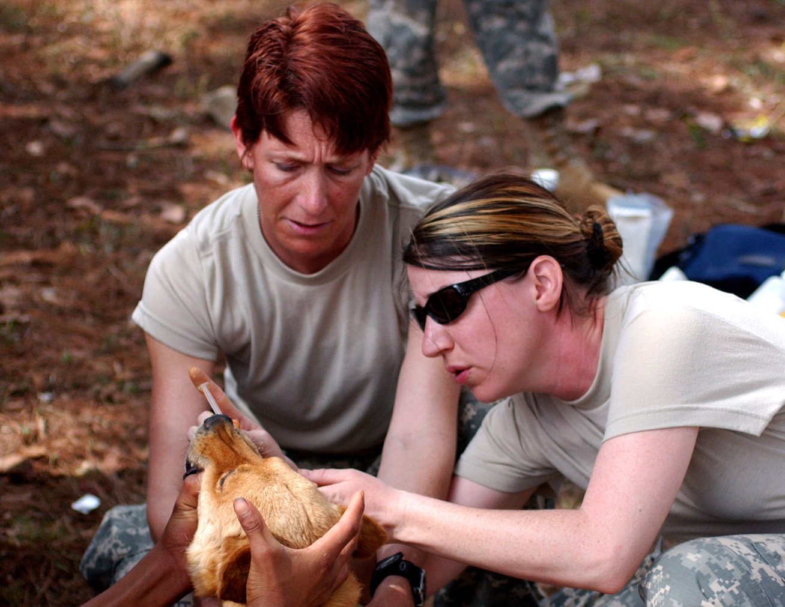

```{r setup, include = FALSE, echo = FALSE, message=FALSE, warning=FALSE}
library(tidyverse)
library(tidyquant)
library(plotly)
library(scales)
library(here)
library(Hmisc)
library(kableExtra)
library(knitr)
library(lubridate)
library(rgdal) # used to read world map data
library(rgeos) 
library(rvest)
library(broom)
library(troopdata)
library(maptools)
library(patchwork)
library(ggmap)
library(sp)
library(sf)
library(colorRamps)
library(ggtext)
library(RColorBrewer)


knitr::opts_chunk$set(fig.width=12, fig.height=8, fig.align="center", echo=FALSE, warning=FALSE, error=FALSE, message=FALSE, dpi=400) 

sysfonts::font_add_google("Oswald", family = "oswald")
showtext_auto()

theme_flynn <- function(){ 
  
      theme_minimal(base_size = 12, base_family = "oswald") %+replace% 
        
        theme(plot.title = element_text(face = "bold", size = 18, hjust = 0, margin = margin(t = 0, b = 0.3, l = 0, r = 0, unit = "cm")),
              plot.subtitle = element_text(size = 12, hjust = 0, margin = margin(t = 0, b = 0.3, l = 0, r = 0, unit = "cm")),
              plot.caption = element_text(face = "italic", size = 8, hjust = 1, margin = margin(t = 0.2, unit = "cm")),
              strip.background = element_rect(fill = "gray80", color = "black"),
              strip.text = element_text(color = "black", face = "bold", margin = margin(t = 0.2, b = 0.2, l = 0.2, r = 0.2, unit = "cm")),
              panel.grid.major = element_line(color = "gray70", size = 0.15),
              panel.grid.minor = element_line(color = "gray90", size = 0.1),
              axis.title = element_text(face = "bold", size = 12),
              axis.title.y = element_text(angle = 90, margin = margin(t = 0, r = 0.5, b = 0, l = 0, unit = "cm")),
              axis.title.x = element_text(margin = margin(t = 0.5, r = 0, b = 0, l = 0, unit = "cm")),
              legend.title = element_text(face = "bold", hjust = 0))
}

theme_flynn_map <- function(){
  
  theme_void(base_size = 12, base_family = "Arial") %+replace% 
    
    theme(plot.title = element_text(face = "bold", size = 18, hjust = 0, margin = margin(t = 0, b = 0.3, l = 0, r = 0, unit = "cm")),
          plot.subtitle = element_text(size = 12, hjust = 0, margin = margin(t = 0, b = 0.3, l = 0, r = 0, unit = "cm")),
          plot.caption = element_text(face = "italic", size = 8, hjust = 1, margin = margin(t = 0.2, unit = "cm")),
          strip.background = element_rect(fill = "gray80", color = "black"),
          strip.text = element_text(color = "black", face = "bold"),
          panel.grid.major = element_line(color = "white", size = 0),
          panel.grid.minor = element_line(color = "white", size = 0),
          #axis.title = element_text(face = "bold", size = 0),
          #axis.title.y = element_text(margin = margin(t = 0, r = 0.5, b = 0, l = 0, unit = "cm")),
          #axis.title.x = element_text(margin = margin(t = 0.5, r = 0, b = 0, l = 0, unit = "cm")),
          legend.title = element_text(face = "bold"),
          legend.position = "bottom",
          legend.key.height = unit(0.6, "cm"),
          legend.key.width = unit(2.5, "cm"))
}

```

# Lecture Overview

1. What are military deployments?

2. What do deployed personnel do?

3. Why deploy military personnel?

4. What effects do military deployments have on host-state?


---
class: left, top

# Key Questions

1. How do troop deployments compare to alliances?

2. What are some of the tradeoffs in deploying military personnel?

3. What are some of the benefits to deploying/hosting military personnel?

4. How do we evaluate the costs and benefits of US overseas basing?


---
class: center, middle, inverse

# What are military deployments?


---
class: center, middle

```{r fig-time}
troops.data <- readxl::read_xls(here("../../../Data Files/troopMarch2005.xls"), sheet = 2)

time.data <- troops.data %>% 
  subset(Country == "TOTAL - WORLDWIDE" 
         | Country == "Total - Foreign (Sum)" 
         | Country  == "% Troops Foreign/Worldwide (Sum)" 
         | Country == "Total - Foreign (Ashore and Afloat)") %>%
  mutate_if(is.numeric, as.character) %>%
  mutate_if(is.double, as.character) %>% 
  select(2:58) %>% 
  pivot_longer(cols = c(`1950`:`2005`)) %>% 
  rename("year" = "name", "group" = "Country") %>% 
  mutate(group = factor(group, labels = c("Percent Overseas", "Total Foreign (A&A)", "Total Foreign", "Total Worldwide")),
         group = ordered(group, c("Total Worldwide", "Total Foreign (A&A)", "Total Foreign", "Percent Overseas")),
         value = as.numeric(paste(value)),
         year = as.numeric(paste(year)))


# total and overseas deployments
ggplot(data = subset(time.data, group == "Total Foreign" 
                     | group == "Total Worldwide"), aes(x = year, y = value, group = group, fill = group)) +
  geom_area(position = "identity", alpha = .8, color = "black", size = .1) +
  theme_flynn() +
  scale_y_continuous(breaks = seq(0, 3500000, 500000), labels = comma_format()) +
  scale_x_continuous(breaks = seq(1950, 2005, 5)) +
  scale_fill_brewer(palette = "Set2") +
  labs(x = "Year",
       y = "Count",
       fill = "Category",
       title = "US military personnel and overseas deployments, 1950-2005",
       subtitle = "A substantial portion of US personnel have been stationed overseas",
       caption = "Data obtained from https://www.heritage.org/defense/report/global-us-troop-deployment-1950-2003")


```


---
class: center, middle

```{r}

# percent overseas
ggplot(data = subset(time.data, group == "Percent Overseas"), aes(x = year, y = value/100, group = group, fill = group)) +
  geom_line(size = 1.5) + 
  theme_flynn() +
  scale_y_continuous(breaks = seq(.12, .32, .04), limits = c(.12, .32), labels = percent_format()) +
  scale_x_continuous(breaks = seq(1950, 2005, 5)) +
  labs(x = "Year",
       y = "",
       title = "US overseas deployments as a percent of all personnel, 1950-2005",
       subtitle = "A substantial portion of US personnel have been stationed overseas",
       caption = "Data obtained from https://www.heritage.org/defense/report/global-us-troop-deployment-1950-2003")

```


---
class: center, middle

```{r troop map, message = FALSE}
library(viridis)
library(maps)
library(maptools)
library(ggmap)

# Map of deployments
# Note: Country code MUST generate a new variable by mutate or assignment.
map.data <- troops.data[31:216, ] %>%
  subset(select = c("Country", "2005")) %>% 
  as.data.frame() %>% 
  arrange(Country) %>% 
  mutate(iso3n = countrycode::countrycode(Country, 'country.name', 'iso3n', nomatch = NA)) %>% 
  rename("troops" = `2005`, "region" = "Country") 

map.base.1 <- map_data("world")

map.df <- map.base.1 %>% 
  mutate(iso3n = countrycode::countrycode(region, "country.name", "iso3n")) %>% 
  left_join(map.data, by = c("iso3n")) %>% 
  mutate(troops = ifelse(troops == 0, NA, troops))

ggplot() +
  geom_polygon(data = map.df, aes(x = long, y = lat, fill = troops, group = group),  color = "white", size = 0.01) +
  theme_void() +
  theme(plot.title = element_text(face = "bold", size = 18),
      plot.caption = element_text(face = "italic", size = 6, hjust = 1.25)) +
  coord_equal(ratio = 1.3) +  
  scale_fill_viridis(na.value = "gray90", trans = "log", breaks = c(1, 10, 100, 1000, 10000, 100000), labels = comma_format()) +
  labs(fill = "Deployment\nSize (log scale)",
       title = "US military deployments, 2005",
       caption = "Data obtained from https://www.heritage.org/defense/report/global-us-troop-deployment-1950-2003")

  

```


---
class: center, middle

```{r base map}

# Map showing location of bases
base.data <- read.csv(here("../../../Projects/Minerva grant documents/Papers/Published/Primary Paper - Contact/apsr-replication-files/apsr-data/", "Bases.csv"))

map.base.2 <- map_data("world")

sample.data <- data.frame(region = c("UK", "Belgium", "Netherlands", "Spain", "Portugal", 
                                    "Germany", "Italy", "Poland", "Kuwait", "Turkey", "Japan",  
                                    "South Korea", "Philippines", "Australia"),
                          value = c(1),
                          stringAsFactors = FALSE)


ggplot() +
  geom_polygon(data = map.base.2, aes(x = long, y = lat, group = group, map_id = region), fill = "gray90", color = "black", size = 0.01) +
  geom_point(data = base.data, aes(x = Longitude, y = Latitude), color = "red",  alpha = 0.5) +
 theme_void() +
  theme(plot.title = element_text(face = "bold", size = 18),
      plot.caption = element_text(face = "italic", size = 6, hjust = 1.25)) +  
  theme(title = element_text(size = 18, face = "bold")) +
  coord_equal(ratio = 1.3) +
  labs(title = "U.S. Military Facilities Around the Globe from the Cold War to the Present",
       caption = "Data obtained from Vine (2015) and updated by graduate research team.")


```


---
class: left, top

# What are military deployments?

Let's define them

> The permanent or temporary placement of military personnel and assets in a location outside of the United States and its territories.


Different types:

- Combat versus non-combat deployments

- Marine Embassy Guards/Marine Security Guard


---
class: center, middle

<figure>

<figcaption>US, German, Spanish and Polish troops of the NATO enhanced Forward Presence battle groups with their tanks get ready for exercises in Adazi, Latvia. These 2018 exercises involved approximately 50,000 military personnel from 31 countries.</figcaption>
</figure>


---
class: center, middle

<figure>

<figcaption>U.S. Marines from 3rd Marine Expeditionary force deployed from Okinawa, Japan, participate in the winter military training exercise with South Korean soldiers on January 28, 2016 in Pyeongchang-gun, South Korea. U.S. and South Korean marines participate in the endurance exercise in temperature below minus 20 degrees celsius under a scenario to defend the country from any possible attacks from North Korea. (Photo by Chung Sung-Jun/Getty Images)</figcaption>
</figure>


---
class: center, middle

<figure>

<figcaption>LAGUNA DEL RINCON, Honduras - Army Staff Sgt. Robyn Porter of the 478th Civil Affairs Battalion of Miami, Florida and Army Reserve Sgt. Mitzi Porter of the 993rd Medical Detachment (Veterinary Services) of Aurora, Colo. administer medication to a dog during their visit to this rural town. Veterinarians, like the two Porters, provided basic medical and dental care to dogs, cats and livestock during daylong visits to this and other remote Honduran villages. U.S. military medical personnel are in Honduras for the joint training exercise Beyond the Horizon. The event provides medical attention, as well as infrastructure renovation, to rural areas in this Central American country. (Photo by Sgt. Claude W. Flowers, 304th Public Affairs Detachment.)</figcaption>
</figure>


---
class: left, top

# Why Deploy Troops?

Lots of reasons

- Balance against power/threat
- Signal credibility
- Facilitate power projection capabilities
- Crisis intervention
- Train host-state soldiers
- Field experience/training for US personnel
- Humanitarian operations
- Secure trade and investment relationships


---
class: left, top

# Why Deploy Troops?


Alliances vs. Troops: Why do states choose one over the other?

- Cheap talk

- Tying hands vs sinking costs

- Force Projection


---
class: center, middle, inverse

# Effects of Military Deployments


---
class: left, top

# Effects of Military Deployments

What are the consequences of deployments?

- Security effects

- Economic effects

- Public opinion


---
class: left, top

# Effects of Military Deployments

Security Effects

- Reduced military spending (for most) and a smaller host-state military

- Effect is also context-dependent

- Some increased likelihood of conflict


---
class: center, middle


---
class: center, middle


---
class: center, middle


---
class: center, middle

```{r spending figure}

library(brms)
library(tidybayes)
library(modelr)
library(rstan)
library(ggpubr)

# Conflicted package really fucks things up
if(any(grepl("package:conflicted", search()))) detach("package:conflicted") else message("package conflicted not loaded")


# Parallelize machine
options(mc.cores = parallel::detectCores())
ncores <- parallel::detectCores()
rstan_options(auto_write = TRUE)
VAGUEPRIOR <- c(set_prior("cauchy(0, 10)", class = "b"),
                set_prior("cauchy(0, 20)", class = "Intercept"))


milspend <- read_csv(here("../../../Projects/Troop Deployments and Military Spending/FPA Submission/FPA Replication Files/troops and military spending data.csv")) %>% 
  filter(year <= 2004) %>% 
  mutate(defburden2 = defburden2 * 100)

prior.1 <- set_prior("normal(0, 5)", class = "b")

m1 <- brm(defburden2 ~ lag(lntroops) + lag(lntroops_spmean) + lag(polity) + 
            lag(growth2) + lag(lntpop) + lag(imr) + lag(threat_environment) + 
            war + movav3 + borderstates +  civilwar,
          data = milspend,
          iter = 2000,
          warmup = 1000,
          chains = 2,
          cores = 2,
          prior = prior.1,
          seed = 66502,
          family = gaussian())
          

# Troop predictions

dfpredict <- milspend %>% 
  data_grid(lntroops = seq_range(lntroops, n = 30),
            lntroops_spmean = mean(lntroops_spmean, na.rm = TRUE),
            polity = mean(polity, na.rm = TRUE),
            growth2 = mean(growth2, na.rm = TRUE),
            lntpop = mean(lntpop, na.rm = TRUE),
            imr = mean(imr, na.rm = TRUE),
            threat_environment = mean(threat_environment, na.rm = TRUE),
            war = 0, 
            movav3 = mean(movav3, na.rm = TRUE),
            borderstates = mean(borderstates, na.rm = TRUE),
            civilwar = 0) %>% 
  add_fitted_draws(.,
                   model = m1,
                   n = 500) %>% 
  group_by(lntroops) %>% 
  mutate(medianline = median(.value, na.rm = TRUE),
         model = "Troops")

# Polity Score

dfpredict.2 <- milspend %>% 
  data_grid(polity = seq_range(polity, n = 30),
            lntroops_spmean = mean(lntroops_spmean, na.rm = TRUE),
            lntroops = mean(lntroops, na.rm = TRUE),
            growth2 = mean(growth2, na.rm = TRUE),
            lntpop = mean(lntpop, na.rm = TRUE),
            imr = mean(imr, na.rm = TRUE),
            threat_environment = mean(threat_environment, na.rm = TRUE),
            war = 0, 
            movav3 = mean(movav3, na.rm = TRUE),
            borderstates = mean(borderstates, na.rm = TRUE),
            civilwar = 0) %>% 
  add_fitted_draws(.,
                   model = m1,
                   n = 500) %>% 
  group_by(polity) %>% 
  mutate(medianline = median(.value, na.rm = TRUE),
         model = "Polity")

dfcombined <- bind_rows(dfpredict, dfpredict.2) %>% 
  mutate(xaxis = ifelse(model == "Troops", lntroops, polity))

ggplot(dfcombined, aes(x = xaxis, group = .draw)) +
  geom_line(aes(y = .value), alpha = 0.1, color = "gray50") +
  geom_line(aes(y = medianline), color = "black", size = 1.5) +
  facet_wrap(. ~ model, scales = "free_x") +
  theme_flynn() + 
  scale_x_continuous(breaks = seq(-10, 10, 2)) +
  scale_y_continuous(labels = percent_format(scale = 1)) + 
  labs(x = "",
       y = "Percent",
       title = "Host country defense burden as a function of polity score and US military deployment size",
       subtitle = "Predicted effects are largely similar",
       caption = "Data obtained from Michael Allen, Michael Flynn, and Julie VanDusky-Allen. 2016.\nThe Localized and Spatial Effects of US Troop Deployments on Host-State Defense Spending.\nForeign Policy Analysis. 12(4):674-694.\nPredictions based on 500 simulated draws per level.")


```


---
class: center, middle


---
class: center, middle


---
class: center, middle

```{r }

spacedata <- readstata13::read.dta13(here("../../../Projects/Troop Deployments and Spatial Effects/Submission II/Replication Files/DATA_COMPILED_ATOP_20151118.dta")) %>% 
  filter(year < 2004)

m2 <- brm(defenseburden ~ lag(lntroops) + lag(lntroops_spmean) + lag(lntroops):lag(lntroops_spmean) + lag(spatial_lag) + 
            lag(polity2) + lag(growth) + lag(lntpop) + lag(IMR) + lag(threat_environment) + 
            war  + movav3 + borderstates + civilwar + lag(meanregionalallies) + lag(meanregionalusallies),
          data = spacedata,
          iter = 2000,
          warmup = 1000,
          chains = 2,
          seed = 66502,
          family = gaussian())
          

# Troop predictions

dfpredictspace <- spacedata %>% 
  data_grid(lntroops = seq_range(lntroops, n = 50),
            lntroops_spmean = seq_range(lntroops_spmean, n = 50),
            polity2 = mean(polity2, na.rm = TRUE),
            growth = mean(growth, na.rm = TRUE),
            lntpop = mean(lntpop, na.rm = TRUE),
            IMR = mean(IMR, na.rm = TRUE),
            threat_environment = mean(threat_environment, na.rm = TRUE),
            spatial_lag = mean(spatial_lag, na.rm = TRUE),
            meanregionalallies = mean(meanregionalallies, na.rm = TRUE),
            meanregionalusallies = mean(meanregionalusallies, na.rm = TRUE),
            war = 0, 
            movav3 = mean(movav3, na.rm = TRUE),
            borderstates = mean(borderstates, na.rm = TRUE),
            civilwar = 0) %>% 
  add_fitted_draws(.,
                   model = m2,
                   n = 100) %>% 
  group_by(lntroops, lntroops_spmean) %>% 
  summarise(.value = median(.value, na.rm = TRUE))

ggplot(dfpredictspace, aes(x = lntroops, y = lntroops_spmean, z = .value)) +
  geom_contour_filled(position = "identity", bins = 14, na.rm = FALSE) +
  theme_flynn() +
  theme(panel.border = element_blank()) +
  scale_x_binned(n.breaks = 14, expand = c(0, 0)) +
  scale_y_binned(n.breaks = 14, expand = c(0, 0)) +
  labs(x = "ln(Troops)",
       y = "ln(Mean Regional Deployment Size)",
       fill = "Host Defense\nBurden(%)")

```


---
class: left, top

# Effects of military deployments

### Economic Effects

Evidence of:

- Higher economic growth
- Higher infrastructure growth
- Higher levels of trade between US and host country
- Higher levels of FDI into host country
- Evidence of increased trade between third-party states


---
class: left, top

# Effects of military deployments


### Economic effects

So what's the causal link?

1. Deployments signal stability, prompting investment?
2. Diffusion of technology and expertise?
3. Increasing demand by increasing consumer pool?


---
class: center, middle


```{r spending level}

spend1 <- read_csv(here("../../../Projects/Minerva grant documents/Papers/Published/Primary Paper - Contact/apsr-replication-files/apsr-data/spending-overseas-20191205.csv"))

library(colorRamps)
library(RColorBrewer)
getPalette = colorRampPalette(brewer.pal(9, "Set1"))
colourCount = length(unique(spend1$country))

# Line chart by country
# Note I needed a custom Brewer palette here because there were too many countries
ggplot(data = spend1, aes(x = year, y = total, group = as.factor(country), colour = as.factor(country), linetype = as.factor(country))) +
  geom_line(size = 1.5)+
  theme_flynn() +
  scale_x_continuous(breaks = seq(2013, 2020, 1)) +
  scale_y_continuous(labels = scales::dollar) +
  labs(y = "Millions of current dollars",
       x = "Year",
       color = "Country",
       linetype = "Country",
       title = "Total cost of maintaining US military presence in select countries, 2013-2020",
       subtitle = "Note that the total cost does not equate to how much the US actually spends",
       caption = "Data obtained from US Department of Defense Office of the Comptroller.") +
  scale_colour_manual(values = getPalette(colourCount)) 


```


---
class: center, middle

```{r operations and maintenance 1}

library(colorRamps)
library(RColorBrewer)
getPalette = colorRampPalette(brewer.pal(9, "Set1"))
colourCount = length(unique(spend1$country))

opmain.ts <- read.csv("../../../Projects/Minerva grant documents/Military Spending/operations-and-maintenance/data_spend_geocoded.csv") %>% 
  mutate(country = countrycode::countrycode(ccode, 'cown', 'country.name')) 

ggplot(opmain.ts, aes(x = factor(year), y = toa.mean, color = country)) +
  geom_jitter(width = 0.2, height = 2, size = 3, alpha = 0.8) +
  theme_flynn() + 
  scale_y_continuous(labels = dollar_format()) +
  scale_color_manual(values = getPalette(colourCount)) +
  labs(x = "Year",
       y = "Thousands of current dollars",
       color = "Country",
       title = "US military construction spending in select countries, 2008-2019")

```


---
class: center, middle

```{r operations and maintenance}

opmain <- read.csv("../../../Projects/Minerva grant documents/Military Spending/operations-and-maintenance/data_spend_geocoded.csv") %>% 
  mutate(country = countrycode::countrycode(ccode, 'cown', 'country.name'))

map <- map_data("world")

# World
ggplot() + 
  geom_polygon(data = map, aes(x = long, y = lat, group = group), colour = "black", size = .1, fill = "gray90") +
  geom_point(data = opmain, aes(x = lon, y = lat, size = toa.sum), color = "red3", alpha = .4) +
  theme_linedraw() +
  theme(plot.title = element_text(face = "bold"),
        panel.grid = element_blank()) +
  scale_x_continuous(breaks = seq(-20, 180, 40)) +
  scale_y_continuous(breaks = seq(-40, 80, 40)) +
  coord_fixed(xlim = c(-20, 180), ylim = c(-40, 80)) +
  scale_size_continuous(labels = comma_format()) +
  labs(title = "US military construction spending, 2008-2018",
       x = "Longtitude",
       y = "Latitude") +
  guides(size = FALSE)

```


---
class: center, middle


```{r south america map}

sam <- readxl::read_xlsx(here("../../../Projects/Troops and Development/Data/SOUTHCOM Data/District Year List_AdamsCoding.xlsx")) %>% 
  group_by(Country) %>% 
  summarise(deploymentcount = n_distinct(Year)) %>% 
  filter(!is.na(Country)) 

map.sa <- map_data("world") %>% 
  mutate(ccode = countrycode::countrycode(region, "country.name", "cown")) %>% 
  filter(ccode >= 90 & ccode <= 199 | region == "French Guiana") %>% 
  left_join(sam, by = c("region" = "Country"))

ggplot() + 
  geom_polygon(data = map.sa, aes(long, lat, group = group, fill = deploymentcount), color = "black", size = 0.1) +
  coord_fixed(ratio = 1.3) +
  theme_void() +
  scale_fill_distiller(na.value = "gray90", palette = 3, direction = 1) +
  labs(fill = "Number of Annual\nDeployments",
       title = "US humanitarian and civic-assistance exercises by country, 2007-2015")

```


---
class: center, middle

```{r peru map}
library(raster)
library(broom)

peru <- getData("GADM", country = "PE", level = 1)

peru.regions <- as.data.frame(peru@data) %>% 
  dplyr::select(NAME_1, CC_1)

peru.deploy <- readxl::read_xlsx(here("../../../Projects/Troops and Public Opinion in Latin America/Data/Raw Data/SOUTHCOM Data/Deployment_Master-AliCopy-June2017.xlsx")) %>% 
  filter(Country == "Peru") %>% 
  group_by(Region) %>% 
  mutate(deploy = 1) %>% 
  dplyr::summarise(deploymentcount = sum(deploy))

peru.regions.c <- peru.regions %>% 
  left_join(peru.deploy, by = c("NAME_1" = "Region")) %>% 
  mutate(deploymentcount = ifelse(NAME_1 == "Lima Province", 4, deploymentcount))


peru.final.df <- broom::tidy(peru, region = "NAME_1") %>% 
  left_join(peru.regions.c, by = c("id" = "NAME_1"))

ggplot(peru.final.df) +
  geom_polygon(aes(x = long, y = lat, group = group, fill = deploymentcount), color = "black", size = 0.1) +
  coord_fixed(ratio = 1.3) +
  scale_fill_distiller(palette = 3, direction = 1, na.value = "gray90") +
  theme_void() +
  labs(fill = "Deployment count",
       title = "Humanitarian and civic-assistance deployments to Peru, 2007-2015")


```


---
class: left, top

# Effects of Troop Deployments


### Public Opinion

- Military deployments have been central to US foreign policy for 70+ years

- But what do we know about their effects on the host-state? Not much.

- Big question: What do people think of these deployments?


---
class: left, top

# Effects of Troop Deployments

Possible causal pathways to influence public opinion:

- Interpersonal or social network contacts

- Economic effects

- Negative externalities 


---
class: center, middle

```{r attitudes by country}

pal.6.cat <- c("#cccccc", "#D73027", "#FC8D59", "#FEE090", "#91BFDB", "#4575B4")

opinion <- read_csv(here("../../../Projects/Minerva grant documents/Papers/Published/Primary Paper - Contact/apsr-replication-files/apsr-data/apsr-data-20190905.csv")) %>% 
  subset(country != "") %>% 
  subset(self_sufficient != "") %>% 
  mutate(troops_1 = factor(troops_1, levels = c("Don't know/decline to answer", "Very unfavorable", "Somewhat unfavorable", "Neutral", "Somewhat favorable", "Very favorable")))


ggplot(opinion, aes(x = ((..count..)/(sum(..count..))), y = country,  group = troops_1, fill = troops_1)) +
  geom_bar(stat = "count", position = "fill", color = "black", size = 0.1) +
  theme_flynn() +
  scale_x_continuous(labels = percent_format()) +
  scale_fill_manual(values = pal.6.cat) +
  labs(x = "Percent",
       y = "Country",
       fill = "Response",
       title = "Attitudes towards the US military presence in 14 host countries")
```


---
class: center, middle


```{r apsr benefit combined figure}


pal.4.cat <- c("#cccccc", "#D73027", "#FC8D59", "#FEE090", "#91BFDB", "#4575B4")
pal.6.cat <- c("#cccccc", "#D73027", "#FC8D59", "#FEE090", "#91BFDB", "#4575B4")


opinion <- read_csv(here("../../../Projects/Minerva grant documents/Papers/Published/Primary Paper - Contact/apsr-replication-files/apsr-data/apsr-data-20190905.csv")) %>% 
  subset(country != "") %>% 
  subset(self_sufficient != "")


opinion.1 <- opinion %>% 
  group_by(country, contact_pers)  %>% 
  summarise(`Troops` = modal(troops_1), `Government` = modal(american_gov), `People` = modal(american_people)) %>% 
  pivot_longer(cols = c("Troops","Government","People")) %>% 
  mutate(contact_pers = factor(contact_pers, levels = c("Don't know/Decline to answer", "No", "Yes")),
         value = factor(value, levels = c("Don't know/Decline to answer", "Very unfavorable", "Somewhat unfavorable", "Neutral", "Somewhat favorable", "Very favorable")),
         Category = "Contact") %>%
  rename("response" = "contact_pers")
  
opinion.2 <- opinion %>% 
  group_by(country, contact_nonpers)  %>% 
  summarise(`Troops` = modal(troops_1), `Government` = modal(american_gov), `People` = modal(american_people)) %>% 
  pivot_longer(cols = c("Troops","Government","People")) %>% 
  mutate(contact_nonpers = factor(contact_nonpers, levels = c("Don't know/Decline to answer", "No", "Yes")),
         value = factor(value, levels = c("Don't know/Decline to answer", "Very unfavorable", "Somewhat unfavorable", "Neutral", "Somewhat favorable", "Very favorable")),
         Category = "Network Contact") %>%
  rename("response" = "contact_nonpers")

opinion.3 <- opinion %>% 
  group_by(country, benefit_pers)  %>% 
  summarise(`Troops` = modal(troops_1), `Government` = modal(american_gov), `People` = modal(american_people)) %>% 
    pivot_longer(cols = c("Troops","Government","People")) %>% 
    mutate(benefit_pers = factor(benefit_pers, levels = c("Don't know/Decline to answer", "No", "Yes")),
           value = factor(value, levels = c("Don't know/Decline to answer", "Very unfavorable", "Somewhat unfavorable", "Neutral", "Somewhat favorable", "Very favorable")),
           Category = "Benefit") %>% 
  rename("response" = "benefit_pers")

opinion.4 <- opinion %>% 
  group_by(country, benefit_nonpers)  %>% 
  summarise(`Troops` = modal(troops_1), `Government` = modal(american_gov), `People` = modal(american_people)) %>% 
  pivot_longer(cols = c("Troops","Government","People")) %>% 
  mutate(benefit_nonpers = factor(benefit_nonpers, levels = c("Don't know/Decline to answer", "No", "Yes")),
         value = factor(value, levels = c("Don't know/Decline to answer", "Very unfavorable", "Somewhat unfavorable", "Neutral", "Somewhat favorable", "Very favorable")),
         Category = "Network Benefit") %>% 
  rename("response" = "benefit_nonpers")
  
opinion.comb <- rbind(opinion.1, opinion.2, opinion.3, opinion.4)  %>% 
  mutate(`Category` = factor(`Category`, levels = c("Contact","Network Contact","Benefit","Network Benefit"))) %>% 
  subset(response != "Don't know/Decline to answer")

# Figure for paper
ggplot(data = opinion.comb, aes(x = response, y = country, fill = value)) +
  geom_tile(color = "black", size = 0.1) +
  facet_grid(name ~ `Category` ) +
  theme_flynn() +
  scale_fill_manual(values = pal.6.cat, drop = FALSE) +
  scale_shape_manual(values = c(32, 45, 45, 22, 3, 3), drop = FALSE) +
  theme(strip.text.x = element_text(size = 8),
        strip.text.y = element_text(size = 8)) +
  scale_x_discrete(labels = function(x) str_wrap(x, width = 15)) +
  labs(fill = "Response",
       shape = "Response",
       x = "Contact/Benefit?",
       y = "",
       title = "")
```


---
class: center, middle


```{r}
base.data <- troopdata::get_basedata(host = 255)

# load troop data
germany.troop.fig <- troopdata::get_troopdata(host = 255, startyear = 2020, endyear = 2020) %>% 
  mutate(troops = comma(troops))

load("C:/Users/flynn/Dropbox/Projects/Minerva grant documents/Book/Data/General/opinion.data.RData")

opinion.data <- o.data %>% 
  filter(ccode == 255) %>% 
  group_by(province) %>%
  mutate(pos.gov = case_when(
    american_g_cat == "pos" ~ 1,
    TRUE ~ 0
  ),
  pos.troops = case_when(
    troops_1_cat == "pos" ~ 1,
    TRUE ~ 0
  ),
  pos.people = case_when(
    american_p_cat == "pos" ~ 1,
    TRUE ~ 0
  )) %>% 
  dplyr::summarise(perc.pos.gov = (sum(pos.gov)/length(pos.gov)),
                   perc.pos.people = (sum(pos.people)/length(pos.people)),
                   perc.pos.troops = (sum(pos.troops)/length(pos.troops)))

map.germany <- raster::getData("GADM", country = "DEU", level = 1) %>% 
  broom::tidy(region = "NAME_1") %>% 
  fuzzyjoin::stringdist_left_join(opinion.data, by = c("id" = "province"))


map.people <- ggplot() +
  geom_polygon(data = map.germany, aes(x = long, y = lat, group = group, fill = perc.pos.people), color = "black", size = 0.1) +
  geom_point(data = base.data, aes(x = lon, y = lat), color = "red", size = 4, alpha = 0.5) +
  coord_fixed(ratio = 1.3) +
  theme_flynn_map() +
  viridis::scale_fill_viridis(direction = 1, limits = c(0, 0.55), labels = scales::percent_format()) +
  labs(fill = "Percent",
       title = "U.S. people")
  


map.gov <- ggplot() +
  geom_polygon(data = map.germany, aes(x = long, y = lat, group = group, fill = perc.pos.gov), color = "black", size = 0.1) +
  geom_point(data = base.data, aes(x = lon, y = lat), color = "red", size = 4, alpha = 0.5) +
  coord_fixed(ratio = 1.3) +
  theme_flynn_map() +
  viridis::scale_fill_viridis(direction = 1, limits = c(0, 0.55), labels = scales::percent_format()) +
  labs(fill = "Percent",
       title = "U.S. government")
  


map.troops <- ggplot() +
  geom_polygon(data = map.germany, aes(x = long, y = lat, group = group, fill = perc.pos.troops), color = "black", size = 0.1) +
  geom_point(data = base.data, aes(x = lon, y = lat), color = "red", size = 4, alpha = 0.5) +
  coord_fixed(ratio = 1.3) +
  theme_flynn_map() +
  viridis::scale_fill_viridis(direction = 1, limits = c(0, 0.55), labels = scales::percent_format()) +
  labs(fill = "Percent",
       title = "U.S. troops")
  


# One map to rule them all
map.com <- patchwork::wrap_plots(map.troops, map.gov, map.people) + 
  patchwork::plot_layout(guides = "collect") +
  patchwork::plot_annotation(title = glue::glue("<span style='font-size: 22pt; color: #000000'>**German Attitudes Towards U.S. Actors**</span><br>",
                               "<span style='font-size: 12pt; color: #778899;'>_The figure shows the percent of respondents in each region expressing a 'very positive' or 'somewhat positive'_</span><br>",
                               "<span style='font-size: 12pt; color: #778899;'>_view of the referent group. Red dots show location of U.S. military facilities from Vine (2015). As of 2020 there_</span><br>",
                               "<span style = 'font-size: 12pt; color: #778899;'>_were {germany.troop.fig$troops} U.S. personnel in Germany. Surveys conducted by the authors from 2018-2020._"),
                  theme = theme(plot.title = element_markdown(lineheight = 1.25))) &
  theme(legend.position = "bottom")

map.com

```


---
class: center, middle


---
class: center, middle


---
class: center, middle

```{r japan economy map data, include=FALSE}

# This uses a different shapefile (others use GADM files)
library(rgdal)
library(rmapshaper)

japan.map <- readOGR(here("../../../Projects/Minerva grant documents/Surveys/Data/Chubu_Region_AL320/Chubu Region_AL3.shp"),
                     verbose = FALSE)

```

```{r japan economy map}

country.df <- spTransform(japan.map, CRS("+proj=longlat +datum=WGS84")) 
  

# Note that I was having problems with group_by and summarise. 
# The code here is slightly different from the other files. Had to call dplyr directly.
opinion <- read.csv(here("../../../Projects/Minerva grant documents/Surveys/Data/data-analysis-compiled-20181107.csv")) %>% 
  as.data.frame(.) %>% 
  subset(ccode == 740) %>% 
  mutate(troops_econ_nat = factor(troops_econ_nat, levels = c("Don't know/decline to answer", "Very negative", "Negative", "Neither Positive nor negative", "Positive", "Very Positive")),
         troops_econ_local = factor(troops_econ_local, levels = c("Don't know/decline to answer", "Very negative", "Negative", "Neither Positive nor negative", "Positive", "Very Positive")),
         troops_crime = factor(troops_crime, levels = c("Don't know/decline to answer", "Very negative", "Negative", "Neither Positive nor negative", "Positive", "Very Positive"))) %>% 
  mutate(troops_econ_local = ifelse(troops_econ_local == "Don't know/decline to answer", NA, troops_econ_local),
         troops_econ_nat = ifelse(troops_econ_nat == "Don't know/decline to answer", NA, troops_econ_nat),
         troops_crime = ifelse(troops_crime == "Don't know/decline to answer", NA, troops_crime)) %>% 
  group_by(provname) %>% 
  mutate(econ_local = length(which(troops_econ_local == 5 | troops_econ_local == 6)),
         econ_nat = length(which(troops_econ_nat == 5 | troops_econ_nat == 6)),
         troops_crime_pos = length(which(troops_crime == 5 | troops_crime == 6)),
         econ_local_tot = length(!is.na(troops_econ_local)),
         econ_nat_tot = length(!is.na(troops_econ_nat)),
         troops_crime_tot = length(!is.na(troops_crime)),
         econ_loc_perc = econ_local / econ_local_tot,
         econ_nat_perc = econ_nat / econ_nat_tot,
         troops_crime_perc = troops_crime_pos / troops_crime_tot) %>% 
  summarise(econ_loc_perc = mean(econ_loc_perc, na.rm = TRUE),
            econ_nat_perc = mean(econ_nat_perc, na.rm = TRUE),
            troops_crime_perc = mean(troops_crime_perc, na.rm = TRUE)) %>% 
  mutate(provname = glue::glue("{provname} Region"))


country.df.sf <- st_as_sf(country.df) %>% 
  mutate(name = case_when(
    name == "Kanto" ~ "Kanto Region",
    name == "Tohoku" ~ "Tohoku Region",
    name == "Kyushu Region" ~ "Kyushu-Okinawa Region",
    TRUE ~ name
  ))

combined <- country.df.sf %>% 
  fuzzyjoin::stringdist_left_join(opinion, by = c("name" = "provname")) 


# National economic assessment
plot.nat <- ggplot() +
  geom_sf(data = combined, aes(fill = econ_nat_perc, geometry = geometry)) +
  theme_flynn_map() +
  theme(legend.position = c(0.9, 0.5),
        legend.key.width = unit(3, "cm"),
        plot.margin = margin(l = 1, r = -1, b = 0, t = 0, "cm")) +
  labs(fill = "Percent Positive",
       title = "Impact on national economy") +
  viridis::scale_fill_viridis(direction = 1, label = percent_format()) 


# Local economic assessment
plot.loc <- ggplot() +
  geom_sf(data = combined, aes(fill = econ_loc_perc, geometry = geometry)) +
  theme_flynn_map() +
  theme(legend.position = c(0.9, 0.5),
        legend.key.width = unit(3, "cm"),
        plot.margin = margin(l = 1, r = -1, b = 0, t = 0, "cm")) +
  labs(fill = "Percent Positive",
       title = "Impact on local economy") +
  viridis::scale_fill_viridis(direction = 1, label = percent_format()) 


ggpubr::ggarrange(plot.nat, plot.loc, ncol = 2, common.legend = TRUE, legend = "bottom")


```


---
class: top, left

# Effects of Troop Deployments

### Negative Effects

What are the downsides of hosting US personnel?

- Negative externalities

- Moral hazard?

- Crime?


---
class: center, middle

<figure>

<figcaption>Japanese demonstrators gather in Okinawa to protest the US military presence after a former US Marine and military contractor raped and murdered Rina Shimabukuro, a 20-year-old Japanese woman. June 2016.</figcaption>


---
class: center, middle

```{r japan crime map with bases}

ggplot() +
  geom_sf(data = combined, aes(geometry = geometry, fill = troops_crime_perc), colour = "black", size = .1) +
  geom_point(data = base.data %>% filter(countryname == "Japan"), aes(x = lon, y = lat), color = "red", size = 3, alpha = .5) +
  theme_flynn_map() +
  theme(legend.position = c(0.9, 0.5),
        legend.key.width = unit(1, "cm"),
        plot.margin = margin(l = 1, r = -1, b = 0, t = 0, "cm")) +
  labs(fill = "Percent Positive",
       title = "Impact on crime") +
  viridis::scale_fill_viridis(label = percent_format())


```