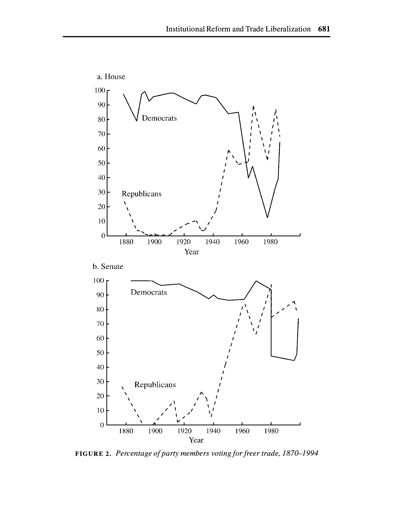
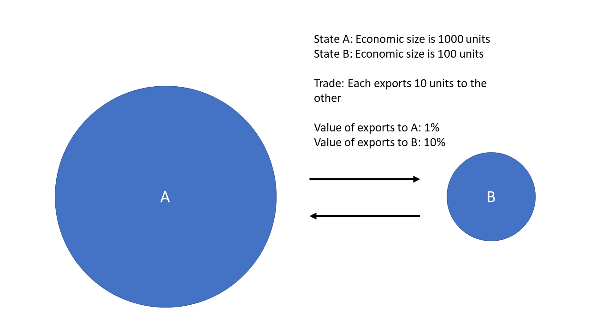

```{r setup, include = FALSE, echo = FALSE}
library(tidyverse)
library(tidyquant)
library(plotly)
library(scales)
library(here)
library(Hmisc)
library(kableExtra)
library(knitr)
library(lubridate)
library(rgdal) # used to read world map data
library(rgeos) 
library(rvest)
library(maptools)
library(ggmap)
library(colorRamps)
library(RColorBrewer)

knitr::opts_chunk$set(fig.width=12, fig.height=8, fig.align="center", echo=FALSE, warning=FALSE, error=FALSE, message=FALSE, dpi=400) 


theme_flynn <- function(){ 
  
      theme_minimal(base_size = 12, base_family = "Arial") %+replace% 
        
        theme(plot.title = element_text(face = "bold", size = 18, hjust = 0, margin = margin(t = 0, b = 0.3, l = 0, r = 0, unit = "cm")),
              plot.subtitle = element_text(size = 12, hjust = 0, margin = margin(t = 0, b = 0.3, l = 0, r = 0, unit = "cm")),
              plot.caption = element_text(face = "italic", size = 8, hjust = 1, margin = margin(t = 0.2, unit = "cm")),
              strip.background = element_rect(fill = "gray80", color = "black"),
              strip.text = element_text(color = "black", face = "bold", margin = margin(t = 0.2, b = 0.2, l = 0.2, r = 0.2, unit = "cm")),
              panel.grid.major = element_line(color = "gray70", size = 0.15),
              panel.grid.minor = element_line(color = "gray90", size = 0.1),
              axis.title = element_text(face = "bold", size = 12),
              axis.title.y = element_text(angle = 90, margin = margin(t = 0, r = 0.5, b = 0, l = 0, unit = "cm")),
              axis.title.x = element_text(margin = margin(t = 0.5, r = 0, b = 0, l = 0, unit = "cm")),
              legend.title = element_text(face = "bold", hjust = 0))
}


```

# Lecture Overview


1. Historical Background

2. Why do these topics matter?

3. Trade, immigration, investment, and monetary policy as foreign policy tools.


---
class: top, left

# Key Questions

1. How has the importance of trade to the US economy changed over time?

2. What is protectionism? What role has it played in the history of US development?

3. What is the difference between fiscal and monetary policy? How do they relate to one another?

4. How does an industry's size relate to its ability to get protectionist policies?

5. What are the positions of the two major parties been on trade policy? How have they changed over time?

6. What are some of the major changes in immigration policy across US history?

7. How has immigration been a tool of US foreign policy?


---
class: center, middle, inverse

# Historical Background


---
class: left, top

# Historical Background

Trade before 1934

- Protectionism is dominant approach to US economic development

- Northeastern manufacturing interests had substantial political influence and favor protectionist policies

- Southern and Western agricultural interests less influential and favor freer trade polices. 


---
class: left, top

# Historical Background

Trade after 1934

- Northeastern and Southern interests align in 1930s and 1940s

- Both groups come to support freer trade

- Protectionist barriers begin to come down

- World War II marks an important turning point 


---
class: left, top




---
class:  left, top

# Historical Background


Bretton Woods System

- Partly a reaction to pre-World War II move to autarky

- Three main components

  - General Agreement on Tariffs and Trade (GATT)
  - International Monetary Fund (IMF)
  - International Bank for Reconstruction and Development (World Bank)
  
  
  
  
---
class: center, middle

```{r us trade fig 1}
trade <- read_csv(here("../../../Data Files/COW Data/COW_Trade_4.0/Dyadic_COW_4.0.csv")) 

trade.national <- read_csv(here("../../../Data Files/COW Data/COW_Trade_4.0/National_COW_4.0.csv"))

gdp <- read_delim(here("../../../Data Files/expgdpv6.0/gdpv6.txt"), delim = "\t") %>% 
  subset(statenum == 2)

cpi <- read_csv(here("../../../Data Files/US Government Files/BLS/cpi_1913_2015.csv")) %>% 
  subset(year >= 1950, select = c(year, annualavg)) %>% 
  mutate(cpi = annualavg/236.736)

us.consumption <- trade.national %>% 
  group_by(ccode, year) %>% 
  mutate(us.dummy = ifelse(ccode == 2, 1, 0)) %>% 
  ungroup() %>% 
  group_by(year) %>% 
  mutate(total.exports = sum(exports, na.rm = TRUE),
         us.cons = imports/(total.exports-exports)) %>% 
  subset(ccode == 2 & year >= 1946)


us.trade.gdp <- trade.national %>% 
  filter(ccode == 2) %>% 
  subset(year >= 1950) %>%
  group_by(year) %>% 
  mutate(imports = imports, na.rm = TRUE,
         exports = exports, na.rm = TRUE) %>% 
  left_join(cpi, by = "year") %>% 
  mutate(imports.con = (imports/cpi),
         exports.con = (exports/cpi),
         deficit = exports.con - imports.con) %>% 
  left_join(gdp, by = "year") %>% 
  mutate(exports.gdp = ((exports.con/realgdp)),
        imports.gdp = ((imports.con/realgdp))) %>% 
  as.data.frame() %>% 
  rename("Exports"= "exports.gdp", "Imports" = "imports.gdp", "Deficit" = "deficit") %>% 
  pivot_longer(cols = c("Exports", "Imports", "exports.con", "imports.con", "Deficit", "realgdp"))


# US exports and imports over time
ggplot(data = subset(us.trade.gdp, name == "exports.con" | name == "imports.con"), aes(x = year, y = value/1000, group = name, colour = name)) +
  geom_line(size = 2) +
  theme_flynn() +
  labs(x = "Year",
       y = "Billions of 2014 Dollars",
       title = "US imports and exports, 1950-2014",
       subtitle = "Imports and exports do not change at the same rate over time",
       caption = "Data obtained from the Correlates of War Data's National Trade Data (v4.0)") +
  scale_y_continuous(labels = dollar) +
  scale_x_continuous(breaks = seq(1950,2015,5)) +
  scale_color_brewer(palette = "Set1", guide_colourbar(title = "Group"))


```


---
class: center, middle

```{r trade over gdp figure}


# Trade as percent of US GDP
ggplot(data = subset(us.trade.gdp, name == "Exports" | name == "Imports"), aes(x = year, y = value, group = name, color = name)) +
  geom_line(size = 2) +
  theme_flynn() +
  labs(x = "Year",
       y = "",
       title = "Trade as a percent of US GDP, 1950-2014",
       color = "Trade Type",
       subtitle = "Trade has also become a larger component of national economies",
       caption = "Data obtained from the Correlates of War Data's National Trade Data (v4.0) \n and Gleditsch's Expanded Trade and GDP Data (v6.0)") +
  scale_y_continuous(labels = percent) +
  scale_x_continuous(breaks = seq(1950,2015,5)) +
  scale_color_brewer(palette = "Set1", guide_colourbar(title = "Group"))
  

```


---
class: center, middle, inverse

# Why Does Trade Matter?


---
class: left, top

# Why Does Trade Matter?

Theoretical

- Realism/Mercantilism

  - Trade as a source of national power
  
  - Trade is a zero-sum game
  
- Liberal theory

  - Trade can be positive-sum (both/multiple players can "win")
  
  - Trade has other beneficial effects (e.g. it promotes peaceful relations between states)
  
  
  
---
class: left, top

# Why Does Trade Matter?

Tangible benefits

- Trade creates jobs

- Access to desirable goods (spices, cool cars, technology, media/entertainment)

Less tangible

- Soft power and prestige

- Information, education, etc.


---
class: center, middle, inverse


# Trade as a Policy Instrument


---
class: top, left

# Trade as a Policy Instrument

Trade can be a source of power

- Control over vital resources

- Necessary for survival of the state, everyday life, etc.
  
- Few substitutes, few alternative suppliers


---
class: center, middle


<figure>

<figcaption>President Franklin Roosevelt (seated right) and Fleet Admiral William Leahy (standing left) meet with King Ibn al Saud (seated center) aboard the USS Quincy, February 14, 1945.</figcaption>
</figure>
  
  
  
---
class: left, top

# Trade as a Policy Instrument

Market access

- Producers need markets. Scaling up production requires larger markets.

- Exports bring in money from the sale of goods

- Domestic consumer base is often limited in various ways (money, taste, interests, etc.)

- Provides bargaining power


---
class: center, middle




---
class: center, middle

```{r gdp world figure}

gdp.2019 <- read_csv(here("../../../Data Files/World Bank Data/GDP and Trade Data/API_NY.GDP.MKTP.CD_DS2_en_csv_v2_1217511.csv"), skip = 3) %>%
  select(`Country Name`, `2019`) %>% 
  rename("GDP" = `2019`) %>%
  mutate(ccode = countrycode::countrycode(`Country Name`, "country.name", "cown")) %>% 
  filter(!is.na(ccode)) %>% 
  filter(GDP >= quantile(GDP, 0.9, na.rm = TRUE))

pop.2019 <- read_csv(here("../../../Data Files/World Bank Data/Population/API_SP.POP.TOTL_DS2_en_csv_v2_1308146.csv"), skip = 3) %>%
  select(`Country Name`, `2019`) %>% 
  rename("POP" = `2019`) %>%
  mutate(ccode = countrycode::countrycode(`Country Name`, "country.name", "cown")) %>% 
  filter(!is.na(ccode)) 

gdp.2019 <- gdp.2019 %>% 
  left_join(pop.2019) %>% 
  mutate(GDPPC = GDP/POP)

ggplot(gdp.2019, aes(x = reorder(`Country Name`, GDP), y = GDP)) +
  geom_bar(stat = "identity", fill = "dodgerblue1", color = "black", size = 0.1) +
  coord_flip() +
  theme_flynn() +
  scale_y_continuous(labels = scales::dollar_format()) +
  labs(x = "",
       y = "2019 US Dollars",
       title = "Largest 10% of global economies according to 2019 GDP")

```


---
class: center, middle

```{r gdppc market size}

ggplot(gdp.2019, aes(x = reorder(`Country Name`, GDP), y = GDPPC)) +
  geom_bar(stat = "identity", fill = "dodgerblue1", color = "black", size = 0.1) +
  coord_flip() +
  theme_flynn() +
  scale_y_continuous(labels = scales::dollar_format()) +
  labs(x = "",
       y = "2019 US Dollars",
       title = "Largest 10% of global economies according to 2019 GDP Per Capita")


```


---
class: center, middle

```{r consumption of global exports}

ggplot(data = us.consumption, aes(x = year, y = us.cons)) +
  geom_area(fill = "dodgerblue1", colour = "black", size = .1, alpha = .8) +
  theme_flynn() +
  scale_x_continuous(breaks = seq(1946, 2014, 5), limits = c(1946, 2014)) +
  scale_y_continuous(labels = percent_format()) +
  labs(x = "Year",
       y = "Percent",
       title = "US consumption of global exports, 1946-2013",
       subtitle = "4.3% of the world's population concums 15-20% of global exports",
       caption = "Data obtained from Correlates of War Project National Trade Dataset (v4.0)")


```


---
class: center, middle

```{r trade deficit}


growth.comparison <- us.trade.gdp %>% 
  subset(name == "Deficit" | name == "realgdp") %>% 
  group_by(name) %>% 
  arrange(name, year) %>% 
  mutate(growth = ((value-lag(value))/lag(value))) %>% 
  filter(year <= 2010) %>% 
  arrange(name, year) %>% 
  ungroup() %>% 
  mutate(name = factor(name, labels = c("Deficit", "GDP"))) %>% 
  arrange(name, year)


# US trade deficit
ggplot(data = subset(growth.comparison, name == "Deficit"), aes(x = year, y = value, fill = value>0)) +
  geom_bar(stat = "identity", alpha = .8, colour = "black", size = .1) +
  geom_hline(yintercept = 0) +
  theme_flynn() +
  scale_y_continuous(labels = dollar) +
  scale_x_continuous(breaks = seq(1950,2015,5)) +
  scale_fill_brewer(palette = "Set1") +  
  guides(fill = FALSE) +
  labs(x = "Year",
       y = "Millions of 2014 Dollars",
       title = "US Balance of Trade, 1950-2014",
       subtitle = "Trade deficits result when states import more than they export",
       caption = "Data obtained from the Correlates of War Data's National Trade Data (v4.0)") 


```


---
class: left, top

# Trade as a Policy Instrument

Protectionism

- Trade creates winners and losers

- Some countries can produce goods more/less efficiently than others

- Domestic producers who are relatively inefficient tend to favor protectionism (i.e. government intervention)


---
class: left, top

# Trade as a Policy Instrument

Forms of Protectionism

- Trade protection can come in a variety of policy interventions

  - Tariffs: Taxes on imported goods
  
  - Quotas: Limits on how much of a good is imported
  
  - Subsidies: Government payments to purchase goods or offset costs of donig business
  
  - Health and safety regulations: Creating different standards between importers and exporters
  
  
  
---
class: center, middle

```{r sugar quota}

us <- read_csv(here("../../../Data Files/US Government Files/USDA/Table04.csv"), skip = 3) %>% 
  subset(select = c(X1, X20)) %>% 
  filter(!is.na(X20)) %>% 
  mutate(Year = as.numeric(paste(X1)),
         Group = "US") %>% 
  rename("Rate" = "X20") %>% 
  subset(select = c(Year, Rate, Group))


world <- read_csv(here("../../../Data Files/US Government Files/USDA/TABLE03a.csv"), skip = 2) %>%   
  subset(select = c(X1, X18)) %>% 
  filter(!is.na(X18)) %>% 
  mutate(Year = as.numeric(paste(X1)),
         Group = "World") %>% 
  rename("Rate" = "X18") %>% 
  subset(select = c(Year, Rate, Group))

# Need to finish this. Index isn't right. 
combined <- data.frame(bind_rows(us,world)) %>% 
  group_by(Group) %>% 
  mutate(index = 100*Rate/first(Rate, order_by = Year))


# Sugar prices over time
ggplot(data = combined, aes(x = Year, y = Rate, group = Group, colour = Group)) +
  geom_line(size = 2, alpha = 0.8) +
  theme_flynn() +
  scale_x_continuous(breaks = seq(1960,2015,5), limits = c(1960,2010)) +
  scale_y_continuous(breaks = seq(0,40,10), limits = c(0,40)) +
  scale_color_brewer(palette = "Set1") +
  labs(y = "Cents per pound",
       title = "Average raw sugar price on US versus world markets, 1960-2010",
       subtitle = "US prices are generally higher than the world market prices due to trade protection", 
       caption = "Data obtained from USDA's Sugar and Sweeteners Yearbook Tables \n https://www.ers.usda.gov/data-products/sugar-and-sweeteners-yearbook-tables.aspx")  


```


---
class: left, top

# Trade as a Policy Instrument

Example: Sugar Quota System

- WTO agreements requires the US to import a minimum of 1,117,195 metric tons of raw sugar from global producers

- This is an aggregate figure-it does not have to be distributed evenly across sugar producing states


---
class: center, middle

```{r sugar distribution}

sugar.data <- readxl::read_xlsx(here("../../../Data Files/US Government Files/USDA/Fy_2019_Final_Sugar_Report.xlsx"), sheet = 4, skip = 3)

sugar.data <- sugar.data %>% 
  select(1, 20) %>% 
  rename("country" = 1, "tons" = 2) %>% 
  filter(!is.na(tons) & country != "Total" & tons > 0)


ggplot(sugar.data, aes(y = reorder(country, tons), x = tons)) +
  geom_bar(stat = "identity", fill = "dodgerblue1", color = "black", size = 0.1) +
  theme_flynn() +
  scale_x_continuous(label = comma_format()) +
  labs(x = "Metric Tons",
       y = "",
       title = "Distribution of US Sugar Quota for FY2019",
       subtitle = "What factors determine the allocation of the quota?",
       caption = "Data obtained from https://usda.library.cornell.edu/concern/publications/tq57nr00k?locale=en")
  


```


---
class: left, top

# Trade as a Policy Instrument


What is the benefit to foreign countries?

--

- Dominican Republic share = 185,050 metric tons

--

- World raw sugar price (2019) $\approx$ 12.36 cents/lb.

--

- US raw sugar price (2019) $\approx$ 26.16 cents/lb.

--

- Difference = 13.8 cents/lb.

--

So what?

--

That's about $56.3 million more than world market!


---
class: center, middle

```{r farm subsidies}

library(tidyquant)
library(rlang)

farm.subsidies <- tq_get("L312041A027NBEA",
                         get = "economic.data",
                         from = "1960-01-01",
                         to = "2021-01-01")


# Farm subsidies
ggplot(data = farm.subsidies, aes(x = date, y = price)) +
  geom_area(fill = "deepskyblue", colour = "black", size = .2, alpha = .8) +
  theme_flynn() +
  scale_x_date(breaks = seq(as.Date("1960-01-01"), as.Date("2021-01-01"), by = "5 years"), date_labels = "%Y",
               limits = c(as.Date("1960-01-01"), as.Date("2021-01-01"))) +
  scale_y_continuous(labels = dollar_format()) +
  labs(y = "Billions of Current Dollars",
       x = "Date",
       title = "US federal agricultural subsidies, 1960-2020",
       caption = "Data obtained from FRED data series L312041A027NBEA")
```


---
class: left, top

# Trade as a Policy Instrument

More recent example: Manufacturing

- Some industries are politically powerful for reasons apart from economic salience

- Manufacturing sector has a lot of influence

- Heavily tied into American image of production and the importance of making things

- Early Trump economic policies focused on "reviving" US manufacturing, but what it in need of resuscitation?


---
class: center, middle


```{r manufacturing index}

# CPI to adjust wage data
cpi <- tq_get("CPILFESL",
              get = "economic.data",
              from = "1960-01-01",
              to = "2021-01-01")

# Manufacturing employment 
man.emp <- tq_get("MANEMP",
                         get = "economic.data",
                         from = "1960-01-01",
                         to = "2021-01-01")
  
# Manufacturing wages data
man.wage <- tq_get("CES3000000008",
                         get = "economic.data",
                         from = "1960-01-01",
                         to = "2021-01-01")


man.wage <- man.wage %>% 
  left_join(cpi, by = c("date")) %>% 
  mutate(cpi = price.y / price.y[date=="2019-01-01"],
    price = price.x/cpi) %>% 
  select(-c(symbol.y)) %>% 
  rename("symbol" = "symbol.x")

# Manufacturing Production Index
man.index <- tq_get("IPMAN",
                         get = "economic.data",
                         from = "1960-01-01",
                         to = "2021-01-01")


ggplot(data = man.index) +
  geom_line(aes(x = date, y = price), size = 1.2) +
  theme_flynn() +
  scale_x_date(breaks = "5 years") +
  labs(x = "Date",
       y = "Index (2012 = 100)",
       title = "US Manufacturing Production Index, 1972-2019",
       subtitle = "Overlal manufacturing production has generally risen over time",
       caption = "Data obtained from FRED data series IPMAN")


```


---
class: center, middle

```{r manufacturing employment and wages}

man.com <- bind_rows(man.emp, man.wage) %>% 
  group_by(symbol) %>% 
  mutate(index = (price / price[date == "2012-01-01"]) * 100,
         symbol = ifelse(is.na(symbol), "CES3000000008", symbol),
         group = factor(symbol, levels = c("MANEMP", "CES3000000008"), labels = c("Employment", "Wages")))

ggplot(man.com, aes(x = date, y = index, color = group)) +
  geom_line(size = 2, alpha = 0.8) +
  geom_vline(xintercept = as.Date("2018-03-01"), linetype = "dotted") +
  annotate("text", x = as.Date("2008-01-01"), y = 130, size = 3, label = "Trump announces tariffs\non steel and aluminum\nMarch 2, 2018", hjust = 0) +
  theme_flynn() +
  scale_x_date() +
  scale_color_brewer(palette = "Set1") +
  labs(x = "Date",
       y = "Index (2012 = 100)",
       color = "Index",
       title = "Index of manufacturing wages and employment, 1960-2020",
       subtitle = "Consider the case and effect of these changes in the broader historical context",
       caption = "Data obtained from FRED data series MANEMP and CES3000000008.\nWage data adjusted for inflation.")

```

???
# Notes

There's really no evidence that Trump's tariffs altered the employment or wage levels/growth that we see here.


---
class: center, middle

```{r steel and aluminum production index}

# Manufacturing employment 
index.steel <- tq_get("IPN3311A2RN",
                         get = "economic.data",
                         from = "1960-01-01",
                         to = "2021-01-01")
  
# Manufacturing wages data
index.alum <- tq_get("IPG3313SQ",
                         get = "economic.data",
                         from = "1960-01-01",
                         to = "2021-01-01")

industry.com <- bind_rows(index.alum, index.steel) %>% 
  mutate(industry = factor(symbol, labels = c("Aluminum", "Steel"))) %>% 
  group_by(industry) %>%
  mutate(index = (price/price[date=="2010-01-01"]) * 100)
  


# Steel and aluminum production
ggplot(data = industry.com, aes(x = date, y = index, color = industry)) +
  geom_line(size = 1, alpha = 0.8) +
  theme_flynn() +
  scale_x_date(breaks = seq(as.Date("1972-01-01"), as.Date("2019-01-01"), by = "5 years"), date_labels = "%Y") +
  scale_y_continuous(breaks = seq(50, 200, 50), limits = c(50, 200)) +
  scale_color_brewer(palette = "Set1") +
  labs(x = "Date",
       y = "Index (2012 = 100)",
       colour = "Group",
       title = "Industry Production Index, 1972-2019",
       subtitle = "Production of both aluminum and steel has been largely stable since the 1980s.",
       caption = "Data obtained from Federal Reserve of St. Louis data series IPG3313SQ and IPN3311A2RN")

```


---
class: center, middle

```{r soy-futures, echo = FALSE, warning=FALSE}
# Soy data
soy.data <- tidyquant::tq_get("CHRIS/CME_S1",
                   get = "quandl",
                   from = "2018-01-01",
                   to = "2019-06-01")

# Soybeans
# Note: Prices rescaled from cents per bushel in original to dollars per bushel
ggplot(data = soy.data, aes(x = date, y = settle/100)) +
  geom_line(size = 1.7) +
  geom_vline(xintercept = as.Date("2018-03-02"), linetype = "dotted", size = 1) + # Trump announaces
  geom_vline(xintercept = as.Date("2018-03-23"), linetype = "dotted", size = 1) + # US imposes first steel and aluminum tariffs
  geom_vline(xintercept = as.Date("2018-05-29"), linetype = "dotted", size = 1) + # Talks break down
  geom_vline(xintercept = as.Date("2018-07-06"), linetype = "dotted", size = 1) + # China and US tariffs take effect on same date
  annotate("text", x = as.Date("2018-03-06"), y = 11.3, size = 2.75, hjust = 0, label = "Trump tweets about tariffs\non steel and aluminum\nMarch 2, 2018") +
  annotate("text", x = as.Date("2018-03-27"), y = 10.85, size = 2.75, hjust = 0, label = "US tariffs on Chinese goods,\nsteel, and aluminum take effect \nMarch 22-23, 2018") +
  annotate("text", x = as.Date("2018-06-03"), y = 10.45, size = 2.75, hjust = 0, label = "US-Chinese talks break down \nMay 29, 2018") +
  annotate("text", x = as.Date("2018-07-10"), y = 9.95, size = 2.75, hjust = 0, label = "US tariffs on Chinese goods \nand Chinese tariffs on US goods \ntake effect \nJuly 6, 2018") +
  theme_flynn() +
  scale_x_date(breaks = seq(as.Date("2018-01-01"), as.Date("2019-03-29"), by = "2 months"), date_labels = "%b %Y",
               limits = c(as.Date("2018-01-01"), as.Date("2019-03-29"))) +
  scale_y_continuous(breaks = seq(8, 11, 1), 
                     limits = c(8, 11.4),
                     labels = dollar_format()) +
  labs(y = "Closing price per bushel",
       title = "Soybean futures contract prices, January 2018-March 2019",
       caption = "Data obtained from https://www.quandl.com/data/CHRIS/CME_S1")


```


---
class: center, middle, inverse

# Monetary Policy


---
class: top, left

# Monetary Policy

People need money to buy things

- Theoretically, we could use all sorts of stuff!

- A commonly held/used/accepted currency (e.g. "brand") of money helps resolve coordination problems

- US dollar is widely used and valued, making it a great basis for global commercial exchange


---
class: top, left

# Monetary Policy

So what are we talking about here?

For present purposes, let's focus on two key issue areas

- Money supply

- Exchange rates


---
class: center, middle

```{r M2 Money supply}

m2stock <- tq_get("M2",
                  get = "economic.data",
                  from = "1970-01-01",
                  to = "2021-09-01") %>% 
  mutate(date = as.Date(date, "%Y-%m-%d"))

ggplot(m2stock, aes(x = date, y = price)) +
  geom_area(fill = "dodgerblue1", color = "black", size = 0.1, alpha = 0.8) +
  theme_flynn() +
  scale_y_continuous(labels = dollar_format()) +
  labs(x = "Date", 
       y = "Billions of Dollars",
       title = "M2 Money Stock, 1980-2020",
       subtitle = "How much money is sloshing around out there?",
       caption = "Data obtained from FRED M2 series.")

```


---
class: center, middle

```{r foreign exchange reserves}

forex.data <- read_csv(here("../../../Data Files/IMF/COFER_03-31-2018 03-43-47-80_timeSeries.csv"))

forex.data <- subset(forex.data, `Country Name` == "World") %>% 
  mutate(indicator = substr(`Indicator Name`, 1, 5)) %>% 
  subset(indicator == "Alloc") %>% 
  mutate(Currency = c("Total", "Australian", "Canadian", "Euro", "Yen", "Pound", "Swiss Franc", "Dollar", "Other", "Deutsche Mark", "ECU", "Franc", "Guilder", "Renminbi")) %>% 
  subset(select=c(`2000`:Currency)) %>% 
  pivot_longer(cols = c("2000", "2001", "2002", "2003", "2004", "2005", "2006", "2007", "2008", "2009", "2010", "2011", "2012", "2013", "2014", "2015", "2016", "2017")) %>% 
  group_by(name) %>% 
  mutate(total = ifelse(Currency == "Total", value, NA),
         total = max(total, na.rm = TRUE),
         percent = (value/total)*100) %>% 
  ungroup() %>% 
  mutate(year = name) %>% 
  arrange(year, percent)  %>% 
  mutate(Currency = factor(Currency, unique(Currency)))
  

ggplot(data = subset(forex.data, Currency == "Dollar" | Currency == "Euro" | Currency == "Yen" | Currency == "Pound"), aes(x = year, y = percent, group = Currency, fill = Currency)) +
  geom_area(alpha = .7, colour = "black", size = .1) +
  theme_flynn() +
  scale_fill_brewer(palette = "Spectral") +
  scale_y_continuous(breaks = seq(0, 100, 20), limits = c(0, 100)) +
  labs(x = "Year",
       y = "Percent",
       title = "Currency shares of global foreign exchange reserves, 2000-2017",
       subtitle = "The US Dollar has long been the dominant reserve currency",
       caption = "Data available from International Monetary Fund, Currency Composition of Foreign Exchange Reserves \n http://data.imf.org/?sk=E6A5F467-C14B-4AA8-9F6D-5A09EC4E62A4")


```


---
class: left, top

# Monetary Policy

Mr. (money) manager

- Governments manipulate money and its value through a couple of key mechanisms

  - Setting interest rates
  
  - Buying and selling assets

--

- People use the dollar, so what?

- Well, when you print your own currency and that currency is used as a global reserve currency, you've got options!


---
class: left, top

```{r interest rate comparison}


fed.rate <- tq_get("DISCNTD8",
                   get = "economic.data",
                   from = "1900-01-01",
                   to = "2021-01-01")

fed.rate <- fed.rate %>% 
  mutate(country = "United States",
         rate = price)

boe.rate <- read_delim(here("../../../Data Files/Bank of England/Interest rate changes since 1694 - INTEREST RATES.tsv"), "\t") %>% 
  mutate(date = as.Date(format(as.Date(Date, "%d-%b-%Y"), "%Y-%m-%d")),
         country = "England") %>% 
  rename("rate" = `Interest rate`)

rate.com <- bind_rows(boe.rate, fed.rate) %>% 
  filter(date >= as.Date("1915-01-01") & date <= as.Date("1930-01-01"))

ggplot(rate.com, aes(x = date, y = rate/100, color = country, linetype = country)) +
  geom_step(size = 1.5, alpha = 0.9) +
  annotate("rect", xmin = as.Date("1919-01-01"), xmax = as.Date("1925-01-01"), ymin=-Inf, ymax = Inf, alpha = 0.2) +
  scale_y_continuous(labels = percent_format()) +
  theme_flynn() + 
  scale_color_brewer(palette = "Set1") +
  guides(linetype = FALSE) +
  labs(x = "Date",
       y = "Interest Rate",
       color = "Country",
       title = "Central Bank Rates in US and England, 1915-1930",
       subtitle = "Countries can coordinate interest rates to accomplish policy goals")

```


---
class: center, middle, inverse

# Immigration Policy


---
class: left, top

# Immigration Policy

A Brief Overview of US Immigration Policy

- Immigration was largely unregulated until the late 1800s
- US government starts keeping track more systematically in 1819 with the Steerage Act
- Immigration Act of 1864 creates positions within the State Department to oversee immigration, but Act is repealed after 4 years.
- Chinese Exclusion Act of 1882
- Immigration Act of 1882
- Immigration Act of 1891


---
class: left, top

# Immigration Policy

Early Quote System

Immigration policy takes a turn in the 20th Century

- Quota Law of 1921
- National Origins Act of 1924


---
ckass: left, top

# Immigration Policy

Cold War Period

- Labor shortages during WWII lead to growth in immigration from Mexico
- US eliminates formal race-based quotas on immigration, but *de facto* policy still prioritizes Western Europe
- Country-specific quotas are gradually eliminated, but broad regional quotas remain
- US policy eventually starts to emphasize humanitarian concerns, partly to stick it to the Soviets


---
class: center, middle, inverse

# What Drives Immigration?


---
class: left, top

# What Drives Immigration?

Lots of things, but for now we'll focus on a basic IPE approach to political economy

- Push Factors
    - Lack of economic opportunity (i.e. jobs)
    - War and conflict
    - Repression and violence
    - Crime
    
- Pull Factors
    - Basically the same, but the inverse
    - Attracted to job opportunities
    - Less crime/violence
    - More political participation 
    
    


---
class: left, top

# What Drives Immigration?


Heckscher--Ohlin Framework

- Think of migration in terms of trade theory
- Countries *export* goods that make intensive use of the factors that are abundant
- Countries *import* goods that make intensive use of the factors that are scarce

Migration as factor mobility

-  Just as investors move capital around seeking a greater return on investment, so too do individuals move trying to find greater returns on **their** investment (i.e. time, effort, skills, etc.)
