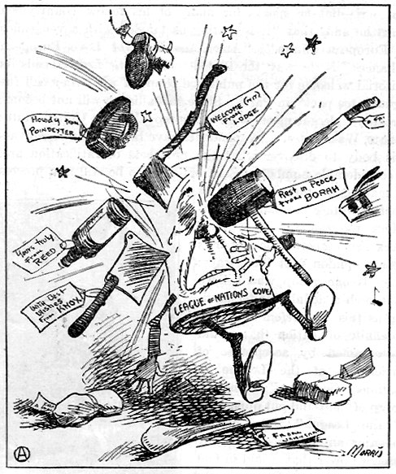

```{r setup, include = FALSE, echo = FALSE}
library(tidyverse)
library(tidyquant)
library(plotly)
library(scales)
library(broom)
library(here)
library(Hmisc)
library(kableExtra)
library(knitr)
library(lubridate)
library(rgdal) # used to read world map data
library(rgeos) 
library(maptools)
library(ggmap)

knitr::opts_chunk$set(fig.width=12, fig.height=8, fig.align="center", echo=FALSE, warning=FALSE, error=FALSE, message=FALSE, dpi=400) 


theme_flynn <- function(){ 
  
      theme_minimal(base_size = 12, base_family = "Arial") %+replace% 
        
        theme(plot.title = element_text(face = "bold", size = 18, hjust = 0, margin = margin(t = 0, b = 0.3, l = 0, r = 0, unit = "cm")),
              plot.subtitle = element_text(size = 12, hjust = 0, margin = margin(t = 0, b = 0.3, l = 0, r = 0, unit = "cm")),
              plot.caption = element_text(face = "italic", size = 8, hjust = 1, margin = margin(t = 0.2, unit = "cm")),
              strip.background = element_rect(fill = "gray80", color = "black"),
              strip.text = element_text(color = "black", face = "bold", margin = margin(t = 0.2, b = 0.2, l = 0.2, r = 0.2, unit = "cm")),
              panel.grid.major = element_line(color = "gray70", size = 0.15),
              panel.grid.minor = element_line(color = "gray90", size = 0.1),
              axis.title = element_text(face = "bold", size = 12),
              axis.title.y = element_text(angle = 90, margin = margin(t = 0, r = 0.5, b = 0, l = 0, unit = "cm")),
              axis.title.x = element_text(margin = margin(t = 0.5, r = 0, b = 0, l = 0, unit = "cm")),
              legend.title = element_text(face = "bold", hjust = 0))
  }
```

class: left, top

# Lecture Overview

1. Historical Context

2. Bipartisan Consensus

3. Consensus and Collapse


---
class: left, top

# Key Questions

1. How have domestic coalitions and their preferences over foreign policy changed over time?

  - How has "ideology" developed over time?
  
  - How have the interests and positions of political parties changed over time?

2. What were some of the key factors in generating greater support for a more internationalist foreign policy?

3. Does bipartisanship represent convergence of interests or “political will”?

4. How have the interests of different regions affected preferences over the different "pillars" of liberal internationalism?


---
class: center, middle, inverse

# Historical Context


---
class: left, top

# Historical Context

Core elements of US foreign policy during the Cold War:

- Projection of American military power

- Free trade and investment

- Multilateral engagement


???
###Note:

- Multilateral cooperation was key


---
class: left, top 

# Historical Context

```{r}
issue <- tibble(Issue = c("Military", "Imperialism", "Free Trade"),
                   Republicans = c("+", "+", "-"),
                   Democrats = c("-", "-", "+"))

knitr::kable(issue,
             'html',
             align = c("l", "c", "c"),
             caption = "Partisanship and positions on key issues") %>% 
  kable_styling(full_width = TRUE) %>% 
  column_spec(1, width_min = "8cm") %>% 
  column_spec(2, width_min = "4cm") %>% 
  column_spec(3, width_min = "4cm") %>% 
  row_spec(0, bold = T, color = "white", background = "#512888")

```

???
# Note:


---
class: left, middle
```{r}
votes <- tibble(`Party` = c("Republicans", "Democrats"),
                `Independece for Cuba` = c(17, 91),
                `Annexation of Hawaii` = c(87, 44),
                `Build and Fortify an Isthmian Canal` = c(63, 15))

knitr::kable(votes,
      'html',
      align = c("l", "c", "c", "c"),
      caption = "Votes on Key 19th Century Foreign Policy Issues") %>%
  kable_styling(full_width = TRUE,
                bootstrap_options = c("striped")) %>% 
  column_spec(1, width_min = "4cm") %>% 
  column_spec(2, width = "3cm") %>% 
  column_spec(3, width = "3cm") %>% 
  column_spec(4, width = "3cm") %>%
  row_spec(0, bold = T, color = "white", background = "#512888") %>% 
  footnote(general = "These votes are a subset of the votes used by Trubowitz (1998, 54) for the purposes of analyzing support for imperialism. All votes occurred during 55th Congress. Roll call data obtained from www.voteview.com (Poole 2012). Vote on Cuba is the vote on the Dinsmore (D-AR) Amendment recognizing Cuban independence (April 14, 1898). Vote on the Annexation of Hawaii is the final vote on the Newlands (D-NV) resolution to annex Hawaiian Islands (June 15, 1898). Canal vote is the vote on the Hepburn (R-IA) Amendment to build and fortify an isthmian canal in Nicaragua (May 2, 1900).",
           footnote_as_chunk = TRUE, 
           title_format = c("italic"))

```

???
###Note
- This shows how the parties broke down on some key issues of the day. 
- There's some variation here. Not that it's not 100% alignment within each party


---
class: left, top

# Historical Context

Economic factors

- Northeast dominated by manufacturing sector

- Manufacturing had strong interest in protectionist policies

- Protectionism tends to correlate with more conflictual foreign policies

- Northeast also controls electoral votes for presidency 

???
###Notes: 

- Talk about protectionism and conflict. Northern manufacturers use protection to keep our European imports, but rely on exports to Europe. European countries retaliate with their own tariffs. They also search for markets, leading them to fight over access to those markets. 
- Shipbuilding interests also located in Northeast. Benefit from naval buildup  


---
class: middle, center

```{r Manufacturing Percent Map}

mfgpct <- read_csv(here("../Data/manufacturing-percent-1900.csv")) %>% 
  mutate(statename = str_to_lower(state.name[match(state, state.abb)]))

mapdata <- map_data("state") %>% 
  left_join(mfgpct, by = c("region" = "statename"))

ggplot(mapdata, aes(x = long, y = lat, group = group, fill = mfgpct)) + 
  geom_polygon(color = "white") +
  theme_void() +
  coord_map(projection = "conic", lat0= 30) +
  scale_fill_gradient2(low = muted("blue"), mid = "white", high = muted("red"), midpoint = median(mfgpct$mfgpct), label = scales::percent_format())+
  labs(fill = "Percent",
       title = "Manufacturing Employment as Percent of State Workforce, 1900",
       caption = "Midpoint set to median manufacturing employment value")

```

???

###Notes:

- Large values in Montana and Colorado are related to mining and smelting industries. These were tied into manufacturing in the Northeast.
- The 15 manufacturing states in the Northeast and Great Lakes region held 214 of the 224 electoral votes needed to win the presidency in the 1900 election and were similarly critical in all the other elections during the 1890-1914 period 


---
class: left, top

# Historical Context

Great Depression:

- October 29, 1929 stock market crashes

- Sparks a worldwide depression

- Many countries resort to protectionist policies

- Economic crisis exacerbates other crises around the world

???

### Notes:

- Great depression played an important part in building the social welfare programs we now take for granted, but this also played a role in the design of programs that came after WWII.
- Marshall Plan and foreign aid were inspired by social safety nets from the depression.
- Also worth noting that WWII did not get the US out of the great depression, as the following slides illustrate. 
- Between 1936 and 1938 federal spending is cut by 20% in nominal terms. This is a massive reduction in spending that helped to stimulate - other recession within the Great Depression.


---
class: middle, center

```{r warning=FALSE, dpi=400}
trade <- read_csv(here("../../../Data Files/COW Data/COW_Trade_4.0/National_COW_4.0.csv")) %>% 
  group_by(year) %>% 
  summarise(imports = sum(imports, na.rm = TRUE), 
            exports = sum(exports, na.rm = TRUE), 
            totaltrade = (imports+exports))

trade.1 <- ggplot(data = subset(trade, year >= 1900 & year <= 1940), aes(x = year, y = totaltrade)) +
  geom_area(fill = "deepskyblue", color = "black", size = 0.1, alpha = .9) +
  theme_flynn() +
  theme(text = element_text(size = 18)) +
  scale_x_continuous(breaks = seq(1900, 1940, 5)) +
  scale_y_continuous(breaks = seq(0, 70000, 10000), labels = dollar) +
  labs(title = "Global trade volume, 1900-1940",
       x = "Year",
       y = "Millions of current dollars",
       caption = "Data obtained from Correlates of War Data National Trade Data (v4.0)")

trade.1

```


---
class: middle, center


```{r dpi = 400, warning=FALSE}
us.trade <- read_csv(here("../../../Data Files/COW Data/COW_Trade_4.0/National_COW_4.0.csv")) %>% 
  subset(ccode == 2) %>% 
  group_by(year) %>% 
  summarise(imports = sum(imports, na.rm = TRUE), 
            exports = sum(exports, na.rm = TRUE), 
            totaltrade = (imports+exports))

exports <- ggplot(data = us.trade, aes(x = year, y = exports)) +
  geom_area(fill = "deepskyblue", color = "black", size = 0.1, alpha = .9) +
  theme_flynn() +
  theme(text = element_text(size = 18)) +
  scale_x_continuous(breaks = seq(1900, 1950, 5), limits = c(1900, 1950)) +
  scale_y_continuous(breaks = seq(0, 15000, 3000), labels = dollar) +
  labs(title = "US export volume, 1900-1950",
       x = "Year",
       y = "Millions of current dollars",
       caption = "Data obtained from Correlates of War Data National Trade Data (v4.0)")

exports
```


---
class: middle, center

```{r us-gnp}

gnp <- read.delim(here("../../../Data Files/NBER/GDP/a08166.dat.txt"), sep = " ", header = FALSE) %>% 
  subset(select = c("V1", "V4")) %>% 
  plyr::rename(c("V1" = "Year", "V4" = "GNP")) %>% 
  mutate(gnp.change = (GNP - lag(GNP)) / lag(GNP),
         growth = as.factor(ifelse(gnp.change > 0, 1, 0)))


gnpfig <- ggplot(data = gnp, aes(x = Year, y = GNP)) +
  geom_bar(fill = "deepskyblue", color = "black", size = 0.1, stat = "identity") +
  theme_flynn() +
  theme(text = element_text(size = 18)) +
  scale_x_continuous(breaks = seq(1920, 1950, 5), limits = c(1919, 1951)) +
  scale_y_continuous(breaks = seq(0, 175000, 25000), labels = dollar) +
  labs(y = "Millions of 1929 dollars",
       title = "US gross national product, 1920-1950",
       subtitle = "What trends or changes do you see near key events?",
       caption = "Data obtained from: http://www.nber.org/databases/macrohistory/rectdata/08/a08166.dat")

gnpfig

```


---
class: middle, center

```{r us-gnp-growth}
# US GNP change by year
gnp.growth <- ggplot(data = gnp, aes(x = Year, y = gnp.change, group = growth, fill = stat(gnp$gnp.change >0))) +
  geom_bar(stat = "identity", color = "black", size = 0.1) +
  geom_hline(yintercept = 0, color = "black", size = .3) +
  theme_flynn() +
  theme(text = element_text(size = 18)) +
  scale_x_continuous(breaks = seq(1920, 1950, 5), limits = c(1919, 1951)) +
  scale_y_continuous(breaks = seq(-0.15, 0.15, 0.05), labels = percent) +
  labs(y = "Growth rate",
       title = "US Gross national product growth, 1920-1950",
       subtitle = "Note the patterns in growth in the 1930s and early 1940s",
       caption = "Data obtained from: http://www.nber.org/databases/macrohistory/rectdata/08/a08166.dat") +
  guides(fill = FALSE)

gnp.growth

```


---
class: center, middle

```{r unemployment}

unemp <- read.delim(here("../../../Data Files/NBER/Unemployment/m08292a.dat.txt"), sep = "", header = FALSE) %>% 
 rename(c("Year" = "V1","Period" = "V2","Rate" = "V3")) %>% 
  mutate(Rate = as.numeric(gsub("[^.[0-9]]", "", Rate)),
         Time = as.Date(paste(Year, Period, "01", sep = "-"), format = '%Y-%m-%d'),
         change = Rate - dplyr::lag(Rate, order_by = Time))

# US unemployment rate
unemp.fig <- ggplot(data = unemp, aes(x = Time, y = Rate/100)) +
  geom_line(size = 0.75) +
  theme_flynn() +
  theme(text = element_text(size = 18)) +
  scale_x_date(breaks = seq(as.Date("1930-01-01"), as.Date("1942-01-01"), "2 years"), limits = c(as.Date("1930-01-01"), as.Date("1942-01-01")), date_labels = "%Y %b") +
  scale_y_continuous(breaks = seq(0, 0.25, 0.05), labels = percent) +
  labs(y = "",
       title = "US monthly unemployment rate, 1930-1941",
       subtitle = "What trends or changes do you see near key events?",
       caption = "Data obtained from: http://www.nber.org/databases/macrohistory/rectdata/08/docs/m08292a.txt")

unemp.fig
```


---
class: center, middle

```{r}

unemp.fig.2 <- ggplot(data = unemp, aes(x = Time, y = change, color = change)) +
  geom_line(size = 1.0) +
  geom_hline(yintercept = 0, color = "black", size = 1.0) +
  theme_flynn() +
  theme(text = element_text(size = 18)) +
  scale_x_date(breaks = seq(as.Date("1930-01-01"), as.Date("1942-01-01"), "2 years"), limits = c(as.Date("1930-01-01"), as.Date("1942-01-01")), date_labels = "%Y %b") +
  guides(color = FALSE) +
  scale_y_continuous(breaks = seq(-3, 3, 1), labels = comma_format()) +
  scale_color_gradient2(low = "green3", mid = "yellow3", high = "red3",  midpoint = 0) +
  labs(y = "",
       title = "Percentage point change in US monthly unemployment rate, 1930-1941",
       subtitle = "What trends or changes do you see near key events?",
       caption = "Data obtained from: http://www.nber.org/databases/macrohistory/rectdata/08/docs/m08292a.txt")

unemp.fig.2


```


---
class: center, middle


```{r fed spending}

fedspend <- read_csv(here("../../../Data Files/Historical Statistics of the United States/TableEa636-643/Ea636-643.csv"), skip = 6) %>% 
  rename("year" = 1, "total" = 3) %>% 
  filter(year >= 1929 & year <= 1940) %>% 
  mutate(total = as.numeric(total))

ggplot(fedspend, aes(x = year, y = total)) +
  geom_line(size = 1.5) +
  theme_flynn() + 
  scale_y_continuous(labels = dollar_format()) +
  scale_x_continuous(breaks = seq(1929, 1940, 1)) +
  labs(x = "Year",
       y = "Millions of Current Dollars",
       title = "Total Federal Spending, 1929-1940",
       caption = "Data obtained from the Historical Statistics of the United States, Table Ea636-643")

```
???
# Notes
- Note that spending declined by about 20% between 1936 and 1938. This massive reduction in spending stunted the recovery and helped push the country back into recession.


---
class: center, middle, inverse

# Bipartisan Consensus


---
class: center, middle


???
# Notes:

- Cold War associated with bipartisan consensus in foreign policy
- Parties used to have considerable disagreements over these issues


---
class: left, top

# Bipartisan Consensus

So what changed?

- Security factors

- Divided government

- Economic factors


---
class: left, top

# Bipartisan Consensus

Security factors:

- World War II

- Pearl Harbor unties Roosevelt’s hands

- Several prominent Republicans rally support for US intervention

- Roosevelt appoints several high-profile Republicans to his cabinet

- Eventual emergence Soviet threat

???
# Notes:

- Nye Committee during the 1930s put the blame on Northeastern financiers for US involvement in WWI. 
- Neutrality Acts of mid 1930s: Prohibit US involvement in conflict and sale of arms to belligerents.
- Cash and carry, 1939: Allowed sale of arms to allies provided they paid in cash and picked up the material themselves. US shipping would not deliver war supplies to belligerents.
- Lend-Lease: US would lend/lease supplies and arms to allies. This was not genuinely expected to result in their return


---
class: left, top

# Bipartisan Consensus

.pull-left[
Henry L. Stimson

- Secretary of War

- Republican

- Long history of government service

- Well connected
]

.pull-right[

]

???
#Note
- Stimson started rallying support for draft before US attack.
- Prominent Republican from previous administrations
- Also representative of “The Establishment”. The Establishment is a group of elite statesmen/diplomats who placed bipartisanship first and foremost. Ivy League lawyers, businessmen, and bankers. 
- There are some interesting demographic traits here, but it's also easy to romanticize these folks. Bipartisanship brought us Vietnam, after all, so be careful not to look too wistfully on particular groups or individuals. 


---
class: left, top

# Bipartisan Consensus

Divided government

- Republicans win control of both House and Senate in 1946 elections (80th Congress)

- Critics cite League of Nations and WWI as failure of domestic politics

- Bipartisanship becomes key to Cold War era policies

???
# Notes:
- Divided government promoted cooperation. Republicans could block Democrat initiatives.
- Republicans wary of inflation associated with massive military spending.
- Failure of League of Nations to pass was blamed on lack of bipartisanship. Next slide shows Cartoons from WWI era to this effect.


---
class: left, top

# Bipartisan Consensus

.pull-left[

]

.pull-right[

]


---
class: left, top

# Bipartisan Consensus

.pull-left[
Arthur Vandenberg (R-MI)

- “Converted” to internationalism following attack on Pearl Harbor

- Enormously influential in securing Republican support for Truman policies
]


.pull-right[

]


???

# Notes:

- Vandenberg came to support FDR’s policies following attack on Pearl Harbor
- Helped to represent Republican preferences in policies that emerged in the key years between 1946 and 1949. Republicans were vary wary of maintaining high levels of military spending, as well as large foreign aid programs.
- One Republican legislator called the Marshall Plan “Operation Rathole”
- Europeans had to ask for American help
- NATO treaty contains guarantees of “self-help” provisions. Republicans were wary of America spending too much money and doing Europeans’ work for them on defense issues.


---
class: center, middle

<figure>

<figcaption> President Truman signs the European Recovery Act, April 3, 1948 </figcaption>
</figure>

???
#Note

- Look! It's Vandenberg and Lovett!


---
class: left, top

```{r Bipartisanship in Cong Voting, dpi=400}
bipart.cong <- readxl::read_xlsx(here("../../../Data Files/Trubowitz Mellow Bipartisanship 2005.xlsx"), sheet = 1) %>% 
  select(congress, bipartisanship_fp, bipartisanship_domesticpolicy) %>% 
  pivot_longer(cols = 2:3)

ggplot(data = bipart.cong, aes(x = congress, y = value, group = name, color = name)) +
  geom_line() +
  geom_point(size = 3) +
  theme_flynn() +
  theme(text = element_text(size = 16)) +
  scale_x_continuous(breaks = seq(50, 110, 10)) +
  scale_color_brewer(palette = "Set1", label = c("Domestic Policy", "Foreign Policy")) +
  labs(x = "Congress",
       y = "Proportion of Votes",
       color = "Policy Area",
       title = "Bipartisanship in Congressional Voting by Congress, 51st-107th Congress",
       subtitle = "What patterns do you see in Congressional voting?",
       caption = "Data obtained from Peter Trubowitz and Nicole Mellow. 2005. Going Bipartisan.")
  
```

???

#Note
- Bipartisan vote defined as any vote in which a majority of both parties vote together. 
- Example: 60% of Republicans and 60% of Democrats vote together


---
class: left, top

```{r Bipartisan Appointments, dpi=400}
bipart.1 <- foreign::read.dta(here("../../../Projects/Working Papers/Bipartisan Appointments/PRQ Final Version/Final Data Files/PRQ Annual Data.dta"))

ggplot(data = bipart.1, aes(x = YEAR, y = bipart_percent)) +
  geom_line() +
  geom_point(size = 3) +
  theme_flynn() +
  theme(text = element_text(size = 16)) +
  scale_x_continuous(breaks = seq(1950, 2010, 10)) +
  labs(x = "Year",
       y = "Percent",
       title = "Bipartisan Appointees as a Percentage of Total Foreign Policy Appointees",
       subtitle = "Do you notice any patterns in appointments?",
       caption = "Data obtained from Michael E. Flynn. 2013. 'Those Halcyon Days: The Evolution of the American Foreign Policy Establishment'. Dissertation. Binghamton University.")
  
```

???
# Note

- Defined as the appointment of an individual who is a member of the opposition party 
- Note surge during immediate post-WWII years and Truman administration
- Low during Eisenhower administration probably because Republicans had been out of power for 20 years.


---
class: left, top

# Bipartisan Consensus

Political Factors

- Divided Government

- Low political polarization

- More moderates


---
class: left, top

```{r Moderates in Congress, dpi=400}

# note that I can plot republicans and democrats moderates with this, too.

moderates.party <- read_csv(here("../../../Data Files/Voteview/HSall_members.csv")) %>% 
  filter(congress >= 55 & chamber != "President" & party_code == 100 | congress >= 55 & chamber != "President" & party_code == 200) %>% 
  group_by(congress) %>% 
  mutate(chamber_median = median(nominate_dim1, na.rm = TRUE),
         party_midpoint = median(nominate_dim1[party_code==100], na.rm = TRUE) + median(nominate_dim1[party_code==200], na.rm = TRUE),
         totalmembers = n_distinct(icpsr)) %>%
  group_by(congress, party_code) %>%
  mutate(party_median = median(nominate_dim1, na.rm = TRUE),
         party_distance = abs(nominate_dim1 - party_median),
         midpoint_distance = abs(nominate_dim1 - party_midpoint),
         moderate = ifelse(party_distance > midpoint_distance, 1, 0),
         moderate.dem = ifelse(party_distance > midpoint_distance & party_code == 100, 1, 0),
         moderate.rep = ifelse(party_distance > midpoint_distance & party_code == 200, 1, 0),
         totalreps = ifelse(party_code == 200, n_distinct(icpsr), NA),
         totaldems = ifelse(party_code == 100, n_distinct(icpsr), NA)) %>%
  group_by(congress) %>% 
  summarise(moderates = sum(moderate, na.rm = TRUE),
            moderate.reps = sum(moderate.rep, na.rm = TRUE),
            moderate.dems = sum(moderate.dem, na.rm = TRUE),
            totalreps = mean(totalreps, na.rm = TRUE),
            totaldems = mean(totaldems, na.rm = TRUE),
            totalmembers = mean(totalmembers)) %>% 
  mutate(moderate.prop = moderates/totalmembers,
            moderate.rep.prop = moderate.reps/totalreps,
            moderate.dem.prop = moderate.dems/totaldems) %>% 
  pivot_longer(cols = 8:10)


ggplot(moderates.party %>%  filter(name == "moderate.prop"), aes(x = congress, y = value, group = name, color = name)) +
  geom_line(size = 1.2) +
  geom_point(size = 3) +
  theme_flynn() +
  theme(text = element_text(size = 16)) +
  scale_x_continuous(breaks = seq(55, 115, 10)) +
  guides(color = FALSE) +
  labs(x = "Congress",
       y = "Proportion",
       title = "Moderates as a percentage of all members of Congress, 55th-116th Congress",
       subtitle = "The influence of moderates ebbs and flows over time")

```

???

#Note

- 80th Congress is highlighted. This is where Republicans took over and Democratic Truman administration had to negotiate.
- Moderates here are defined as individuals whose ideology score puts them closer to the chamber’s median legislator than to their own party’s median legislator
- Perhaps draw on the board? In the normal times, yes, I would.


---
class: left, top

# Bipartisan Consensus

Economic factors

- Move to free trade

- US position in global economy changing

- Manufacturing sector more competitive

- European economy collapses during WWII

- South Benefiting from military spending

???

#Note:

- Differences over free trade change in the years around WWII.
- See earlier Hiscox graphic. I'll show it again shortly.
- This is Trubowitz’s story. US position in the global economy is changing, and this affects domestic political alignments
- Northeastern manufacturing, represented by Republicans, more competitive. Leads to support for free trade. 
- Democratic South benefitting from military buildup during WWII. Creates jobs for Democratic constituents.


---
class: left, top

```{r US Manufacturing, dpi=400}

# Note this uses Consumer Price Index for All Urban Consumers: All Items in U.S. City Average
cpi <- tq_get("CPIAUCNS",
              get = "economic.data",
              from = "1913-01-01",
              to = "2019-01-01") %>% 
  mutate(year = as.numeric(format(date, "%Y")),
         basevalue = mean(price[year==2018]),
         cpi = price/basevalue)

manufacturing <- readxl::read_xlsx(here("../../../Data Files/US_Exports_Finished_Manufactures_1905-1956.xlsx"), sheet = 1) %>% 
  rename(manufacturing = 3, year = 1, month = 2) %>% 
  mutate(time = paste(year, month, 1, sep = "-"),
         manufacturing = as.numeric(manufacturing),
         time2 = as.Date(time, format = "%Y-%m-%d")) %>% 
  left_join(cpi) %>% 
  mutate(manufacturing = manufacturing/cpi)

ggplot(manufacturing %>% filter(year >= 1910 & year <= 1950), aes(x = time2, y = manufacturing)) +
  geom_line() + 
  theme_flynn() +
  theme(text = element_text(size = 16)) +
  scale_x_date(limits = c(as.Date("1910-01-01"), as.Date("1955-01-01")), date_labels = "%Y") +
  labs(x = "Year",
       y = "Millions of 2018 Dollars",
       title = "Value of finished manufactured exports, 1913-1955",
       subtitle = "The influence of the manufacturing sector increases over time")

```

???

# Note

- At this time finished manufactures are primarily coming from the Northeast.
- So Republicans who used to oppose free trade now support it! 
- The magic underpinnings of bipartisanship! Money!
- Notice how the surge from WWII plumets in 1945, but then starts to rebound later.
- Last, point out that even though this large surges make other values look small, the values we see around 1950 are still *way* bigger than what we see in the 20s and 30s.


---
class: left, top


???
### Notes:

- From Hiscox (1999) this goes to show how important WWII was in changing Republican positions on trade
- Also note how Democrat positiosn drop in the 1970s and 1980s, but eventually rebound.
- Also note that this contradicts narratives about institutions ceding authority to the executive.


---
class: left, top

```{r military spending map, dpi=400}
library(tabulizer)
library(usmap)

statespend <- here("../../../Data Files/US Government Files/DOD/FY2017_Defense_Spending_by_State_Report_Web_Version_20190315.pdf")

#locate_areas(statespend, pages = 8)

statespend.df <- extract_tables(statespend, 
                                pages = 8,
                                output = "data.frame") %>% 
  as.data.frame() %>% 
  slice(10:60) %>% 
  rename("region" = 1, "spend.gdp"= 2, "def.total.share" = 3, "per.capita" = 4, "total.con.payroll" = 5, "total.con" = 6) %>% 
  mutate(spend.gdp = as.numeric(spend.gdp),
         spend.ntile = factor(ntile(spend.gdp, 5), levels = c(5, 4, 3, 2, 1), labels = c("81-100%", "61-80%", "41-60%", "21-40%", "0-20%"))) 


mapdata <- us_map(regions = "states") %>% 
  rename("region" = "full")  %>% 
  left_join(statespend.df, by = "region")


ggplot(mapdata, aes(x = x, y = y, group = group, fill = spend.ntile)) + 
  geom_polygon(color = "white") +
  theme_void() +
  scale_fill_brewer(type = "seq", palette = "RdPu", direction = -1) +
  labs(title = "Defense spending as a percentage of state GDP, 2017",
       subtitle = "States are grouped into quintiles based on dependence on DOD spending",
       fill = "Quintile",
       caption = "Data assembled by US Department of Defense Office of Economic Adjustment\nhttps://www.oea.gov/sites/default/files/fy2017-r2/FY2017_Defense_Spending_by_State_Report_Web_Version_20190315.pdf")


```

???

# Note: 
- This is active duty and civilian payroll, contracts, and grants. 
- Military spending accounts for a higher proportion of state economies in the South and midwest. Also Arizona, Mid-Atlantic states around DC. - Note that the exact figures aren't really all that relevant, but overall economies are probably bigger now than in the past.
- We don't have older data on this that I'm aware of, but luckily a lot of this big installations are kind of sticky---they're not easily changed and largely fixed. 


---
class: middle, center, inverse

name: collapse

# Collapse


---
class: left, top

# Collapse

Typical foreign policy narrative is that this bipartisan consensus collapsed

--

- Vietnam War

--

- End of the Cold War

--

- Or did it?


---
class: top, left

# Collapse

Vietnam War

- War is long and bloody

- Argued to have shattered the bipartisan consensus

- Democrats/liberals increasingly dovish 

- Republicans/conservatives increasingly hawkish


???

# Notes:

- This is the typical account
- Pundits and former policymakers argue that the war was so bad, and the governing elite so badly misrepresented the public, that the old bipartisan elite gave way to increasingly partisan factions who took different lessons from the war
- Republicans, increasingly conservative, viewed the American loss as due to a lack of resolve and an unwillingness to engage in more open/widespread conflict
- Democrats, increasingly dovish, saw the limits of American military power to accomplish foreign policy goals.
- Preview here of the policymaking process and the influence of salient historical cases


---
class: top, left

# Collapse

Cold War

- Berlin Wall falls in 1989

- Threat posed by the USSR is gone

- Incentives for bipartisan cooperation are also gone

???
# Notes:
- In this telling bipartisanship was the result of exogenous security threats
- With those threats gone the US was free to revert to more partisan foreign policymaking process

### Problems

- Data don't really support this
- Domestic factors, like partisan realignment, drive more behavior in areas like bipartisanship of presidential appointments


---
class: top, left

# Collapse

Economic explanation:

- Cold War economic policies are working

- Northeast industry suffering from international competition

- South Benefiting from military spending

???
# Notes:
- The collapse of bipartisanship can be better understood as a process of evolving interests---just like the formation of bipartisanship before it
- Republicans increasingly find their base in the South and West---places that have benefitted from military spending
- Republicans also in general have a longer history of opposing multilateral agreements, favoring unilateralism, bilateral negotiations, and military power
- Democrats have evolved to be more the party of northeastern labor and urban areas. A more diverse coalition. 
- Their opposition to military spending can partly be explained by their focus on social welfare programs and urban labor who benefit from those programs. Free trade hurt some of these people in traditional manufacturing sector, so they benefit from shift away from military spending to social welfare spending. 


---
class: center, middle

```{r summary table, echo = FALSE}

summary.1 <- tibble(`Region` = c("North", "South", "West"),
                    `Party` = c("Republican", "Democrat", "Mixed"),
                    `Free Trade` = c("-", "+", "Mixed"),
                    `Military` = c("+", "-", "-"))

kable(summary.1,
      'html',
      align = c("l", "l", "c", "c"),
      caption = "Pre-World War II") %>%
  kable_styling(full_width = TRUE,
                bootstrap_options = c("striped", "hover")) %>% 
  column_spec(1, width = "5cm") %>% 
  column_spec(2, width = "5cm") %>% 
  column_spec(3, width = "4cm") %>% 
  column_spec(4, width = "5cm") %>%   row_spec(0, bold = T, background = "#512888", color = "white")
  

```


---
class: middle, center

```{r summary table 2, echo = FALSE}

summary.2 <- tibble(`Region` = c("North", "South", "West"),
                    `Party` = c("Democrat", "Republican", "Republican"),
                    `Free Trade` = c("-", "+", "+"),
                    `Military` = c("-", "+", "+"))

kable(summary.2,
      'html',
      align = c("l", "l", "c", "c"),
      caption = "Late/Post-Cold War") %>%
  kable_styling(full_width = TRUE,
                bootstrap_options = c("striped", "hover")) %>% 
  column_spec(1, width = "5cm") %>% 
  column_spec(2, width = "5cm") %>% 
  column_spec(3, width = "4cm") %>% 
  column_spec(4, width = "5cm") %>% 
  row_spec(0, bold = T, background = "#512888", color = "white")
  

```


---
class: center, middle

```{r nominate-dimensions-1}

nom.1 <- read_csv(here("../../../Data Files/Voteview/HSall_members.csv")) %>% 
  filter(congress == 55 | congress == 86 | congress == 115) %>% 
  filter(chamber == "House") %>% 
  mutate(party = factor(party_code, levels = c(100, 200), labels = c("Democrat", "Republican")),
         congress = factor(congress, labels = c("55th Congress (1897-1899)", "86th Congress (1947-1949)", "115th Congress (2017-2019)"))) %>% 
  filter(!is.na(party))


ggplot(nom.1, aes(x = nominate_dim1, fill = factor(party))) +
  geom_density(alpha = 0.8) +
  facet_wrap(. ~ congress, ncol = 1) +
  geom_vline(xintercept = 0, size = 1.5, linetype = "dashed") +
  theme_flynn() + 
  scale_fill_brewer(palette = "Set1", direction = -1) +
  labs(x = "First Dimension NOMINATE Score",
       y = "Density",
       fill = "Party ID",
       title = "First and Second Dimension House NOMINATE Scores across time",
       caption = "Data obtained from Voteview.com")


#ggplot(nom.1, aes(x = nominate_dim1, y = nominate_dim2, color = factor(party))) +
#  geom_point(alpha = 0.8) +
#  theme_flynn() +
#  coord_equal(ratio = 1) +
#  geom_hline(yintercept = 0, size = 1.5, linetype = "dashed") +
#  geom_vline(xintercept = 0, size = 1.5, linetype = "dashed") +
#  facet_wrap(. ~ congress) +
#  scale_color_brewer(palette = "Set1", direction = -1) +
#  labs(x = "First Dimension NOMINATE Score",
#       y = "Second Dimension NOMINATE Score",
#       color = "Party ID",
#       title = "First and Second Dimension House NOMINATE Scores across time",
#       caption = "Data obtained from Voteview.com")
#
```

???
# Notes:

- The parties have moved over time
- Pre-WWII period was also polarized, so the current environment is only abnormal if we use WWII as a baseline.
- This doesn't mean there aren't serious problems, though.


---
class: center, middle, inverse

# Conclusion


---
class: left, top

# Conclusion

So what did we learn?

- "Bipartisanship" of the Cold War era based on converging interests across regions and parties

- Little evidence that the Cold War period prompted as much bipartisanship as often claimed

- Bipartisan support for Cold War policies was a result of several factors:

  - Changing economic interests

  - Changes in partisan bases of support

  - Institutional changes in post-WWII period (divided government in 80th Congress)


???
#Notes:
- Bipartisanship not the result of "political will". Interests align. 
- Parties have different histories wrt the pillars of internationalism (force, economic integration, diplomacy, and multilateralism)


