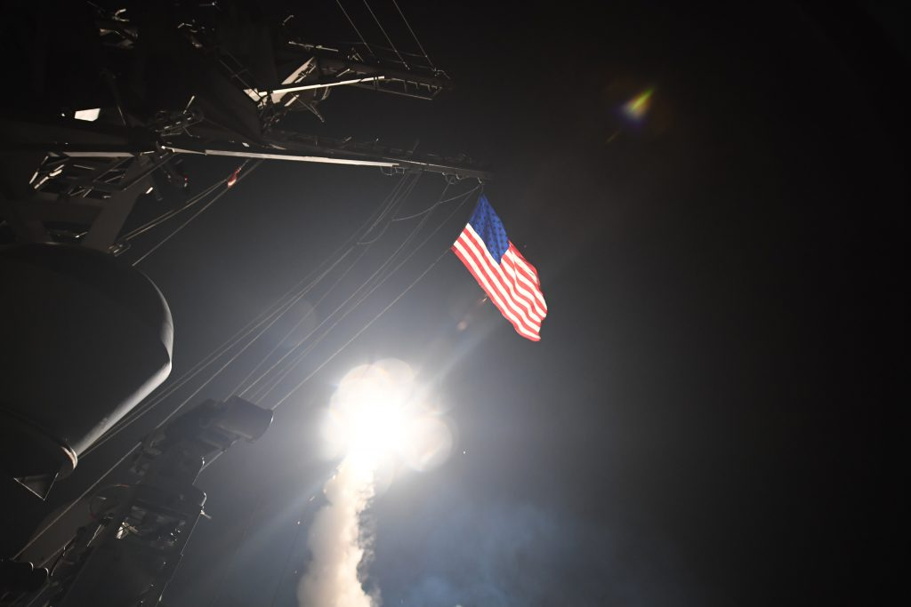
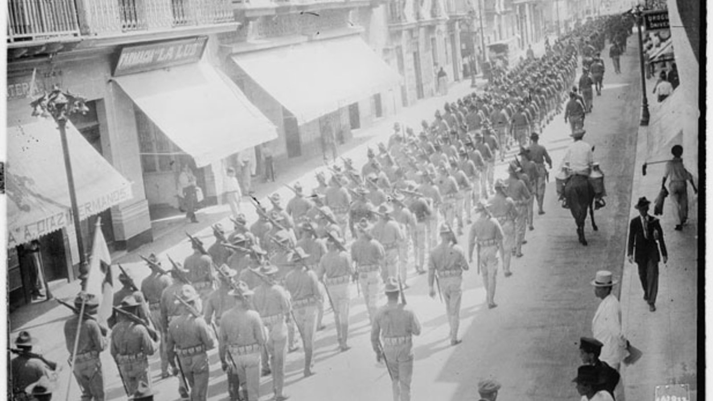

```{r setup, include = FALSE, echo = FALSE}
library(tidyverse)
library(tidyquant)
library(plotly)
library(scales)
library(here)
library(Hmisc)
library(kableExtra)
library(knitr)
library(lubridate)
library(rgdal) # used to read world map data
library(rgeos) 
library(rvest)
library(maptools)
library(ggmap)
library(colorRamps)
library(xaringan)
library(RColorBrewer)

knitr::opts_chunk$set(fig.width=12, fig.height=8, fig.align="center", echo=FALSE, warning=FALSE, error=FALSE, message=FALSE, dpi=400) 


theme_flynn <- function(){ 
  
      theme_minimal(base_size = 12, base_family = "Arial") %+replace% 
        
        theme(plot.title = element_text(face = "bold", size = 18, hjust = 0, margin = margin(t = 0, b = 0.3, l = 0, r = 0, unit = "cm")),
              plot.subtitle = element_text(size = 12, hjust = 0, margin = margin(t = 0, b = 0.3, l = 0, r = 0, unit = "cm")),
              plot.caption = element_text(face = "italic", size = 8, hjust = 1, margin = margin(t = 0.2, unit = "cm")),
              strip.background = element_rect(fill = "gray80", color = "black"),
              strip.text = element_text(color = "black", face = "bold", margin = margin(t = 0.2, b = 0.2, l = 0.2, r = 0.2, unit = "cm")),
              panel.grid.major = element_line(color = "gray70", size = 0.15),
              panel.grid.minor = element_line(color = "gray90", size = 0.1),
              axis.title = element_text(face = "bold", size = 12),
              axis.title.y = element_text(angle = 90, margin = margin(t = 0, r = 0.5, b = 0, l = 0, unit = "cm")),
              axis.title.x = element_text(margin = margin(t = 0.5, r = 0, b = 0, l = 0, unit = "cm")),
              legend.title = element_text(face = "bold", hjust = 0))
}

```

# Lecture Overview

1. What constitutes a "use of force"?

2. Trends in the use of force over time

3. When and why does the US use military force?

4. Limits on the use of force


---
class: top, left

# Key Questions

1. What does US military activism look like over time?

2. What constraints do policymakers face when using military force?

3. Wha domestic factors shape incentives to use military force?

4. Why do policymakers escalate (or not) military conflicts?

5. What role do concepts like "resolve" play in the use of force?


---
class: center, middle, inverse

# What Constitutes Force?


???

# Notes:

- Talk about generla misperceptions of what constitutes military force
- We typically think of big cases, but most are small.
- If it pops into your mind, it's probably a bad representative case.


---
class: left, top

# What Constitutes Force?

What do we mean when we talk about the use of force?

- This probably seems obvious, but reality differs from most people's perceptions

- Most uses of military force are short duration and low intensity

- Large-scale uses of force (i.e. wars) are relatively rare


---
class: center, middle

<figure>

<figcaption>Allied forces move ashore during the invasion of Normandy, June 6, 1944.</figcaption>
</figure>


???
# Notes:

- Operation Overlord - The invasion of Normandy on D-Day in WWII.
- Massive multilateral military operation that took months of planning. 
- This is a highly salient, but highly unusual example of military force embedded within an already enormous military operation. 


---
class: center, middle

<figure>

<figcaption>Members of the US Marine Corps 15th Marine Expeditionary Unit Maritime Raid Force fight off pirates that seized the Magellan Star in the Gulf of Aiden, September 2010.</figcaption>
</figure>


???
# Notes:

- US Navy and Marines conduct an operation to retake a ship from pirates in the Gulf of Aden
- This is not Captain Philips, but similar.
- Smaller operation, limited goals


---
class: center, middle

<figure>

<figcaption>The guided middle destroyer USS Porter launches cruise missiles targeting Al-Shayrat Air Base in Syria. These strikes were part of a larger operation that involved the launch of 59 Tomahawk cruise missiles at targets in Syria in response to the use of chemical weapons by the Syrian government against civilians.</figcaption>
</figure>

???
# Notes:

- USS Porter launches cruise missiles into Syria in response to reports that Syrian government used chemical weapons against civilians.
- Smaller operation, more limited goals.
- Intent is to signal more than achieve general military goals.
- We'll talk more about this point later


---
class: left, top

# What Constitutes Force?

What do we mean when we talk about the use of force?

- This probably seems obvious, but reality differs from most people's perceptions

- Most uses of military force are short duration and low intensity

- Large-scale uses of force (i.e. wars) are relatively rare


???

# Notes:

- Militarized interstate disputes (MID) represents a way to conceptualize a broad range of cases where force is used
- Not all of these are purposeful policy actions
- Many represent impulsive acts on the part of agents in the field


---
class: center, middle

```{r mid-1}
middata <- read_csv(here("../../../Data Files/COW Data/MID-level/MIDB_4.01.csv")) %>% 
  mutate(us.mid = as.numeric(ifelse(ccode == 2, 1, 0))) %>% 
  rowwise() %>% 
  mutate(year = list(seq(StYear,EndYear))) %>% 
  ungroup() %>% 
  unnest() %>% 
  group_by(HostLev, year) %>% 
  summarise(midcount = n_distinct(DispNum3), usmidcount = sum(us.mid))
  
mid.time <- tibble(year = seq(1815, 2010)) %>% 
  left_join(middata) %>% 
  mutate(midcount = ifelse(is.na(midcount), 0, midcount),
         usmidcount = ifelse(is.na(usmidcount), 0, usmidcount)) %>%
  group_by(year) %>% 
  mutate(usmidperc = usmidcount/midcount,
         usmidperc = ifelse(!is.finite(usmidperc), 0 , usmidperc)) %>% 
  pivot_longer(cols = c("midcount", "usmidcount", "usmidperc")) %>% 
  filter(!is.na(HostLev))


# US MID count over time
ggplot(data = subset(mid.time, name == "usmidcount"), aes(x = year, y = value)) +
  geom_bar(stat = "identity") +
  theme_flynn() +
  scale_x_continuous(breaks = seq(1815, 2010, 20)) +
  scale_y_continuous(breaks = seq(0, 12, 2)) +
  labs(x = "Year",
       y = "Count",
       title = "Militarized Interstate Disputes involving the US, 1816-2010",
       subtitle = "What patterns do you see over time?",
       caption = "Data obtained from the Correlates of War Project Militarized Interstate Dispute (v4.01) \n/http://cow.dss.ucdavis.edu/data-sets/MIDs")


```

???
# Notes

- What are the patterns here?


---
class: center, middle

```{r mid-2}

# US MID count over time by hostility level
ggplot(data = subset(mid.time, name == "usmidcount"), aes(x = year, y = value, group = HostLev, fill = as.factor(HostLev))) +
  geom_bar(stat = "identity", color = "black", size = .05) +
  theme_flynn() +
  scale_x_continuous(breaks = seq(1815, 2010, 20)) +
  scale_y_continuous(breaks = seq(0, 12, 2)) +
  scale_fill_brewer(palette = "Spectral") +
  labs(x = "Year",
       y = "Count",
       fill = "Hostility Level",
       title = "Militarized Interstate Disputes involving the US, 1816-2010",
       subtitle = "What patterns do you see over time?",
       caption = "Data obtained from the Correlates of War Project Militarized Interstate Dispute (v4.01) \n/http://cow.dss.ucdavis.edu/data-sets/MIDs")


```


???

# Notes

- Broken down by type
- Notice that green and yellow are the most common categories


---
class: center, middle

```{r mid-3}

usmids.allmids <- mid.time %>% 
  group_by(year, name) %>% 
  summarise(value = sum(value, na.rm = TRUE))

# US MIDs and total MIDs over time
ggplot(data = subset(usmids.allmids, name != "usmidperc"), aes(x = year, y = value, group = name, fill = name)) +
  geom_area(alpha = .8, color = "black", size = .1, position = "stack") +
  theme_flynn() +
  scale_x_continuous(breaks = seq(1815, 2010, 20)) +
  scale_y_continuous(breaks = seq(0, 150, 10)) +
  scale_fill_brewer(palette = "Set1", labels = c("All Countries", "United States")) +
  labs(x = "Year",
       y = "Count",
       fill = "Group",
       title = "Militarized Interstate Disputes involving the US, 1816-2010",
       subtitle = "What patterns do you see over time?",
       caption = "Data obtained from the Correlates of War Project Militarized Interstate Dispute (v4.01) \n/http://cow.dss.ucdavis.edu/data-sets/MIDs")


```

???
# Notes

- US MIDs relative to all mids in a given year
- US Accounts for a fairly high proportion of total MIDs in any given year.


---
class: center, middle

```{r us-mid-hist}

midduration <- read_csv(here("../../../Data Files/COW Data/MID-level/MIDB_4.01.csv")) %>% 
  mutate(us.mid = as.numeric(ifelse(ccode == 2, 1, 0))) %>% 
  rowwise() %>% 
  mutate(startdate = as.Date(paste(StYear, StMon, StDay, sep = "-"), "%Y-%m-%d"),
         enddate = as.Date(paste(EndYear, EndMon, EndDay, sep = "-"), "%Y-%m-%d"),
         duration = (enddate - startdate)/365) %>% 
  ungroup() %>% 
  unnest() %>% 
  filter(us.mid == 1)

meanduration <- round(mean(midduration$duration, na.rm = TRUE), 2)
medianduration <- round(median(midduration$duration, na.rm = TRUE), 2)

ggplot(midduration, aes(x = duration)) +
  geom_histogram(binwidth = 1, fill = "deepskyblue", color = "black", size = 0.1) +
  annotate("text", x = 8, y = 145, label = paste("Mean =", meanduration, "Years", sep = " "), size = 5, hjust = 0) +
  annotate("text", x = 8, y = 130, label = paste("Median =", medianduration, "Years", sep = " "), size = 5, hjust = 0) +
  theme_flynn() +
  scale_x_continuous(breaks = seq(0, 14, 1)) +
  labs(x = "Years",
       y = "Count",
       title = "Duration of Militarized Interstate Disputes involving the United States",
       subtitle = "Note that the overwhelming majority are extreme short duration",
       caption = "Data obtained from the Correlates of War Project Militarized Interstate Dispute (v4.01) \n/http://cow.dss.ucdavis.edu/data-sets/MIDs")


```

???
# Notes:

- Notice that most conflicts are *very* short. 
- Mean is less than 6 months,
- Median is only 0.04 years---only about 14 days. 
- Side point---this is why stats is handy. Average isn't always the best indicator to use.


---
class: center, middle, inverse

# When and Why Does the US Use Force?


---
class:  left, top 

# When and Why Does the US Use Force?

Motivations:

- Protest citizens abroad
- Acquire territory
- Secure commerce and access to markets
- Secure access to to resources
- Remove hostile leaders/governments from power
- Check expansion of rival powers
- Signal resolve
- Strikes against actors who use terror
- Intervene for humanitarian reasons

???

# Notes

- Countries use force for all sorts of reasons


---
class: center, middle


<figure>

<figcaption>US military forces occupy the city of Veracruz, Mexico, 1914.</figcaption>
</figure>


???
# Notes:

- Occupation of Veracruz, Mexico in 1914.
- Began with the arrest of 9 US service personnel who went into a restricted part of the city. They were released a short while later.
- US Admiral Mayo demanded an apology (which he got) and a full 21 gun salute from the Mexican military.
- Victoriano Huerta had come to power in a coup during the Mexican Revolution. President Wilson hoped to push him out of power. Wilson decided to use this as an opportunity to increase pressure on Huerta and backed Admiral Mayo's demands. Huerta refused.
- Wilson asks Congress for approval to use military force against Mexico in response, and both the House and Senate vote to approve the use of force against Mexico.
- Approximately 6,500 Marines invade and occupy the city
- Shortly after military operatiosn begin Wilson gets word of a ship about to dock at Veracruz that contains machine guns and munitions, which he fears will strengthen Huerta's regime.
- Wilson thinks US troops will be greeted as liberators, but Mexican naval cadets and civilians start fighting US forces after Huerta's forces pull back. Huerta's opponents also denounce the US intervention, contrary to Wilson's beliefs (sound familiar?)
- Source: [CFR Page on the invasion of Veracruz](https://www.cfr.org/blog/twe-remembers-us-invasion-veracruz-mexico)


---
class:  left, top 

# When and Why Does the US Use Force?

But what general factors should we think about?

Two broad categories:

- International factors

- Domestic factors


---
class:  left, top 

# When and Why Does the US Use Force?

International factors

- Opportunities to use force

- Interests

  - Security Interests
  
  - Economic interests
  
  
???
# Notes

- Specific details vary, but we can distill motivations down into some broad groupings
- Security interests would be things like destroying a rival's capacity to launch an attack on the US, or thwarting an actual planned attack.
- Economist interests csan include access to new markets, or access to natural resources
  
  
  
  
  
  
  
---
class: left, middle

```{r fordham-results}

fordham <- tibble(Predictor = c("Ally involvement", "Rival intervenes first", "Volume of trade", "Relative power of target", "Distance from US", "Population of target", "Democratic states", "US growth rate", "# Other states involved"),
                  `Civil Wars` = c("+", "+", " ", " ", "+", "-", " ", " ", " "),
                  `International Crises` = c("+", "+", " ", " ", " ", " ", " ", " ", "-"))

kable(fordham,
      "html",
      align = c("l", "c", "c"),
      caption = "Predictors of US military intervention in civil and international crises") %>% 
  kable_styling(full_width = TRUE) %>% 
  row_spec(0, bold = TRUE, color = "white", background = "#512888") %>% 
  column_spec(1, width = "8cm") %>% 
  footnote(general = c("Fordham, Benjamin O. 2008. Power or Plenty? Economic interests, security concerns, and American intervention. International Studies Quarterly. 51(1):737-758."))
```

???
# Notes:
- Fordham (2008) analyzes cases where the US intervenes in international and internal/civil conflicts
- Talk about coefficients


---
class: center, middle

```{r trade-fig}
library(modelr)
allies <- readstata13::read.dta13(here("../../../Data Files/Replication Files/Fordham 2008/aformation.dta")) %>%
  filter(ccode < 1000) %>%
  dplyr::rename("prefail" = "_prefail", "spline1" = "_spline1", "spline2" = "_spline2", "spline3" = "_spline3")
  

m1 <- glm(atopdo ~ lnexports1 + lndistance + 
                  lntotmids10_1 + lntotmids10_2 + 
                  lndyadmid10 + lncap_1 + 
                  lncap_2 + polity22 + coldwar + noallyrs +
                  prefail + spline1 + spline2 + spline3,
                data = allies,
          family = binomial(link = "logit"))


df <- tibble(lnexports1 = seq(0, 10, 1),
             lndistance = mean(allies$lndistance, na.rm = TRUE),
             lntotmids10_1 = mean(allies$lntotmids10_1, na.rm = TRUE),
             lntotmids10_2 = mean(allies$lntotmids10_2, na.rm = TRUE),
             lndyadmid10 = mean(allies$lndyadmid10, na.rm = TRUE),
             lncap_1 = mean(allies$lncap_1, na.rm = TRUE),
             lncap_2 = mean(allies$lncap_2, na.rm = TRUE),
             polity22 = mean(allies$polity22, na.rm = TRUE),
             prefail = mean(allies$prefail, na.rm = TRUE),
             noallyrs = mean(allies$noallyrs, na.rm = TRUE),
             spline1 = mean(allies$spline1, na.rm = TRUE),
             spline2 = mean(allies$spline2, na.rm = TRUE),
             spline3 = mean(allies$spline3, na.rm = TRUE),
             coldwar = 1)

df$predict1 <- predict(m1,
                       newdata = df,
                       type = "response")

ggplot(df, aes(x = lnexports1)) +
  geom_line(aes(y = predict1), size = 1.5) +
  theme_flynn() +
  labs(x = "log US Exports to Referent State",
       y = "Pr(Alliance Formation)",
       title = "Immediate probability of alliance formation as a function of exports",
       subtitle = "The US is more likely to be allied with states to which it exports more goods",
       caption = "Figure based on data from Fordham, Benjamin O. 2008. Power or Plenty?\nEconomic interests, security concerns, and American intervention. International Studies Quarterly. 51(1):737-758.")


```

???
# Notes

- Short run effect of trade on alliance formation


---
class: left, top

# When and Why Does the US Use Force?

Resolve

- Politicians often talk about this a lot, but what is it?

> A signal that an actor is willing to endure costs over a long period of time

- But how can actors effectively communicate resolve?

???

# Notes

- Resolve is often something that politicians talk a lot about
- Cases like Trump's cruise missile attacks on Syria are intended to demonstrate US resolve and signal the US' seriousness about a particular policy issue
- Dr. Danielle Lupton has done work on this. She discusses the fact that things like cruise missile strikes are viewed as safe and effective means of signaling US intent and resolve, but the fact that they're low cost undermines their effectiveness. 


---
class: center, middle


<figure>

<figcaption>Vice President Mike Pence stares down North Korean soldiers from a parapet along the de-militarized zone. "I thought it was important that we went outside...I thought it was important that people on the other side of the DMZ see our resolve in my face."</figcaption>
</figure>

???

# Notes

- Mike Pence famously walked up on to the parapet and said he wanted North Koreans to see the resolve on his face
- Lupton's research suggests this kind of thing makes for a good photo op, but does little to actually communicate resolve or effectively signal intent to an adversary, particularly when earlier statements and actions undermine these later efforts.
- Lupton's research also shows that leaders who fail to live up to their hawkish rhetoric face consequences. She notes that this stuff might play well domestically, but have consequences internationally.


---
class: left, top

# When and Why Does the US Use Force?

Domestic Political Factors

- Diversionary use of force?

- Partisanship?

- Ideology?

???
# Notes

- Various domestic factors can also matter
- But what are they?
  - Do leaders use force to distract from domestic problems?
  - Are the parties different?
  - Does ideology shape incentives to use military force?


---
class: left, top

# When and Why Does the US Use Force?

Diversionary Use of Force

- The idea is to distract from poor economic or domestic political conditions

- Use of force triggers a "rally" effect, increases presidential approval/favorability ratings


---
class: center, middle

```{r bush 9/11}
# Note that str_sub works with the -2 and -1 to target characters at end of the string, but substr does not.
approve <- readxl::read_xlsx(here("../../../Data Files/us_presidential_approval.xlsx")) %>% 
  mutate(netfav = approve - disapprove,
         date = as.Date(start, "%Y-%m-%d")) %>% 
         group_by(., president, date) %>% 
         summarise(netfav = mean(netfav), approve = mean(approve)) %>% 
  mutate(party = as.factor(ifelse(president == "Eisenhower" | president == "Nixon" | president == "Ford" | president == "Reagan" | president == "Bush" | president == "W_Bush" | president == "Trump", "Republican", "Democrat")),
         begin = as.Date(min(date)),
         end = as.Date(max(date))) %>% 
  group_by(., president) %>% 
  arrange(., president, date) 
  
approve_short <- approve %>% 
  group_by(., president, party) %>% 
  summarise(begin = min(begin), 
            end = max(end)) %>% 
  arrange(begin) %>% 
  ungroup() %>% 
  mutate(begin2 = c("1933-03-04", "1945-04-12", "1953-01-20", "1961-01-20", "1963-11-22", "1969-01-20", "1974-08-01", "1977-01-20", "1981-01-20", "1989-01-20", "1993-01-20", "2001-01-20", "2009-01-20", "2017-01-20"),
         end2 = c("1945-04-12", "1953-01-20", "1961-01-20", "1963-11-22", "1969-01-20", "1974-08-01", "1977-01-20", "1981-01-20", "1989-01-20", "1993-01-20", "2001-01-20", "2009-01-20", "2017-01-20", "2020-06-08"),
         begin2 = as.Date(begin2, "%Y-%m-%d"),
         end2 = as.Date(end2, "%Y-%m-%d"))


# George W. Bush only
ggplot(data = subset(approve, president == "W_Bush"), aes(x = date, y = netfav)) +
  geom_point(size = 3) +
  geom_line(size = 1) +
  geom_vline(xintercept = as.Date("2001-09-01"), colour = "red") +
  geom_vline(xintercept = as.Date("2003-03-01"), colour = "red") +
  annotate("text", x = as.Date("2002-03-11"), y = -20, label = "September 11 Attacks", size = 3) +
  annotate("text", x = as.Date("2003-08-20"), y = -20, label = "Invasion of Iraq", size = 3) +
  theme_flynn() +
  scale_x_date(date_breaks = "1 years", date_labels = "%Y") +
  scale_y_continuous(breaks = seq(-50, 100, 20), limits = c(-50,90)) +
  labs(title = "George W. Bush approval ratings over time", 
       subtitle = "National security crises can affect public opinion, but effects are often short-lived",
       x = "Date", y = "Net favorability %", 
       fill = "Party", 
       caption = "Monthly mean approval score shown \n Data obtained from: http://www.presidency.ucsb.edu/data/popularity.php") 
```


---
class: center, middle

```{r all approval}
# All presidents Roosevelt to Trump
ggplot() +
  geom_line(data = approve, aes(x = date, y = netfav), size = 1) +
  geom_rect(data = approve_short, aes(xmin = begin2, xmax = end2, ymin = -50, ymax = 100, group = party, fill = party), colour = "white", alpha = 0.3) +
  geom_label(data = approve_short, aes(x = begin2+((end2-begin2)/2), y = 95, label = president), size = 2.5) +
  theme_flynn() +
  scale_fill_manual(values = c("red", "blue"), guide = FALSE) +
  scale_x_date(date_breaks = "4 years", date_labels = "%Y") +
  scale_y_continuous(breaks = seq(-50, 100, 25), limits = c(-50, 100)) +
  labs(title = "Presidential approval ratings over time",
       subtitle = "Approval ratings vary, but still follow fairly common patterns",
       x = "Date", 
       y = "Net favorability %", 
       fill = "Party", 
       caption = "Monthly mean approval score shown \n Data obtained from: http://www.presidency.ucsb.edu/data/popularity.php") 

```


---
class: center, middle


<figure>

<figcaption>Front page of the December 17, 1998 issue of the New York Times. President Bill Clinton ordered air strikes against targets in Iraq in the midst of an unfolding impeachment process.</figcaption>
</figure>

???
# Notes:

- It can be REALLY hard to escape damning domestic political events
- Using military force typically doesn't create sustainable conditions that can help leaders distract from their problems.


---
class: left, top

# When Does the US Use Force?

But diversion may be more complicated

- Parties are better/worse equipped to respond to "bad" conditions

- We can think of policy as substitutable, rather than strictly as diversionary

- Example: Unemployment

  - Democrats
  
  - Republicans
  
  
???
# Notes
- Diversion can be more complicated
- Parties don't face the same incentives, and don't have the same cost-benefit calculus when looking at different policy options.
- Democrats typically don't have the same limits as Republicans when it comes to inflationary macroeconomic policy. They can respond to growing unemployment with stimulus spending more easily. 
  
  
  
---
class: center, middle


---
class: left, top

# When Does the US Use Force?

What about other countries?

- So far we've assumed the US *initiates* the use of force, but sometimes it's also a *target*

- We often focus on decision-making within the US, ignoring the decisions of other states

- What sorts of factors determine when other countries target the US, and the intensity with which they do so?


---
class: left, top

# When Does the US Use Force?


When is the US a target?

- A few factors to consider
  - When is a target vulnerable? 
  - When is a target's hands tied?
  - When do you want to avoid "poking the bear"?

Diversionary logic can help us here:

- Economic conditions: States try to avoid conflict with the US when economic conditions are bad (e.g. high unemployment). 
- Partisanship: Prior beliefs about how likely presidents of different parties are to use military force may shape other states' decisions about attacking the US.
- Rivalry: States with long-standing grievances and hostility towards the US may be more likely to use force in general.


---
class: left, middle

```{r target table}

target <- tibble(`Outcome/Variable` = c("US conflict behavior",
                              "US Unemployment rate",
                              "Democratic president",
                              "Communist state",
                              "State power",
                              "Communist regime"),
                 Effect = c("+", "-", "+", "+", "+","+"))

kable(target,
      "html",
      align = c("l", "c"),
      caption = "Correlates of foreign conflict behavior towards the United States, 1946-1992") %>% 
  kable_styling(full_width = TRUE) %>% 
  row_spec(0, color = "white", background = "#512888", bold = TRUE) %>% 
  column_spec(1, width = "7cm") %>% 
  column_spec(2, width = "4cm") %>% 
  pack_rows("Conflict Intensity", 1, 4) %>% 
  pack_rows("Variation in State Behavior", 5, 6) %>% 
  footnote("Dave Clark, Ben Fordham, and Tim Nordstrom. 2011. Preying on the Misfortune of Others: When do states exploit their opponents' domestic troubles? Journal of Politics. 73(1):248-264.")

```


???
# Notes

- Focuses mostly on the Cold War period, so some of these effects may be more or less relevant today.


---
class: center, middle, inverse

# Limits on the Use of Force


---
class: left, top

# Limits on the Use of Force

A puzzle:

- The US is the most powerful state in history, but it loses wars and we never see its military capabilities used in full. Why?

- What constraints exist on US military power?

- What are the limits of US military power?


---
class: left, top

# Limits on the Use of Force

Some key factors:

- Risks, costs, benefits

- Public support

- What will allies do?

- What will rivals do?

- Is the military the appropriate instrument of power for the goal in question?


---
class: center, middle


<figure>

<figcaption>US test of a hydrogen bomb on Bikini Atoll, July 1946. Extreme military power is often of very little practical use.</figcaption>
</figure>


---
class: left, top

# Limits on the Use of Force

Domestic public support

- Public support generally diminishes over time

- As a rule, the costs of war only grow over time

- Military force becomes increasingly political, leading to greater congressional involvement

- Conflict reveals information over time, and may reveal faulty assumptions from war's beginning


---
class: left, top

# Limits on the Use of Force

What will allies do?

- Allied leaders may press for limits on the scope of conflict

- They might withold capabilities

- They might limit mission types in which their troops can participate

- Allied publics might not support expanding the scope of conflict


---
class: center, middle


<figure>

<figcaption>Supply routes into Afghanistan required to support the US war effort.</figcaption>
</figure>


---
class: left, top

# Limits on the Use of Force

What will rivals do?

- Rivals might greet US escalation with their own action

- Rivals may benefit from overly aggressive US action

- Rivals might also ramp up their efforts to counter US in other geographic/issue areas


---
class: left, top

# Limits on the Use of Force

Are there better options?

- The US has come rely more and more on the military to do a wide range of tasks

- But the military may not always be the best tool for the job

- The use of force often requires deploying other forms of power, influence, and expertise, but the military can't generate comparable levels of expertise in all issue areas as compared to other agencies

- Efforts to build soft power may be undercut or offset by US military presence


